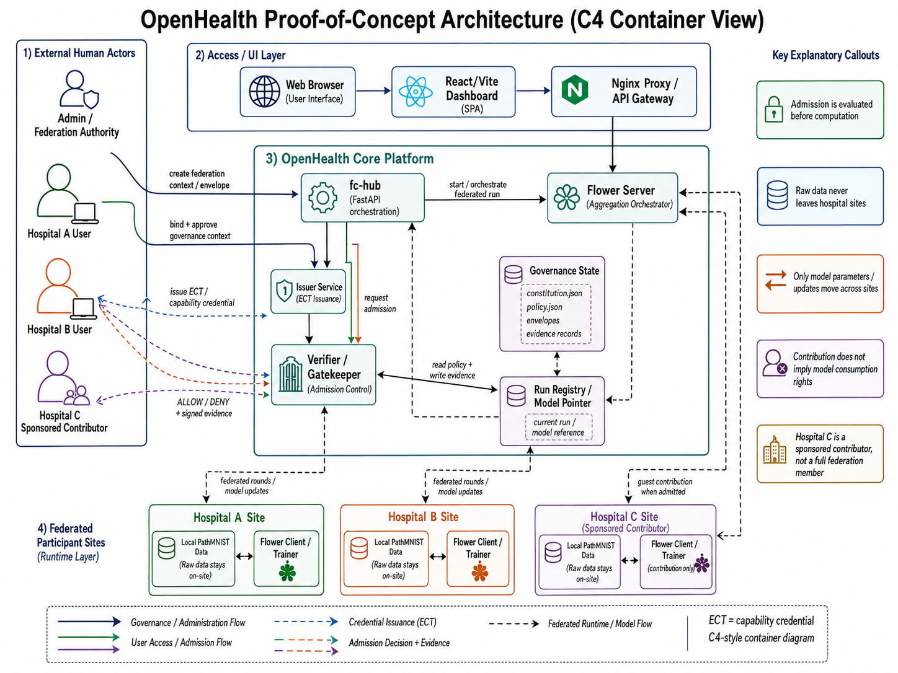
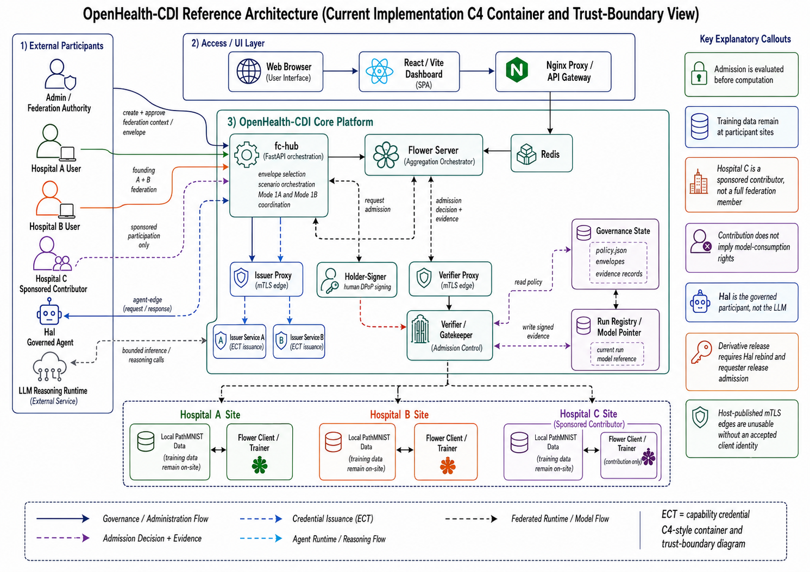

# OpenHealth-CDI

**OpenHealth-CDI is a research reference implementation of governed cross-organizational Federated Computing.**

Its purpose is to make federation architecture, governance relations, trust boundaries, and behavioural invariants executable, inspectable, and reproducible.

> OpenHealth-CDI is a reference implementation of governed federation — an architecture in which every operation on a governed resource is admitted or denied as a constituted relation: a credentialed principal, holder-bound proof, an envelope naming the collaboration context, and locally compiled policy, evaluated statelessly at a single boundary and producing signed, independently verifiable evidence per decision; AI agents participate under the same discipline, as sponsored, capability-bounded principals rather than trusted infrastructure.

 Structurally it's four separated planes:
 1. constitution (KYO, bind, quorum, signed envelopes),  
 2.  issuance (entitlements compiled into portable ECTs, lifetime-clamped), 
 3. admission (the stateless waist, fail-closed, evidenced),  
 4.  execution (Flower, Hal) — with the separation enforced as a conformance
    invariant,

The central design principle is simple: **Authority and execution are separate.** Organisations retain authority over their resources, while participation in a federated activity is established through explicit relations defining who may participate, under whose authority, for which purpose, within which scope, and with what evidence.

## Three executable modes

| Mode | Governed evolution |
| --- | --- |
| **A+B** | Hospitals A and B establish the founding federation, perform federated training, and consume the resulting model under governed capabilities. |
| **Mode 1A** | Hospital C participates as a sponsored contributor without becoming an equivalent federation member or acquiring model-consumption rights. |
| **Mode 1B** | Hal participates as a governed computational participant with bounded inference and policy-authorised transformation capabilities. |

The modes are not different governance architectures. They exercise progressively different **relations among participants, resources, and operations** while preserving the same federation-governance model.

---

## From the JMIR paper to the reference implementation

The accompanying [JMIR paper](doc/JMIR_MI_Manuscript_final.pdf) introduced the OpenHealth governance model and its progression from a fixed A+B federation to differentiated organisational and computational participation. The figure below represents the state of the system described by the manuscript.

<em>Architecture presented in the JMIR manuscript.</em>

The repository shall be read as the **implementation continuation of the JMIR study**.

The subsequent implementation operationalises those requirements. Mode 1B now provides a holder-bound computational participant, bounded inference, policy-authorised Unbind, independently governed derivative consumption, execution-path isolation, and negative tests verifying that execution cannot enlarge the authority established by admission.

The implementation also goes beyond the original single requester scenario. The same agent is exercised across different requester-resource relations. Whether the source can be returned directly or must first be transformed therefore depends on the governed relation among **requester, resource, capability, purpose, and context**, not on the identity or internal behaviour of the agent alone.

---

## Current OpenHealth-CDI architecture

<em>Current OpenHealth-CDI C4 container and trust-boundary view.</em>

The current architecture makes explicit several properties that were only requirements when the JMIR manuscript was completed.

The Hub is the controlled operational aperture into the federation. Governance state, model/run state, credential issuance, holder signing, admission, analytical execution, and agent execution remain distinct responsibilities.

Hospital C remains a **sponsored contributor**, not a founding member. Contribution authority does not imply model-consumption authority.

Mode 1B adds a separate agent execution boundary. **Hal is the governed participant, not the LLM.** An LLM reasoning runtime may act through Hal, but it cannot enlarge Hal's admitted authority. Agent execution, federation admission, policy-authorised transformation, and requester release remain separate relations.

The implementation also keeps **model lifecycle and governance-envelope lifecycle distinct**. An existing model artefact may be used under a later governed context without implying that the model was trained under that envelope.

---

## Portable reference deployment

The reference implementation supports both **CPU-only** and **CUDA** execution profiles for the PathMNIST Flower clients. The deployment selects the compute backend before OpenTofu is applied. A host without NVIDIA GPU hardware uses CPU. A host with NVIDIA GPU hardware must have a working NVIDIA container runtime and CUDA path rather than silently falling back to CPU.

A fresh clone intentionally excludes mutable trust state, holder private keys, OpenTofu state, and local secrets. Reproducing the system therefore has three distinct stages:

1. bootstrap and validate local trust material, holder identities, name resolution, secrets, and compute selection;
2. deploy the Docker/OpenTofu infrastructure;
3. enrol runtime members and execute the conformance regression.

See [DEPLOYMENT.md](doc/DEPLOYMENT.md) for the clean-clone procedure and [AWS-PORTING.md](doc/AWS-PORTING.md) for the mapping from the local reference deployment to AWS.

---

## Executable conformance

The repository tests governance as an executable systems property rather than inferring it from configuration or documentation.

The principal regression families cover federation-envelope establishment, issuer-owned capabilities, holder binding and DPoP, sponsorship, contribution-versus-consumption separation, signed ALLOW/DENY evidence, agent isolation, bounded agent authority, policy-authorised Unbind, derivative release, and contextual agent-mediated execution.

In particular:

`Test2E_fcac_conformance.sh` verifies the shared admission-governance substrate.
`Test4C_sponsorship_regression.sh` verifies sponsorship without collapsing provenance, membership, or delegated authority.
`Test5A_agent_isolation.sh` verifies the Mode 1B execution boundary.
`Test5C_agent_credential_admission.sh` verifies Hal's holder-bound admitted capability relation.
`Test5D_mode1b_table7_conformance.sh` makes the JMIR Table 7 requirements executable.
`Test5E_mode1b_contextual_agent.sh` extends the experiment across different requester-resource relations.
`Test0C_delivery_regression.sh` is the top-level delivery regression for the Mode 1B release path. A successful run terminates with `ALL DELIVERY GATES GREEN`.

Detailed prerequisites, commands, expected results, and the invariant established by every test are documented in [TESTING.md](doc/TESTING.md).

---

## Documentation

Detailed documentation is organised by concern:
- [Architecture and trust boundaries](doc/ARCHITECTURE.md)
- [Governance model](doc/GOVERNANCE.md)
- [Executable scenarios](doc/SCENARIOS.md)
- [Mode 1B and agent participation](doc/MODE1B.md)
- [Tests and conformance evidence](doc/TESTING.md)
- [Deployment](doc/DEPLOYMENT.md)
- [AWS porting guide](doc/AWS-PORTING.md)
- [Troubleshooting](doc/TROUBLESHOOTING.md)
- [Release and reproducibility](doc/RELEASE.md)

The JMIR manuscript is retained under `doc/` so that the original paper architecture, the implemented architecture, and the executable evidence remain available together.

---

## Release status

**v1.0.0** is the frozen audited baseline for A+B, Mode 1A, and Mode 1B. It is archived as a [GitHub release](https://github.com/onzelf/openhealth-cdi/releases/tag/v1.0.0) and on [Zenodo](https://zenodo.org/records/22209771).

The **v1.1.0** release line adds portable clean-clone deployment across CPU-only and CUDA hosts together with explicit bootstrap and deployment prerequisites. It does not change the governance semantics established by v1.0.0.

> **Disclaimer**: OpenHealth-CDI is a **research reference implementation**. It demonstrates governed federation evolution and provides reproducible evidence for the implemented invariants. It does not claim clinical effectiveness, production-scale deployment, or general-purpose AI-agent safety.

## License

OpenHealth-CDI is released under the **GNU Affero General Public License v3.0**.

See [LICENSE](LICENSE). 
