# OpenHealth-CDI Architecture and Trust Boundaries
## 1. Purpose of this document
OpenHealth-CDI is a research reference implementation of governed cross-organizational Federated Computing. It demonstrates how independently governed organisations can participate in shared computational activities without transferring general authority over their resources to a central platform. The implementation uses federated learning as its principal computational example and later extends the same governance architecture to sponsored contributors and a computational agent. This document explains how the system is structured, why its components are separated, which relationships are architecturally significant, and which implementation details may be changed without altering the architecture.
A reader should not need prior knowledge of the OpenHealth project, the accompanying JMIR paper, FCaC, or the development history to understand this document. Where historical identifiers such as `fcac` or `vfp` remain in source paths or container names, they should be treated as implementation names rather than as prerequisites for understanding the architecture.
The central architectural principle is that **authority and execution are separate**. A process may be technically capable of performing an operation without being authorised to perform it. A participant may exist without being a member of the federation. A model may exist without being available to every contributor. A network route may exist without establishing governance authority. OpenHealth-CDI therefore makes the relationships among participants, resources, operations, authorities, and evidence explicit rather than inferring them from the existence of system objects.
## 2. Architecture is not an inventory of objects
A conventional deployment description often begins by listing components such as servers, containers, users, datasets, models, certificates, databases, and APIs. OpenHealth-CDI contains all of these, but such a list does not explain its federation architecture. The same objects could be assembled into a centralised service, an ordinary distributed application, or an ungoverned federated-learning experiment.
What distinguishes OpenHealth-CDI is the set of relations that determines how those objects may interact. Hospitals A and B are not architecturally important merely because two hospital objects exist. They are important because they retain independent authority while jointly constituting an approved collaboration. Hospital C is not equivalent to them merely because it also runs a Flower client. Its contribution occurs through sponsorship and does not grant constitutive membership or model-consumption rights. Hal is not privileged merely because it is an AI agent. It participates through a bounded capability relation and remains subject to admission in the same way that other governed operations are subject to admission.
The distinction can be illustrated by comparing object descriptions with architectural descriptions.

| Object inventory | Architectural meaning |
| --- | --- |
| Hospital A and Hospital B exist | A and B are independently governed founding organisations whose approval constitutes the collaboration |
| Hospital C exists | C may contribute through a sponsored relation without becoming a founding member |
| Charlie exists | Charlie is a sponsored contributor whose sponsor and organisational provenance remain distinct |
| Audrey and Bob exist | They hold different resource-consumption capabilities issued by different organisational authorities |
| Hal exists | Hal is a holder-bound computational participant with explicitly bounded operations |
| An LLM is called | The LLM is an execution mechanism used by Hal and has no federation standing of its own |
| A Flower client exists | A process can participate in federated execution without that process type determining its governance status |
| A model file exists | The model has an analytical lifecycle that remains distinct from the active governance context |
| A Docker network exists | The network is one mechanism used to preserve a trust-boundary invariant |
| A certificate exists | The certificate authenticates identity at a trust boundary but does not by itself grant an operation |
| An ECT exists | The credential represents issuer-derived capability bound to a holder and governance context |
| A derivative exists | Production of the derivative does not imply that a requester is authorised to consume it |

The architecture should therefore be read from the relationships between objects rather than from the list of objects themselves. Components can be replaced while the architecture remains the same, but changing one of the authority-bearing relationships can alter the architecture even if every component remains physically unchanged.
## 3. What Federated Computing means in OpenHealth-CDI
OpenHealth-CDI uses the term Federated Computing for collaboration across independently governed computational domains. The defining property is not that computation is distributed. Distributed computation can occur entirely inside one administrative domain. Federation begins when an operation crosses boundaries between authorities that retain control over their own resources and participation conditions.
The relevant architectural questions are therefore who may participate, which authority establishes that participation, what resource is involved, which operation is requested, for what purpose the operation is permitted, what scope applies, which approved collaboration provides the governance context, and what evidence records the result. These questions apply equally to organisations, humans, services, and computational agents.
The following conceptual view shows why the relationships, rather than the object classes, carry the architectural meaning.

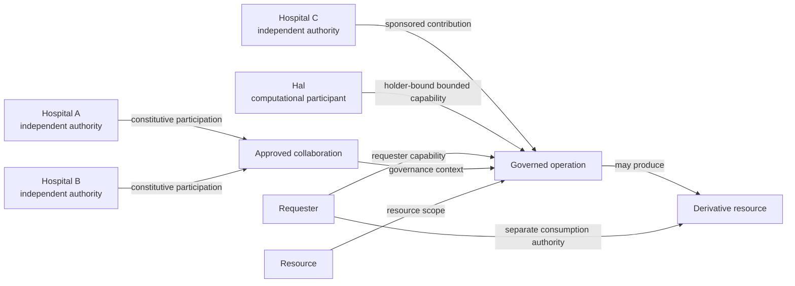

The boxes identify objects. The labelled arrows describe how those objects acquire meaning inside the federation. The architecture is primarily concerned with preserving those arrows and the conditions attached to them.
## 4. The three executable modes
The repository contains three architectural scenarios. They do not represent three different governance systems. They exercise increasingly differentiated forms of participation while preserving the same underlying model of authority.
The A+B baseline establishes the constitutive federation. Hospitals A and B remain independent organisations but approve a common collaboration and participate in federated training. This establishes the reference case in which the founding participants both contribute to and govern the collaboration.
Mode 1A adds Hospital C through a different relation. C does not become a third founding member. Charlie participates as a sponsored contributor, with Hospital A acting as sponsor while Hospital C provenance remains explicit. This mode demonstrates that a federation can evolve operationally without flattening every new participant into one uniform membership category.
Mode 1B adds Hal as a computational participant. Hal is not admitted merely because it is an agent and the LLM used by Hal does not become a federation principal. Hal receives bounded authority to perform specific operations, and each operation remains subject to the same governance principle as operations initiated by human participants.
The progression can be summarised as follows.

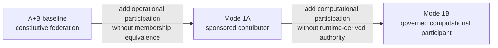

The important evolution is therefore relational. The architecture accommodates new forms of participation without redefining federation as a growing inventory of objects.
## 5. Architectural planes
For implementation purposes, OpenHealth-CDI can be understood as four interacting planes. The access plane contains the user-facing dashboard and API entry points. The governance plane contains policy, federation-envelope establishment, capability issuance, holder binding, admission, and signed decision evidence. The federated-execution plane contains the Flower server, participant clients, local datasets, model training, and model artefacts. The agent-execution plane contains Hal and the external reasoning runtime used by Hal.
These planes interact but do not inherit one another's authority. The dashboard can initiate an operation but cannot authorise it. Flower can execute training but cannot decide federation membership. Hal can perform a transformation but cannot decide that the transformation is permitted. The LLM can select an intended action but cannot grant the capability required for that action.
The principal components are connected as follows.

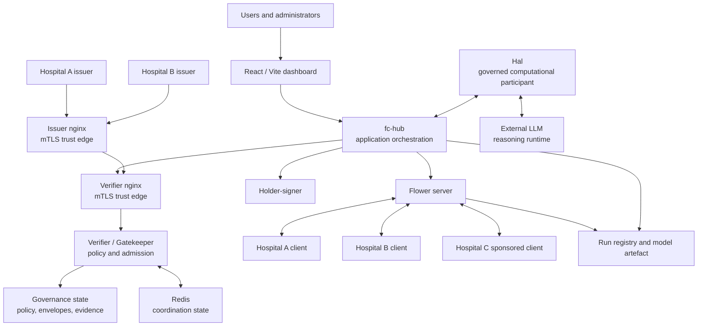

This is a functional architecture rather than a deployment diagram. It shows which components participate in each responsibility and prepares the reader for the trust boundaries described later.
## 6. The Hub as the controlled operational aperture
`fc-hub` coordinates the application workflow. It connects the user-facing application to governance services, the federated runtime, model state, and the Mode 1B agent path. In the local Docker deployment it is attached to both the federation-internal `fc` network and the separate `agent-edge` network. Hal is attached only to `agent-edge`, while privileged federation services reside on `fc`.
This arrangement makes the Hub the intended operational aperture between Hal and the federation. That term does not mean that the Hub owns federation authority. Policy, issuer authority, holder binding, and admission remain separate. The Hub is instead the point through which the application presents an attempted operation to those governance mechanisms before invoking the corresponding execution path.
This distinction is important because admission would be weak if the component requesting an operation could simply bypass the admitted path and invoke the protected service directly. In such a design the Gatekeeper might still produce an ALLOW or DENY record, but the decision would not determine whether execution was possible. The decision would be observational rather than constitutive.
The intended structure is therefore:

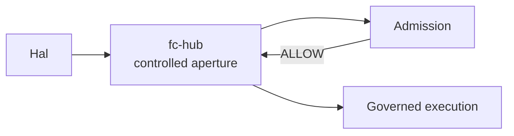

The Hub coordinates the transition from governance to execution, but authority continues to originate from the governance relations evaluated by the Gatekeeper.
## 7. Governance state and execution state
OpenHealth-CDI deliberately keeps governance state separate from execution state. Governance state describes the approved collaboration and the authority under which operations may occur. It includes policy, constitutive participants, quorum, sponsorship, capability definitions, envelope state, holder bindings, and admission evidence. Execution state describes what the computation is doing or has produced. It includes Flower rounds, connected clients, training progress, model artefacts, predictions, and derivatives.
The distinction prevents runtime facts from being mistaken for authority. A connected Flower client is not evidence of constitutive membership. A model file is not evidence that a requester may query the model. A derivative file is not evidence that a requester may receive it. A successful prediction is not evidence that the prediction was produced under an admitted operation.
The relationship can be summarised as follows.

| Governance fact | Execution fact that must not replace it |
| --- | --- |
| constitutive participation | process connected to Flower |
| sponsorship | network connectivity |
| capability | implementation contains callable function |
| holder binding | possession of token string |
| admission | successful computation |
| governance envelope | training run |
| derivative-consumption authority | derivative bytes exist |
| signed decision evidence | UI reports success |

This separation is used throughout the implementation and becomes particularly important in Mode 1B.
## 8. Federation constitution
The current collaboration is defined by an executable policy derived from the project constitution and MOU. Hospitals A and B are the founding organisations. The current constitutive policy requires both participants and a quorum of two approvals out of two.
A caller may initiate creation of a collaboration, but the caller does not define the constitutive participant set or lower the quorum through arbitrary request parameters. The policy provides those values. This ensures that the federation is established under the authority of the collaboration rather than being defined by whichever application process happens to initiate the request.
The establishment sequence is therefore:

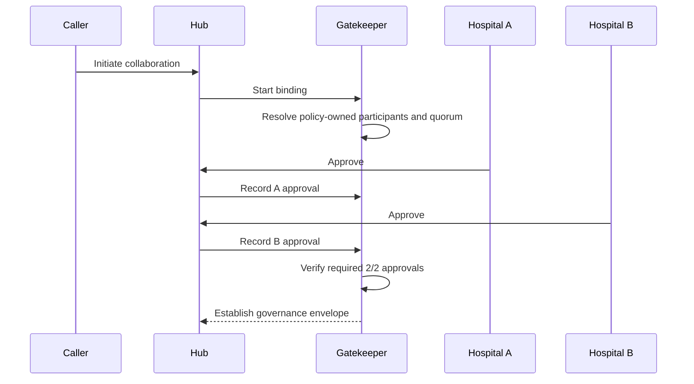

The caller initiates a process whose constitutional conditions already exist. It does not create those conditions by assertion.
## 9. Governance envelope
A governance envelope identifies an approved collaboration context under which operations may be admitted. Capabilities are bound to an `envelope_id`, and the Gatekeeper verifies that the identifier carried by the credential matches the identifier carried by the attempted operation. This prevents authority issued for one collaboration from being reused silently in another.
The envelope is not a training run and it is not a model identifier. Those concepts have different lifecycles. A model can be trained during one analytical run and later be used under another governance envelope that authorises a subsequent operation. Selecting the later envelope means that the current use of the model is governed by that collaboration context. It does not mean that the model was trained under the later envelope and it must not rewrite the historical provenance of the model artefact.
The two lifecycles are therefore related only when an operation requires both.

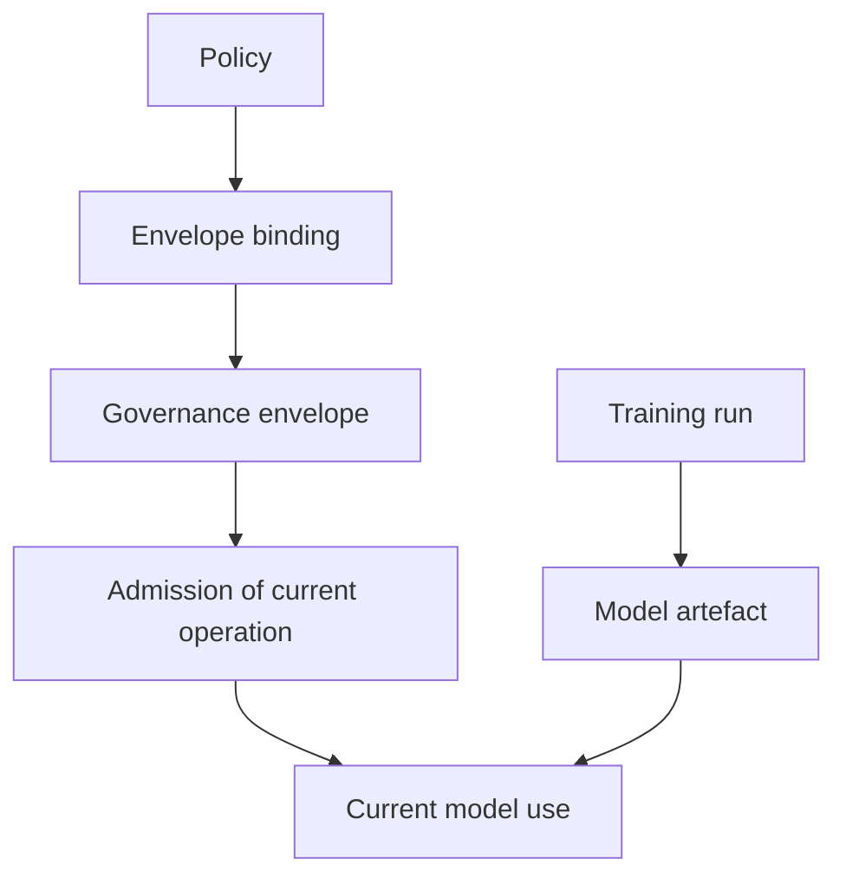

This separation is reflected in the Hub, dashboard state, run registry, tests, and documentation. A cloud port must preserve it.
## 10. Capability issuance
OpenHealth-CDI uses organisation-specific issuers to assign capabilities. The issuer does not accept an arbitrary authorisation profile chosen by the requester. Instead, the requester identifies the subject and governance envelope, and the issuer resolves that subject against its own member registry and entitlement configuration.
The Hospital A and Hospital B issuers therefore represent independent issuing authorities. Their local configuration determines which profile or profiles a registered holder may receive. The mapping from issuer role names to executable policy capability sets is also issuer-controlled.
This design prevents the frontend, Hub, or requester from becoming a hidden authorisation authority. A caller may request issuance, but it cannot enlarge the resulting capability by adding profile, sponsor, or actor metadata to the request.
The process is:

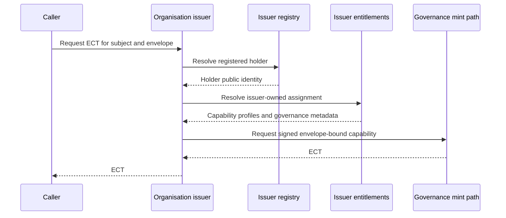

A capability therefore represents authority asserted by an issuer under the federation policy. It is not an arbitrary structure supplied by a caller.
## 11. Holder binding
Issuing a capability to a named subject is not sufficient on its own. The system must also verify that the party exercising the capability controls the holder identity to which the credential was issued.
OpenHealth-CDI therefore uses DPoP holder proof. The issued credential contains confirmation material identifying the holder key, and the request includes a proof produced by that holder. The proof is bound to request properties including the target operation, HTTP method, freshness values, unique request identifier, and governance-envelope context.
Human participants use the separate `holder-signer` component in the reference implementation. Hal maintains its own computational holder identity. These are different mechanisms for producing proof, but the architectural rule is identical. Capability exercise must be bound to the legitimate holder rather than treated as bearer-token possession.
The architecture consequently distinguishes three questions that are often collapsed. mTLS asks which service identity reached a protected network edge. The ECT asks which capability an issuer granted to a governed principal. DPoP asks whether the current request is being exercised by the legitimate holder of that capability.
## 12. Admission
Admission evaluates a concrete attempted operation against the governance authority already compiled into the presented credential. The Gatekeeper verifies the signed ECT and holder proof, checks the `envelope_id` relation and compiled-policy binding, and compares the requested resource, action, purpose, and scope against the capabilities carried by the ECT. Envelope validity, sponsorship, capability assignment, and the ECT lifetime bound are resolved during issuance and are not reconstructed from online governance state at admission.
An ALLOW means that this particular operation is permitted under those conditions. It does not mean that every operation by the same participant is permitted. A DENY means that the attempted relation is outside the admitted authority. It does not mean that the participant is globally excluded from the federation.
The process is therefore relational.

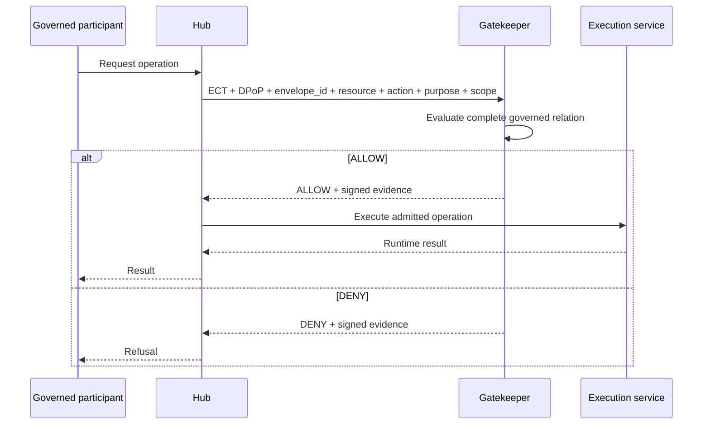

Admission is therefore neither authentication nor execution. It sits between them and determines whether the federation accepts the requested relation.

### 12.1 Stateless admission and distinction from IAM

OpenHealth-CDI separates governance establishment and capability issuance from runtime admission. During setup and issuance, the selected governance envelope is validated, sponsorship conditions are evaluated, capability profiles are compiled into machine-evaluable operations, the credential lifetime is bounded by the envelope lifetime, and the resulting authority is signed into the ECT.

Admission does not reconstruct those governance decisions. The Gatekeeper does not query a participant directory, retrieve current roles or group memberships, resolve an `envelope_id` into mutable governance state, or contact the issuing organisation to determine what the requester may do. The `envelope_id` is an opaque relation identifier whose consistency is verified across the ECT, holder proof, and attempted operation. Authority is carried by the signed ECT and evaluated against the locally compiled governance policy.

This is the principal distinction from conventional Identity and Access Management. An IAM decision commonly derives current authority from centrally maintained identity, role, group, session, or entitlement state. OpenHealth-CDI instead verifies authority already established by independently governed issuers and presented as a holder-bound capability. The admission boundary therefore verifies a governed relation rather than reconstructing requester authority from an online authorization store.

Admission is stateless with respect to governance and authorization state. Every ALLOW is determined from the presented ECT, holder proof, requested operation, opaque `envelope_id`, and locally compiled policy rather than from mutable authority state. This is the sense in which the FLICS and JMIR architectures describe stateless admission.

DPoP anti-replay introduces one deliberately bounded form of mutable runtime security state. A presented proof identifier is recorded for its freshness window so that the same proof cannot be exercised more than once. This replay state does not supply, enlarge, or reconstruct authority. Failure to access the replay store is fail-closed. Gatekeeper replicas therefore require no shared governance or authorization database, although strict cross-replica single-use DPoP requires a consistent replay domain or deterministic routing.

Signed decision evidence is persisted after evaluation. Evidence persistence records the result but is not consulted to determine the authority of subsequent requests.Because envelope state is resolved at issuance rather than admission, changing or removing an envelope after an ECT has been issued does not independently revoke that credential. Its authority remains bounded by the ECT lifetime, which cannot exceed the envelope lifetime established at issuance. A Gatekeeper running under a different compiled policy hash rejects credentials issued under the previous policy. Immediate fine-grained credential revocation would require a separate mechanism and is not provided by the reference implementation.

## 13. The verifier mTLS trust boundary
The verifier is reached through an nginx mTLS edge. nginx terminates TLS, validates the client certificate against the configured federation CA, obtains the verified subject DN from the TLS session, and forwards protected operations only when the endpoint-specific identity requirement is satisfied.
For example, `/admission/check` accepts the Hub identity rather than arbitrary network callers. Administrative routes accept the relevant founding-organisation administrator identities. The Gatekeeper therefore receives requests through a boundary where transport identity has already been established by cryptographic verification.
This architecture does not mean that a TLS certificate is sufficient to authorise the requested federation operation. mTLS establishes who is calling the protected service edge. The ECT, DPoP proof, policy, and admission request determine what the governed principal is authorised to do.
The trust path is:

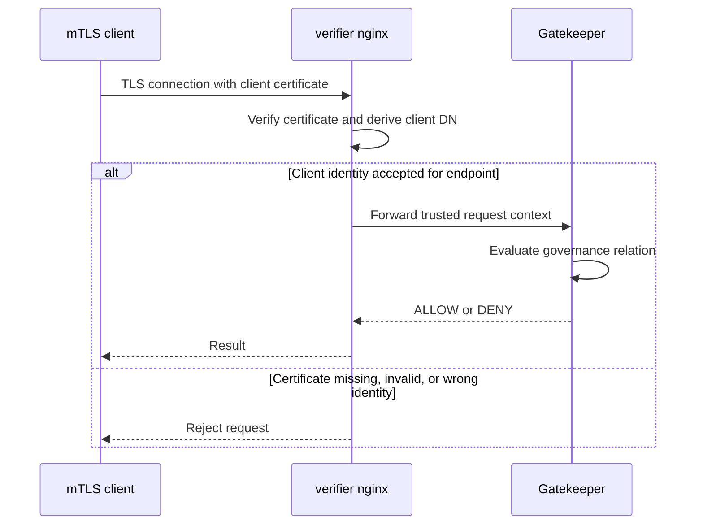

This boundary becomes particularly important when the system is ported to AWS. Moving TLS termination to another component changes where authenticated identity is established. Such a change is not automatically equivalent to the current trust model even if HTTP traffic continues to work.
## 14. Network topology and trust boundaries
The local deployment uses two Docker networks named `fc` and `agent-edge`. Federation-internal services such as the Gatekeeper, issuers, holder-signer, Redis, and Flower runtime reside on `fc`. Hal resides on `agent-edge`. The Hub is connected to both networks so that it can mediate between the agent execution domain and the governed federation services.
The architectural invariant is not the Docker network names. The invariant is that Hal does not obtain the normal privileged federation-internal service path while the Hub remains the intended application aperture through which Hal participates in governed operations.
The topology is:

```mermaid
flowchart LR
    subgraph AG["Agent execution domain"]
        Hal["Hal"]
    end

    Hub["fc-hub<br/>connected to both domains"]

    subgraph FC["Federation-internal domain"]
        VP["Verifier proxy"]
        GK["Gatekeeper"]
        IP["Issuer proxy"]
        IA["Issuer A"]
        IB["Issuer B"]
        HS["Holder-signer"]
        R["Redis"]
        F["Flower server"]
    end

    LLM["External reasoning runtime"]

    Hal <--> Hub
    Hal <--> LLM

    Hub --> VP
    VP --> GK
    Hub --> HS
    Hub --> F
    IA --> IP
    IB --> IP
    IP --> VP
    GK <--> R
```

Removing Docker and replacing it with another infrastructure is permitted. Removing the separation between the agent execution domain and privileged federation services is not equivalent.
## 15. Network reachability is not governance authority
The architecture deliberately distinguishes physical reachability from authority. Hal is not attached to the internal `fc` Docker network and therefore lacks the normal container-level routes to federation-internal services. Some federation edges are nevertheless published through the host, and host routing may make a TCP connection physically possible from contexts outside the intended Docker network.
Such reachability does not establish federation authority. The published verifier and issuer edges require authenticated client certificates and accepted identities. A process capable of reaching a TCP port but unable to present the required identity has not acquired the right to invoke the protected operation.
The correct architectural statement is therefore that network topology constrains available paths while cryptographic authentication constrains accepted identities. These controls complement one another. OpenHealth-CDI does not claim that every possible packet from Hal to every host-published address is physically impossible.
This distinction is essential for interpreting `Test5A_agent_isolation.sh` and for translating the topology to AWS security groups.
## 16. Federated execution
The analytical workload used by the reference implementation is PathMNIST federated learning. Hospitals run Flower clients against local data partitions while the Flower server coordinates model updates. The raw training data remain in the participant environments rather than being centralised as a prerequisite for training.
The runtime is useful because it provides a real distributed operation against which the governance model can be exercised. It should not be mistaken for the federation architecture itself. Flower, its internal ports, the number of training rounds, optimizer choices, GPU configuration, and sample allocation are operational choices.
The important architectural relation is that independently governed participants contribute to a shared operation under explicitly admitted authority.

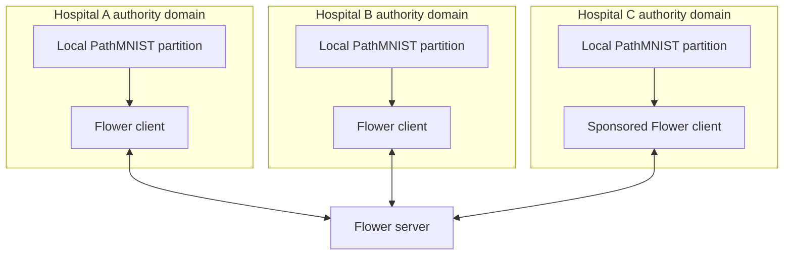

The three Flower clients may look operationally similar, but they do not necessarily have the same governance standing.
## 17. Mode 1A and sponsored participation
Mode 1A demonstrates how the federation can accept a new contributor without redefining the constitutive collaboration. Hospital C does not join the founding A+B governance relation. Instead, Charlie participates through a guest-contributor capability issued by Hospital A and sponsored by Hospital A, while Hospital C remains the contributor's institutional provenance.
Issuer, sponsor, provenance, and membership therefore remain separate concepts. Hospital A issuing the capability does not erase Hospital C provenance. Hospital A sponsoring Charlie does not make Hospital C a sponsor. Hospital C providing provenance does not make it a founding member. Charlie being allowed to submit a federated update does not give Charlie or Hospital C model-consumption authority.
The architecture can therefore express differentiated participation instead of forcing every new participant into one homogeneous membership list.

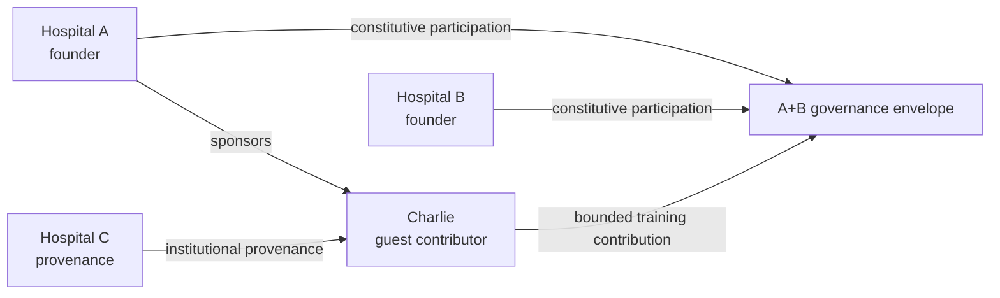

This relation is one of the principal examples of why the architecture cannot be inferred from process inventory alone.
## 18. Contribution is distinct from consumption
Mode 1A also demonstrates that participation in one operation does not imply participation in every operation over the resulting resources. Hospital C can contribute to federated training without thereby receiving custody of the resulting model, the right to download the model, or general query authority.
The same principle applies more broadly. Capability is operation-specific. `submit_update`, `query_model`, `bounded_inference`, `unbind`, and `consume_derivative` are different governed actions and may be granted to different participants under different scopes.
This separation is a core architectural invariant because otherwise adding one operational right would silently amplify authority over unrelated resources.
## 19. Mode 1B and governed computational participation
Mode 1B introduces Hal as a computational participant. Hal has its own holder identity and receives the `capset:pathmnist_bounded_agent` profile under sponsorship by Hospitals A and B. The current capability permits bounded inference and policy-authorised Unbind over the tissue classes defined by policy. It does not grant founding membership, quorum rights, general model-query authority, or privileged governance operations.
Hal is therefore treated as another governed participant rather than as a special authority category. The fact that Hal is computational changes its execution implementation but does not replace the underlying admission model.

The terminology used for computational participation is intentionally separated from governance authority:

- **AI agent** denotes the broad class of computational agents.
- **Governed agent** denotes the architectural role of an autonomous computational participant whose operations on governed resources remain subject to independently evaluated admission conditions.
- **Bounded Agent** denotes the Mode 1B demonstrator using a predefined bounded task path.
- **LLM Agent** denotes the Mode 1B demonstrator using contextual LLM reasoning for action selection.
- **Gatekeeper** denotes the component that evaluates admission. Neither the Bounded Agent nor the LLM Agent exercises governance authority.

Both Mode 1B agent paths use the same holder-binding, capability, Gatekeeper, and evidence architecture. The distinction concerns execution and action selection, not the source of authority.

The important relation is:

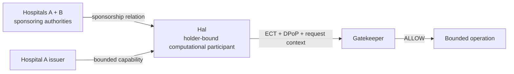

Hal's authority comes from the capability and admission relation shown here. It does not come from being described as an AI agent.
## 20. Hal is the governed participant, not the LLM
Hal can use an external LLM as a reasoning runtime. This runtime helps select an intended action from a finite set made available by Hal. It is deliberately outside the federation-governance model.
The LLM does not receive federation membership. It does not receive an ECT. It does not hold Hal's federation authority. It does not become a sponsor, issuer, or Gatekeeper. Changing from one LLM provider or model to another therefore need not change the federation architecture.
The distinction is especially important because execution intelligence and governance authority are different dimensions. A more capable model does not acquire more federation authority simply because it can generate a more sophisticated plan.
The current design can be represented as follows.

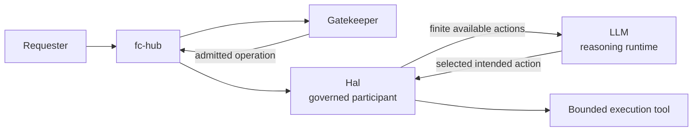

The LLM influences execution. It does not enlarge the set of actions admitted by governance.
## 21. Context-dependent agent behaviour
The contextual Mode 1B scenario demonstrates that the correct operation cannot be determined from Hal's identity alone. The same Hal instance handles requests from Audrey and Bob over different tissue classes. Audrey has direct source-query authority over selected other-tissue classes, while Bob has direct source-query authority over cancer-associated classes. Both possess derivative-consumption authority.
As a result, Audrey requesting mucus can receive the source directly, whereas Audrey requesting colorectal adenocarcinoma epithelium is denied the source and follows a governed derivative path. Bob exhibits the complementary behaviour for those same classes.
The important architectural result is that Hal remains the same object in every case. What changes is the relation among requester, resource, capability, purpose, and governance context. The operation follows the relation rather than an intrinsic behavioural label attached to the agent.

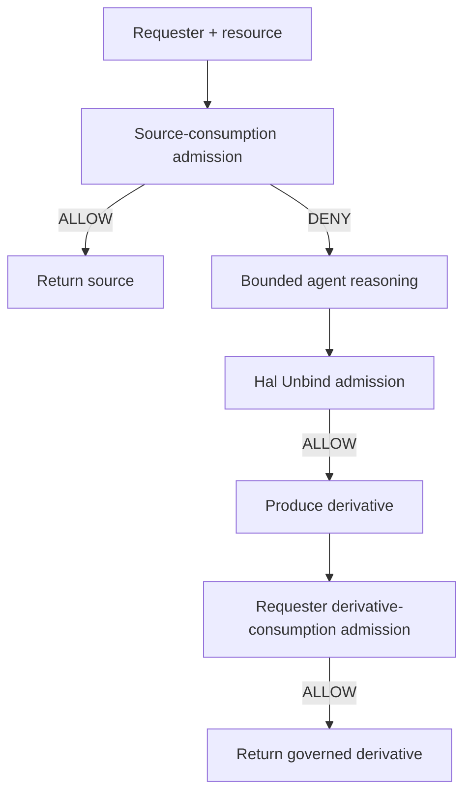

This is the principal architectural extension implemented after the JMIR manuscript was completed.
## 22. Transformation is distinct from release
The derivative path intentionally separates source access, transformation, and release. If source access is denied, that denial does not automatically authorise Hal to transform the resource. Hal's `unbind` operation must itself be admitted. If that transformation is allowed and a derivative is produced, the derivative still cannot be returned automatically to the requester. The requester must separately be admitted for `consume_derivative`.
This creates three independent governance decisions where a less rigorous architecture might contain only one. The separation prevents transformation authority from becoming a privilege-amplification mechanism.
The sequence is:

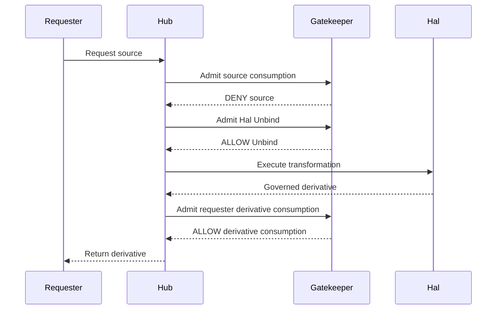

The original source remains denied throughout this sequence. The final ALLOW applies to a different governed resource and operation.
## 23. Source and derivative are different governed resources
A derivative is related to its source through provenance, but it is not governed as though it were simply the same resource with a different file format. The current policy identifies the source resource as `pathmnist-colon-pathology` and the derivative resource as `pathmnist-derived-representation`.
This separation allows a requester to be denied source consumption while being authorised to consume a policy-approved derivative. It also prevents the existence of a derivative from being interpreted as automatic release authority.
The architecture therefore preserves both continuity and distinction. The derivative remains attributable to the source operation, but its consumption is independently governed.
## 24. Model lifecycle and governance-envelope lifecycle
The model lifecycle begins with an analytical run and produces an artefact that may persist after the run completes. The governance-envelope lifecycle begins with approval of a collaboration context and determines which operations may currently be performed. These lifecycles can overlap, but neither contains the other.
For example, a model produced during an earlier A+B run can later be used under a newly established governance envelope. The later envelope determines whether Audrey, Bob, or Hal may perform a current operation over that model. It does not imply that the model was trained under the later envelope.
This distinction must remain visible in runtime state, evidence, dashboard presentation, and cloud deployment because conflating the two would fabricate provenance.
## 25. Evidence as part of the architecture
OpenHealth-CDI records signed ALLOW and DENY decision evidence. These records are not merely debugging logs. They make the result of governance evaluation independently inspectable and allow the conformance suite to verify that a successful or rejected operation corresponds to a recorded admission decision.
Evidence is particularly important because the architecture contains negative invariants. It is not sufficient to show that authorised operations succeed. The reference implementation must also demonstrate that out-of-scope operations are rejected and that the rejection is attributable to the expected governance rule.
Examples include rejection of caller-selected capability profiles, caller-selected sponsorship, holder mismatch, replay, stale DPoP proofs, source-scope violations, and privileged operations attempted by Hal.
The architecture therefore treats the decision record as part of the governed operation rather than as optional observability data.
## 26. Executable conformance
The repository includes tests that exercise the major architectural boundaries. `Test2E_fcac_conformance.sh` checks the shared admission-governance substrate. `Test4C_sponsorship_regression.sh` verifies that sponsorship, issuer identity, provenance, and membership remain distinct. `Test5A_agent_isolation.sh` verifies the Mode 1B execution boundary. `Test5C_agent_credential_admission.sh` checks Hal's holder-bound capability relation. `Test5D_mode1b_table7_conformance.sh` makes the five Mode 1B governance requirements executable. `Test5E_mode1b_contextual_agent.sh` exercises the same agent across different requester-resource relations.
These tests provide evidence for selected invariants of the local implementation. They should not be interpreted as proving every property of every future deployment. In particular, infrastructure-specific tests must be adapted when Docker network mechanisms are replaced by AWS networking mechanisms.
Detailed prerequisites, commands, expected results, and evidence interpretation are documented in [TESTING.md](TESTING.md).
## 27. Implementation choices versus architectural constraints
A deployment mechanism is not automatically part of the architecture. The correct question is whether changing that mechanism changes an observable governance or trust-boundary invariant.
The current local implementation can be classified as follows.

| Current mechanism | Architectural interpretation |
| --- | --- |
| Docker | implementation choice |
| network name `fc` | implementation choice |
| separate federation-internal connectivity | architectural constraint |
| network name `agent-edge` | implementation choice |
| Hal separated from privileged federation services | architectural constraint |
| Hub connected to both execution domains | current realization of controlled aperture |
| Hub port `8080` | implementation choice |
| local loopback publication | local realization of restricted ingress |
| nginx | implementation choice |
| authenticated identity at governance trust edge | architectural constraint |
| verifier port `8443` | implementation choice |
| mTLS trust semantics | architectural constraint |
| Redis | implementation choice |
| Hal excluded from privileged Redis access | architectural constraint |
| Flower | implementation choice |
| independently governed contribution | architectural constraint |
| OpenAI reasoning runtime | implementation choice |
| LLM unable to enlarge Hal authority | architectural constraint |
| local filesystem model storage | implementation choice |
| model provenance distinct from envelope lifecycle | architectural constraint |

This distinction is the basis of [AWS-PORTING.md](AWS-PORTING.md). The cloud deployment should not attempt to reproduce Docker mechanically. It must reproduce the constraints that Docker currently helps enforce.
## 28. Architectural failure patterns
Several technically plausible modifications would change or invalidate the architecture even if the application continued to run. Attaching Hal directly to the federation-internal service domain would weaken the controlled-aperture relation. Allowing the frontend or Hub to choose the effective capability profile would violate issuer ownership. Treating Hospital C as an ordinary founding member would eliminate the Mode 1A distinction. Treating the LLM-selected action as an authorisation result would move governance authority into the reasoning runtime. Returning a derivative immediately after transformation would collapse Unbind and release. Treating the currently selected envelope as the provenance of an older model would merge governance and analytical lifecycles. Terminating mTLS at another infrastructure layer without preserving trusted client-identity semantics would move the trust boundary and require explicit revalidation.
These are architectural failures because they alter authority-bearing relationships. By contrast, changing a port number, replacing Redis, changing Flower versions, modifying training rounds, replacing the frontend, or replacing the LLM can be legitimate operational changes if the same invariants remain true.
## 29. Local source-code map
The principal implementation locations are shown below so that the architectural description can be traced directly to code.

| Architectural concern | Repository path |
| --- | --- |
| local infrastructure topology | `src/infra/tofu/main.tf` |
| Hub orchestration | `src/vfp-core/hub/hub.py` |
| frontend | `src/vfp-core/frontend/` |
| issuer implementation | `src/vfp-core/issuers/issuer.py` |
| issuer entitlement configuration | `src/vfp-core/issuers/config/` |
| Hal | `src/vfp-core/agents/hal/hal.py` |
| executable policy | `src/vfp-governance/verifier/state/policy.json` |
| constitution | `src/vfp-governance/verifier/state/constitution.json` |
| institutional MOU | `src/vfp-governance/verifier/state/MOU.txt` |
| Gatekeeper | `src/vfp-governance/gatekeeper/app.py` |
| verifier mTLS edge | `src/vfp-governance/verifier/nginx/nginx.conf` |
| holder-signer | `src/vfp-governance/signer/signer.py` |
| conformance tests | `src/tests/` |

The repository contains historical prefixes such as `fcac` and `vfp`. These names should not be used to infer architectural scope. The delivered system is documented as OpenHealth-CDI and its architecture is defined by the relations described here.
## 30. Portability principle
The safest way to port or refactor OpenHealth-CDI is to identify the invariant currently implemented by each mechanism before replacing that mechanism. Docker network separation may become ECS task networking and security groups. Local nginx may remain nginx behind an NLB or later be replaced by another identity-preserving trust edge. Redis may become a managed service. Flower may be upgraded or substituted. Hal's LLM may change.
What must remain unchanged is the meaning of participation and authority. Hal must not gain privileged federation access because its container technology changes. An infrastructure load balancer must not silently become the source of an unauthenticated identity header. Hospital C must not become a founding member because deployment topology changes. A derivative must not become automatically releasable because storage moves to S3. A model must not acquire fictitious governance provenance because run metadata is migrated.
The porting rule is therefore:
> **Replace mechanisms freely where appropriate, but preserve every authority-bearing relation and trust-boundary invariant explicitly.**
The detailed AWS realization of this principle is documented in [AWS-PORTING.md](AWS-PORTING.md).
## 31. Architectural summary
OpenHealth-CDI is a federation architecture because independently governed domains participate in shared operations while retaining authority over their own resources and participation conditions. The architecture is not defined by the presence of hospitals, containers, datasets, models, agents, or certificates. Those objects are the material on which the architecture operates.
Hospitals A and B constitute the collaboration through policy-owned governance. Hospital C can contribute through sponsorship without becoming constitutionally equivalent to the founders. Audrey and Bob can hold different source-consumption rights while sharing derivative-consumption rights. Hal can participate computationally without making the LLM a federation principal. Capability issuance remains issuer-owned. Capability exercise remains holder-bound. Admission remains distinct from authentication and execution. Transformation remains distinct from release. Model provenance remains distinct from the governance context of later use. Network topology constrains execution paths without being mistaken for authority. Signed evidence records the result of the governed relation.
The architecture should therefore be understood as a set of invariants over relations among participants, authorities, resources, operations, and evidence. The implementation inventory may evolve significantly while those relations remain intact.
The shortest statement of the architecture is:
> **Do not preserve the inventory of objects. Preserve the relations that make those objects a governed federation.**
