# OpenHealth-CDI Architecture and Trust Boundaries

## 1. Purpose

This document describes the architecture of the OpenHealth-CDI research reference implementation.

The architecture is not defined by its inventory of containers, services, users, datasets, models, credentials, agents, or network interfaces. Those objects are necessary to implement and exercise the system, but they do not by themselves define a federation.

The architecture is defined by the **relations and invariants that must hold when operations cross independently governed domains**.

This distinction is fundamental.

An inventory answers questions such as which services exist, which ports they use, where a model is stored, or which process executes an operation.

An architecture answers different questions. It establishes who may interact with whom, under whose authority, for what purpose, within what scope, through which governed path, subject to which conditions, and with what evidence.

The implementation can therefore change substantially while preserving the architecture. Docker may become ECS. Redis may be replaced. Flower may be upgraded or substituted. The React frontend may disappear. An OpenAI reasoning runtime may become another model or another service. None of these substitutions necessarily changes the federation architecture.

Conversely, a deployment may contain exactly the same objects and nevertheless violate the architecture if one relation changes. Giving Hal direct privileged access to federation services, treating Hospital C as a founding member, allowing a caller to define its own capability, or returning a derivative without independently admitting its consumption would all change the architecture even if every container remained present.

The primary reading rule for this document is therefore:

> **Objects realise the system. Relations define the federation. Invariants define the architecture.**

The root [README](../README.md) provides the short project overview. This document provides the complete architectural interpretation of the implemented system.

---

## 2. Scope and non-claims

OpenHealth-CDI is a **research reference implementation** of governed cross-organizational Federated Computing.

It is not a production deployment, an MVP, a clinical system, a general-purpose agent-security framework, or evidence of clinical effectiveness.

Its architectural purpose is narrower and more precise. It makes governance relations executable and allows their preservation or violation to be tested.

The implementation demonstrates:

- independently governed organisational participation
- policy-owned federation constitution
- explicit capability issuance
- holder binding and DPoP
- admission before governed operations
- signed ALLOW and DENY evidence
- sponsored contribution without membership equivalence
- separation of contribution and consumption authority
- bounded participation by a computational agent
- separation between the governed agent and its reasoning runtime
- independently governed transformation and derivative release
- separation between model lifecycle and governance-envelope lifecycle
- network and cryptographic boundaries that make the admitted path load-bearing

The implementation does **not** claim that admission governance solves model alignment, prompt injection, arbitrary code containment, tool safety, model correctness, hallucination, or general-purpose AI-agent safety.

Those are separate concerns.

---

## 3. Architecture is not an object inventory

A common way to describe a distributed system is to enumerate its components.

OpenHealth-CDI contains organisations, users, a dashboard, a Hub, issuers, credentials, a verifier, policies, envelopes, Redis, Flower clients and server, models, datasets, a signer, an AI agent, an LLM reasoning runtime, network interfaces, certificates, decisions, and evidence.

That list is useful operationally. It is insufficient architecturally.

The same object may participate in different relations. Different objects may participate in the same relation. Adding an object does not necessarily add a new architectural category.

Examples are important here.

| Inventory statement | Architectural statement |
| --- | --- |
| Hospital A and Hospital B exist | A and B are the constitutive participants whose governed approval establishes the founding collaboration |
| Hospital C exists and runs a Flower client | C participates through sponsorship and contribution authority without becoming equivalent to a founding member |
| Charlie is a user | Charlie's relevant standing is the sponsored contributor relation under Hospital A with Hospital C provenance |
| Hal is a process in a container | Hal is a governed computational participant whose operations remain bounded by admitted capability |
| An LLM is called by Hal | The LLM is an execution mechanism and does not acquire federation standing or authority |
| An ECT exists | Its architectural meaning is the capability relation that an issuer asserts for a holder within a governed envelope |
| A DPoP signature exists | It binds exercise of capability to the holder rather than making possession of a token sufficient |
| Redis exists | State transport or persistence does not grant Redis governance authority |
| Flower exists | Federated learning is one governed operation, not the definition of federation |
| A model file exists | A model artefact has a lifecycle distinct from the governance envelope under which later operations may be admitted |
| Two Docker networks exist | The relevant invariant is separation of agent execution from privileged federation services, with the Hub acting as the controlled aperture |
| nginx exists | The relevant invariant is that client identity at the governance edge is authenticated before protected operations are accepted |
| A derivative image exists | Production of a derivative and permission for a requester to consume that derivative are distinct governed relations |

The object inventory changes from A+B to Mode 1A and again to Mode 1B.

The architectural invariants do not.

This is the point of the three executable modes.

---

## 4. Federated Computing as an architecture of relations

OpenHealth-CDI treats federation as collaboration across independently governed computational domains.

The defining issue is not whether the system contains datasets, models, agents, services, credentials, or distributed processes. The same objects can exist in a centralized system.

The defining issue is that autonomous domains retain authority over their own resources while participating in shared operations.

The relevant questions are therefore relational:

- who may participate
- under whose authority
- for which purpose
- over which resource
- within which scope
- through which operation
- under which governance context
- with which capability
- bound to which holder
- with which sponsorship or provenance relation
- with which evidence

A useful abstract view is:

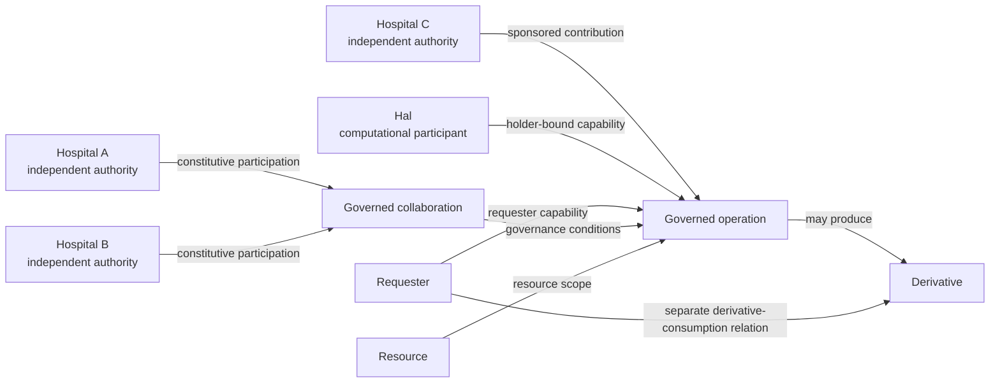

The objects on the diagram are not the architecture.

The labelled arrows are closer to the architecture.

The invariants governing those arrows are the architecture.

---

## 5. Architectural invariants

The following invariants form the architectural contract of the current implementation.

### INV-01 — Authority is distinct from execution

Executing an operation does not create authority to perform it.

A Flower client, a Python process, Hal, an LLM runtime, or any other computational mechanism may be technically capable of performing an operation. Technical capability is not federation capability.

Authority must derive from the admitted governance relation.

### INV-02 — Independent domains retain authority

Participation in a federation does not imply transfer of general authority to a central platform.

Hospital A, Hospital B, and Hospital C remain independently governed domains.

The shared platform coordinates governed operations. It does not erase the distinction between organisational authorities.

### INV-03 — Federation constitution is policy-owned

A caller may initiate federation establishment but does not define the constitutive participants or quorum through arbitrary request parameters.

The governing policy owns those conditions.

For the delivered A+B baseline, Hospitals A and B form the constitutive collaboration and the required approval structure is derived from policy.

This prevents federation constitution from becoming a caller assertion.

### INV-04 — Admission precedes the governed operation

A protected operation must not be treated as authorised merely because the caller can reach the service capable of executing it.

Admission evaluates the relevant governance relation before the operation is accepted.

This is why the admitted route must be load-bearing rather than decorative.

### INV-05 — Authentication, capability, and admission are distinct

Authentication establishes an identity at a trust boundary.

A capability describes an allowed class of operations and scope.

Admission evaluates whether a concrete attempted operation is permitted under the current governance context.

These are related but not interchangeable.

A valid TLS client certificate does not itself grant a federation operation.

Possession of a capability object does not by itself establish holder possession.

Technical reachability does not establish admission.

### INV-06 — Capability is issuer-owned

A caller must not be able to enlarge its authority by supplying arbitrary entitlement fields.

Issuer-owned entitlement configuration determines the capability material that can be issued.

The caller requests a capability. It does not authorise itself.

### INV-07 — Capability exercise is holder-bound

A capability is not treated as a bearer token.

DPoP binds its exercise to the holder identity and to the relevant request context.

The implementation tests replay resistance, freshness, holder binding, and envelope binding separately.

### INV-08 — Sponsorship is not membership

Sponsorship creates a specific governed relation.

It does not silently turn a sponsored participant into a constitutive federation member.

Hospital C can therefore contribute in Mode 1A without being promoted to the same constitutive standing as Hospitals A and B.

### INV-09 — Sponsorship is not delegation of arbitrary sponsor authority

A sponsored participant receives only the authority explicitly represented by the sponsorship and capability relations.

The sponsor does not transfer its full authority.

The sponsored participant does not become the sponsor.

Provenance remains distinct from sponsorship.

### INV-10 — Contribution and consumption are independent dimensions

Permission to contribute to a federated activity does not imply permission to consume the resulting model or another governed resource.

Mode 1A depends on this distinction.

Hospital C can contribute under sponsorship while remaining outside the model-consumption relation.

### INV-11 — Object type does not determine authority

Being a human, organisation, service, process, or AI agent is descriptive metadata.

It is not an authorisation rule.

A human participant may have a narrow relation. A computational participant may have a different narrow relation. Neither receives authority merely from its object type.

This becomes particularly important in Mode 1B.

### INV-12 — Hal is the governed participant, not the LLM

Hal has federation standing as the governed computational participant.

The LLM reasoning runtime is an execution mechanism used by Hal.

The LLM does not possess an ECT merely because Hal calls it.

It does not become a federation member.

It does not acquire the right to contact privileged federation services.

It does not enlarge Hal's authority.

Changing the LLM implementation therefore need not change the governance architecture.

### INV-13 — Execution cannot enlarge admitted authority

A reasoning runtime may select an intended action. A tool may be technically able to transform a resource. A process may know how to construct a request.

None of those execution facts can make an operation admissible.

The set of operations that can be executed through the governed path must remain bounded by admitted authority.

### INV-14 — The agent execution path is separate from privileged federation services

Hal is attached to the `agent-edge` execution domain.

Privileged federation services reside on the `fc` domain.

The Hub is attached to both and forms the controlled operational aperture.

Hal is not attached directly to the `fc` Docker network.

This prevents the normal agent execution path from becoming an alternative privileged federation path.

The invariant is the separation.

Docker networks are one implementation of that invariant.

### INV-15 — Network reachability is not authority

Physical or TCP reachability and federation authority are different properties.

Docker-internal federation services are outside Hal's `agent-edge` network.

Some host-published mTLS edges may nevertheless be reachable at the network level depending on host routing.

That does not make them usable.

Protected operations require an accepted client certificate and expected client identity.

The architecture therefore does not claim that Hal can never send a packet toward every published host port. It claims that Hal has neither the privileged internal service path nor the authenticated federation identity required to turn such reachability into authority.

### INV-16 — Transformation and release are separate governed operations

Producing a derivative does not imply that a requester may consume it.

Mode 1B therefore separates:

1. the source-consumption attempt
2. the agent's transformation or rebind operation
3. requester admission for consumption of the governed derivative

This distinction prevents transformation from becoming an implicit release mechanism.

### INV-17 — Source and derivative are different governed resources

A derivative does not inherit the source's governance relation automatically.

Its provenance must remain connected to the source while its permitted consumption can be evaluated independently.

### INV-18 — Model lifecycle and governance-envelope lifecycle are distinct

A model artefact can outlive the envelope under which it was trained.

A later governance envelope may govern an operation over an existing model.

That does not imply that the model was trained under the later envelope.

The architecture must not fabricate such provenance.

A selected governance envelope and a selected model/run reference are therefore separate state dimensions.

### INV-19 — Governance state and execution state are distinct

Policy, envelope state, sponsorship, capability, and admission evidence are governance state.

Training progress, model artefacts, prediction outputs, and runtime status are execution state.

They may be correlated, but one must not be substituted for the other.

### INV-20 — Evidence is part of the governed operation

ALLOW and DENY results are not merely UI messages.

The implementation records decision evidence so that the result of admission can be inspected independently from the execution path.

A successful operation without corresponding governance evidence would weaken the reference implementation's claim.

### INV-21 — Federated learning is an operation, not the architecture

Flower implements the federated-training runtime used by the reference scenario.

The federation architecture does not depend conceptually on gradients, aggregation, rounds, or learning.

Another governed distributed operation could use the same architecture of relations.

---

## 6. Current system context

The current implementation can be viewed as four interacting planes:

1. access and presentation
2. governance and admission
3. federated execution
4. agent execution

These planes are related, but they should not be collapsed.

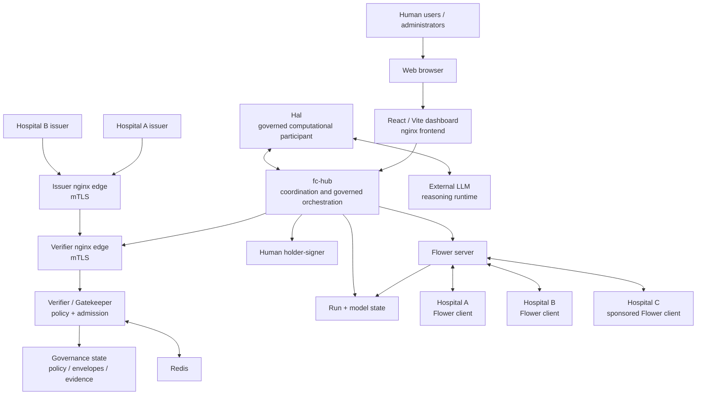

This diagram is intentionally functional rather than pictorial.

The key architectural question is not where a box appears. It is which arrows are permitted and which arrows must not exist.

---

## 7. Component inventory and architectural responsibility

The component inventory is useful once its limitations are understood.

### 7.1 Dashboard

Implementation area:

`src/vfp-core/frontend/`

The dashboard presents federation state, scenarios, training state, events, evidence, and model-use interactions.

It is not a governance authority.

Removing private holder-key material from the frontend is intentional. The browser-facing component must not become a holder-key repository merely because that is convenient for a demonstration.

The dashboard can initiate requests.

It cannot make those requests authoritative by presentation.

### 7.2 Hub

Implementation area:

`src/vfp-core/hub/`

Container:

`fc-hub`

The Hub coordinates the application-level workflow.

It is the principal controlled aperture between user-facing operations, governance services, federated runtime services, and the Mode 1B agent boundary.

The Hub is dual-homed in the local implementation.

It is attached to:

- `fc`
- `agent-edge`

Hal is attached only to `agent-edge`.

Most privileged federation services are attached only to `fc`.

This topology is architectural because it prevents the agent process from simply choosing an alternative privileged service path.

The Hub is powerful operationally.

It is not the source of policy authority.

It submits operations to the governance path and acts on admission outcomes.

### 7.3 Verifier proxy

Implementation:

`src/vfp-governance/verifier/nginx/nginx.conf`

The verifier nginx proxy is the mTLS trust edge in the local implementation.

It terminates TLS and obtains the authenticated client-certificate state directly from the TLS session.

Protected routes explicitly require successful certificate verification and constrain accepted subject DNs.

For example, the admission endpoint accepts the Hub identity rather than arbitrary callers.

The nginx configuration globally allows optional client certificates because some public or diagnostic routes exist. Protected locations independently require successful client verification.

That distinction must not be lost during deployment changes.

The proxy does not decide the federation policy itself.

It establishes the trusted client identity presented to the gatekeeper and constrains which identities may invoke protected apertures.

### 7.4 Verifier / Gatekeeper

Implementation:

`src/vfp-governance/gatekeeper/app.py`

Container:

`verifier-app`

The Gatekeeper evaluates the governed relation for attempted operations.

Its responsibilities include governance-envelope processing, admission evaluation, policy interpretation, evidence generation, and related state transitions.

The Gatekeeper is intentionally separated from the runtime that performs federated training or agent reasoning.

Admission must remain meaningful even if the execution engine changes.

### 7.5 Issuer proxy

Implementation area:

`src/vfp-core/issuers/nginx/`

The issuer proxy is the mTLS edge for issuer-facing operations.

Like the verifier edge, it is an implementation of a trust-boundary invariant rather than the invariant itself.

### 7.6 Hospital A and Hospital B issuers

Implementation area:

`src/vfp-core/issuers/`

Containers:

- `issuer-hospitala`
- `issuer-hospitalb`

The issuers derive capability material from issuer-owned entitlement configuration.

The caller does not supply arbitrary effective entitlements.

The issuers verify TLS when communicating with the verifier path and are configured fail-closed if the trusted CA material is unavailable or verification is disabled.

The architectural property is issuer ownership of capability assertions.

The Python process implementing an issuer is replaceable.

### 7.7 Human holder-signer

Implementation area:

`src/vfp-governance/signer/`

Container:

`holder-signer`

The reference implementation uses a separate signing service to hold human participant private keys and generate DPoP proofs.

The signer owns the `iat` value placed in the proof rather than accepting caller-supplied signing time.

This component simulates a stronger custodial boundary.

It is not presented as production HSM, WebAuthn, hardware-backed key custody, or a complete key-management system.

The architectural invariant is that holder proof is produced under holder-key control and is not reducible to a caller-supplied token string.

### 7.8 Redis

Container:

`redis`

Redis supports shared runtime and governance coordination.

It is attached to the `fc` network.

Redis is not a federation authority.

Its existence, replacement, or internal persistence strategy does not alter the architecture provided that the governance and isolation invariants remain intact.

Hal must not gain Redis access merely because Redis is operationally convenient.

### 7.9 Flower server

The Flower server coordinates the federated-learning runtime.

It handles the aggregation-side execution of the PathMNIST scenario.

Its port numbers, aggregation implementation, and training parameters are runtime choices.

The architectural requirement is not that Flower exists.

The relevant requirements are that governed participants enter the operation under the appropriate relation, that local data remain local to their participant sites, and that contribution authority is not confused with constitutive membership or model-consumption authority.

### 7.10 Hospital Flower clients

Hospitals A, B, and C all execute Flower-client processes.

This is an especially important example of why object type cannot define federation standing.

At the process level, all three may look like "Flower clients".

At the governance level, they are not equivalent.

Hospitals A and B are constitutive participants in the baseline collaboration.

Hospital C is a sponsored contributor in Mode 1A.

The runtime object class is therefore insufficient to determine the governance relation.

### 7.11 Hal

Implementation:

`src/vfp-core/agents/hal/hal.py`

Container:

`hal`

Hal is the governed computational participant introduced in Mode 1B.

Hal maintains its own Ed25519 holder identity.

It can produce DPoP proof bound to its identity and the governance request context.

It provides bounded execution functions used by the scenario, including reasoning selection and image transformation.

Hal is attached to `agent-edge`, not to `fc`.

The object "Hal" is not intrinsically privileged because it is an agent.

Its authority derives from the capability and admission relation under which a concrete operation is attempted.

### 7.12 LLM reasoning runtime

The current Hal implementation can invoke an external OpenAI reasoning runtime.

This runtime is explicitly outside the federation-governance authority model.

Hal supplies a finite set of available actions to the reasoning runtime.

The runtime selects among those actions.

The Hal implementation rejects unknown available actions and falls back to refusal if the returned action is invalid or outside the supplied set.

This is useful execution hardening.

It is not the source of governance.

The prompt itself explicitly tells the reasoning runtime that it does not grant authority and does not modify governance rules.

Even if that prompt were ignored, the runtime still must not be able to enlarge the operations admitted by the federation path.

This is the architectural point.

### 7.13 Governance state

Governance state includes policy, envelope state, approvals, capability-related state, sponsorship relations, and admission evidence.

Its semantic ownership belongs to the governance plane.

It must not be silently reconstructed from runtime state.

### 7.14 Run registry and model pointer

Training-run state and model references represent the analytical lifecycle.

They are separate from the active governance envelope.

This separation is deliberate.

A model may have been produced during an earlier run and later used under a newly established governance context.

Selecting the new governance envelope must not rewrite the model's historical provenance.

---

## 8. Trust-boundary architecture

The local Docker topology implements several distinct trust boundaries.

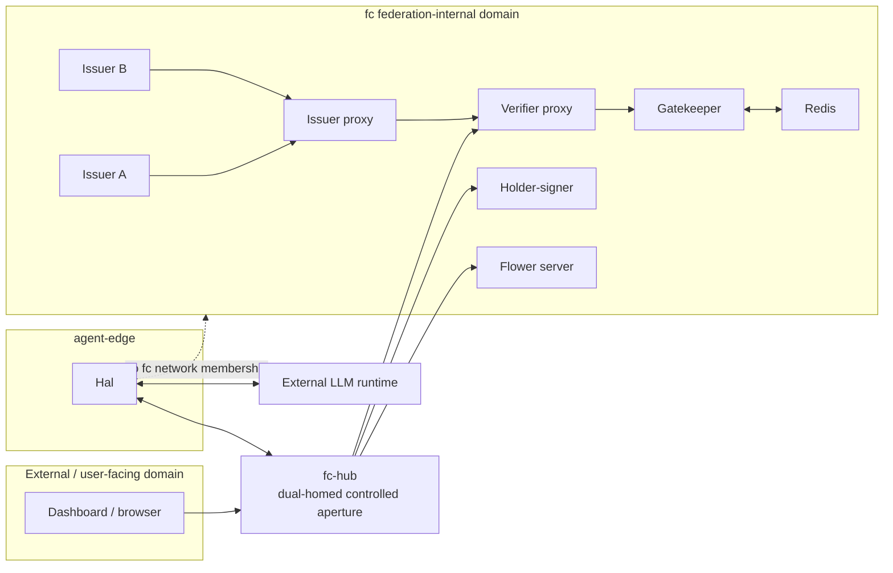

The dashed line from Hal to the `fc` domain is not a permitted path.

It documents the boundary.

The important property is that the Hub is the intended bridge between the agent execution domain and federation-internal services.

---

## 9. The Hub as controlled aperture

Calling the Hub a controlled aperture does not mean that the Hub owns federation authority.

It means that the application topology directs cross-boundary operational requests through a location where governance can be made load-bearing.

Without this property, admission can degrade into a side check.

Consider the wrong architecture:

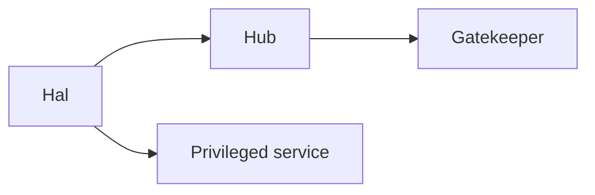

If Hal can simply bypass the governed path and invoke the privileged service directly, a successful admission decision may be recorded while having no constitutive effect on whether execution can occur.

The decision becomes decorative.

The intended architecture is instead:

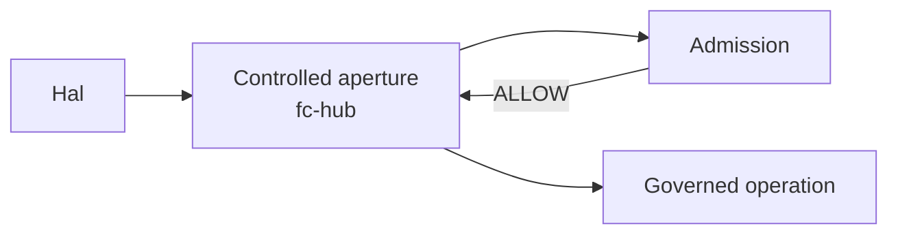

This is why Mode 1B isolation is not merely "hardening".

It is what makes admission operationally meaningful for the agent path.

---

## 10. Network isolation and cryptographic isolation

OpenHealth-CDI deliberately distinguishes two different protections.

### 10.1 Docker-internal service isolation

Hal is connected to `agent-edge`.

Services such as Redis, the holder-signer, verifier application, issuers, and Flower runtime are attached to `fc`.

Hal is not a member of `fc`.

It therefore does not have the normal Docker-internal service path to those components.

### 10.2 Published mTLS edges

The verifier and issuer nginx edges are published from the Docker environment for intended federation interaction.

A published host edge may be physically reachable from an unexpected local process depending on host and Docker routing.

The architecture does not equate possible TCP reachability with authority.

The protected verifier routes require successful client-certificate authentication and expected certificate subject identities.

The issuer edge similarly depends on authenticated client identity.

A process that can open a TCP connection but cannot present an accepted federation client certificate has not acquired federation authority.

This gives the correct architectural statement:

> **Network separation constrains available execution paths. mTLS constrains accepted identities at published trust edges. Neither should be confused with the other.**

The implementation intentionally uses both.

### 10.3 What is not claimed

This design is not a complete hostile-agent sandbox.

Hal requires outbound access to the external reasoning runtime.

The implementation therefore does not attempt to make the complete agent execution domain an offline containment environment.

The claim is narrower.

The agent's normal application path does not include privileged federation-internal services, and published governance edges remain cryptographically protected.

---

## 11. mTLS boundary

The local verifier trust path is:

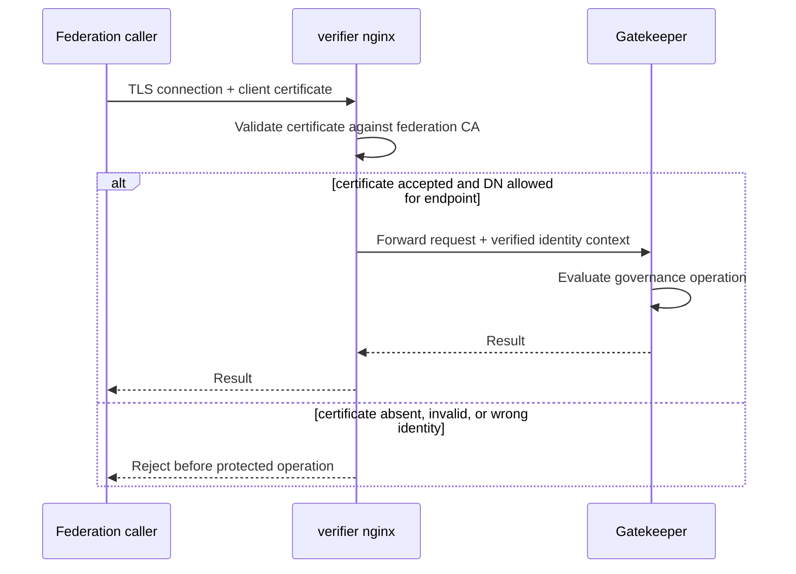

The nginx edge computes client-verification state and subject DN from the TLS session.

Protected routes test those values before forwarding.

This is important for deployment portability.

An infrastructure change that terminates TLS elsewhere and forwards an unauthenticated caller-supplied identity header is **not equivalent** to the current architecture.

The implementation technology may change.

The trusted origin of client identity may not silently change.

The detailed AWS consequence is documented separately in [AWS-PORTING.md](AWS-PORTING.md).

---

## 12. Governance path

At a high level, a governed operation separates identity, capability, holder proof, policy context, and execution.

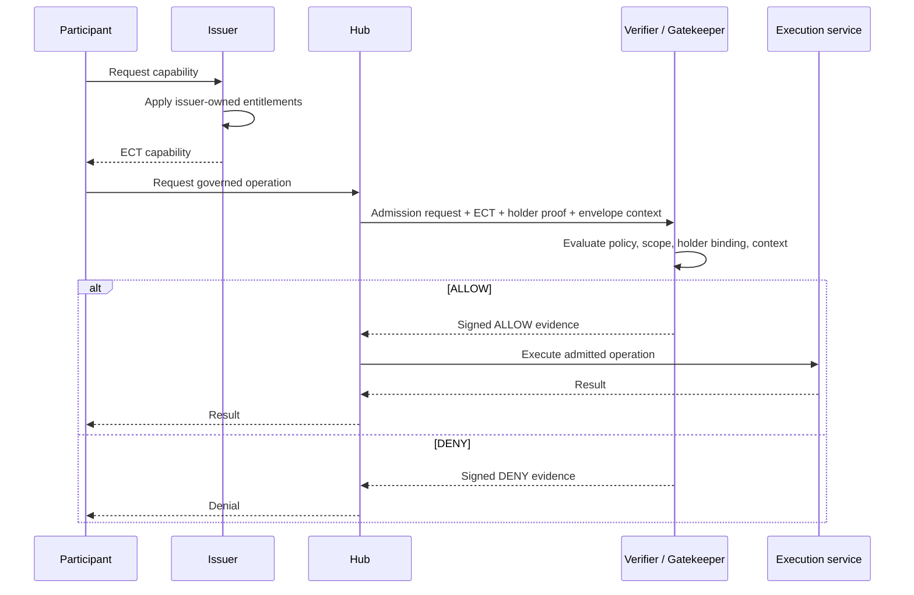

This diagram intentionally avoids implying that possession of one object authorises the operation.

The admission result emerges from the relation among the objects.

---

## 13. Federation-envelope lifecycle

The governance envelope represents the current governed collaboration context.

The envelope does not become the model run.

The model run does not become the envelope.

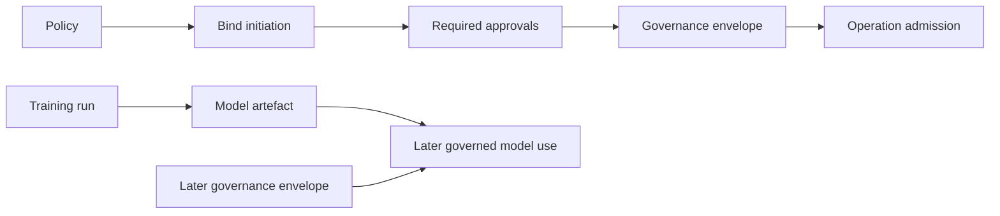

The lower path is deliberately separate.

A later envelope can govern use of an existing model.

That relationship must not be rewritten as "this model was trained under the later envelope".

This distinction matters in the dashboard, evidence, test design, documentation, and cloud port.

---

## 14. Mode evolution

The three executable modes add participants and relations without replacing the underlying governance architecture.

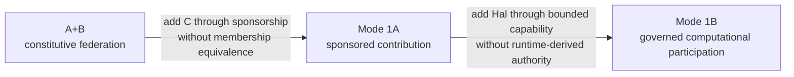

### 14.1 A+B

Hospitals A and B form the constitutive collaboration.

They establish the governed context, participate in federated training, and consume the model under governed capabilities.

This is not special because there are exactly two hospitals.

It is the baseline relation against which later differentiated participation can be observed.

### 14.2 Mode 1A

Mode 1A adds Hospital C and Charlie.

The significant change is not "another Flower client exists".

The significant change is that contribution is admitted through **sponsorship**.

Hospital C provenance is preserved.

Charlie does not become Hospital A.

Hospital C does not automatically become a constitutive member.

Contribution authority does not imply model-consumption authority.

Mode 1A therefore demonstrates evolution of participation without rebuilding the federation as a uniform membership set.

### 14.3 Mode 1B

Mode 1B adds Hal as a governed computational participant.

Again, the important change is relational rather than taxonomic.

The system does not create a special rule saying "AI agents are allowed" or "AI agents are forbidden".

Instead, Hal receives a bounded capability relation and must satisfy the same architectural principle as other participants.

Operations require admitted authority.

Hal's reasoning runtime does not create authority.

Hal's ability to transform data does not create requester release authority.

---

## 15. Mode 1B agent architecture

Mode 1B intentionally separates three concepts that are frequently collapsed:

1. the governed participant
2. the reasoning runtime
3. the governed operation

Hal is the governed participant.

The external LLM is the reasoning runtime.

Admission governs the operation.

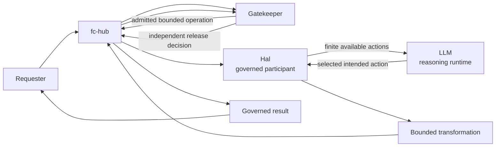

The LLM can influence which intended action Hal proposes.

It cannot change:

- federation membership
- sponsorship
- issuer entitlements
- policy
- envelope constitution
- holder identity
- requester capability
- resource scope
- the result of admission
- derivative-release authority

The reasoning runtime is therefore downstream of governance, not a source of governance.

---

## 16. Contextual agent execution

Mode 1B also demonstrates why the identity of the agent is not sufficient to determine the operation.

The same Hal process can receive requests involving different requester-resource relations.

The resulting operation can differ while Hal's object identity remains unchanged.

The implemented contextual examples include Audrey and Bob over the same relevant tissue classes.

For one requester-resource relation, source consumption may already be admitted.

For another, source consumption may be denied while a governed derivative path remains available.

The architecture can be represented as:

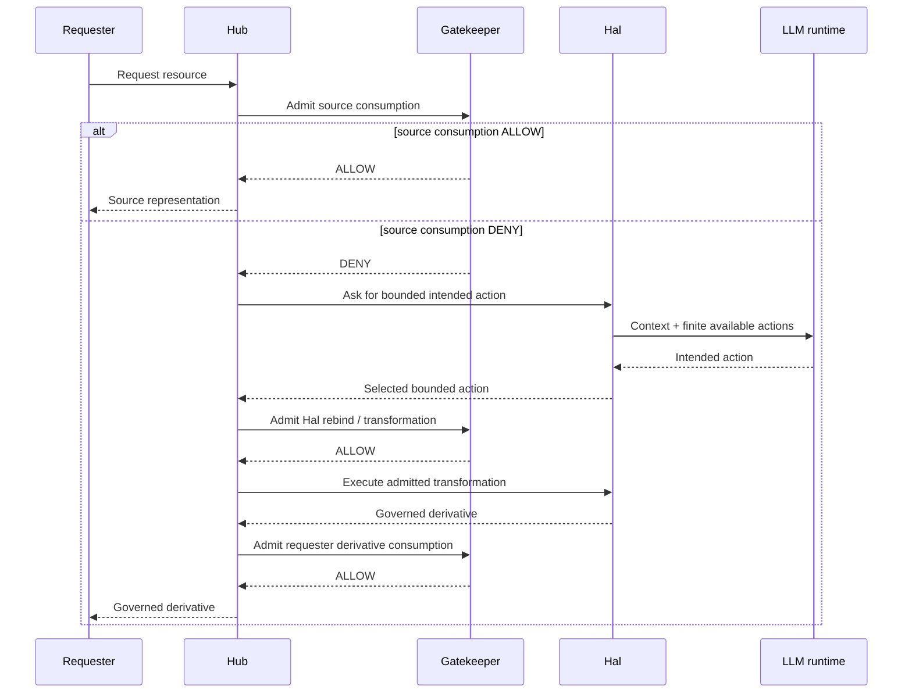

The key observation is architectural.

Hal remains Hal in every branch.

The resource may remain the same.

What changes is the **relation** among requester, resource, capability, purpose, and governance context.

The operation follows that relation.

It does not follow an intrinsic property of "the AI agent".

---

## 17. Source, transformation, and derivative release

The derivative path deserves explicit repetition because collapsing its steps creates a serious governance error.

A denial of source consumption does not automatically authorise a transformation.

An allowed transformation does not automatically authorise release of its output.

The complete relation is:

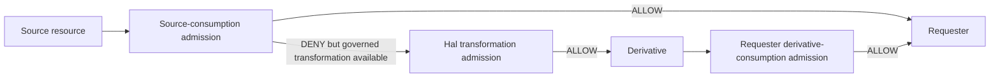

This distinction is essential to Mode 1B.

If derivative consumption were implied merely by successful transformation, rebind would become an authority-amplification mechanism.

The implementation instead makes release independently governed.

---

## 18. Human and non-human participants

OpenHealth-CDI does not make "human" and "AI agent" two different federation technologies.

The object classes differ.

The architecture of relation remains the same.

A human participant may use a custodial holder-signer.

Hal holds its own computational identity.

Those are implementation differences around holder proof.

The governance question remains:

> What operation may this holder perform under this governance context over this resource for this purpose?

This is also why `actor_type` must not become an authorisation shortcut.

An `actor_type` value can describe an object.

It cannot substitute for the relation.

---

## 19. Federated runtime and local data

The PathMNIST scenario gives OpenHealth-CDI a concrete distributed computation.

Hospital A, Hospital B, and in Mode 1A Hospital C operate local Flower clients.

Training data remain at the participant sites.

Flower coordinates model updates rather than centralising the underlying training data.

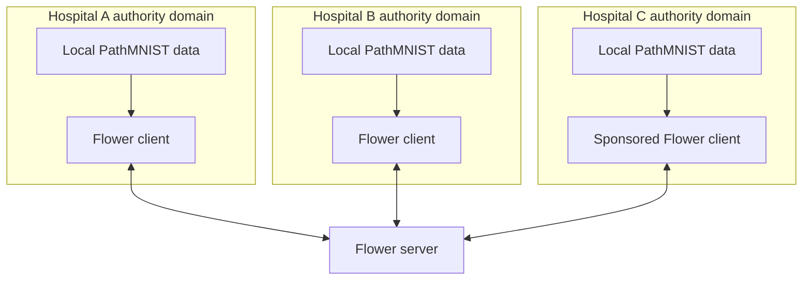

This runtime illustrates the architecture.

It does not define it.

If Flower were replaced while the same governance invariants remained true, OpenHealth-CDI would still implement the same federation architecture.

---

## 20. Governance state versus runtime state

The implementation must preserve a clear distinction between governance facts and runtime facts.

| Governance state | Runtime state |
| --- | --- |
| policy | training rounds |
| constitutive participants | connected Flower clients |
| quorum | client process count |
| envelope | model run |
| sponsorship | process topology |
| capability | callable implementation |
| holder binding | key-loading mechanism |
| admission evidence | prediction result |
| derivative-consumption authority | existence of derivative bytes |

The right-hand column cannot be used to infer the left-hand column.

A connected process is not necessarily a member.

A produced model is not evidence of a particular governance envelope.

A derivative file is not evidence that a requester may consume it.

A callable function is not a capability.

---

## 21. Current local network realization

The local OpenTofu deployment currently uses:

- Docker network `fc`
- Docker network `agent-edge`
- Hub attached to both
- Hal attached to `agent-edge`
- federation-internal services attached to `fc`
- verifier nginx mTLS edge published from port 8443
- issuer nginx mTLS edge published from port 8443 to the configured issuer host port
- Hub local debug publication bound to `127.0.0.1:8080`

These are mechanisms.

Some embody constraints and some are merely local choices.

| Local mechanism | Architectural interpretation |
| --- | --- |
| Docker network named `fc` | Name and Docker technology are choices |
| Separate federation-internal connectivity | Constraint |
| Docker network named `agent-edge` | Name and Docker technology are choices |
| Hal separated from privileged federation-internal services | Constraint |
| Hub attached to both networks | Current mechanism implementing the controlled-aperture relation |
| Hub port 8080 | Choice |
| Hub bound to `127.0.0.1` for local publication | Local mechanism implementing restricted ingress |
| Verifier port 8443 | Choice |
| Client identity authenticated at governance edge | Constraint |
| nginx | Choice |
| mTLS semantics and trusted identity provenance | Constraint |
| Redis | Choice |
| Hal must not obtain privileged governance state access through Redis | Constraint |
| Flower | Choice |
| Governed contribution and local authority over participant data | Constraint |
| OpenAI reasoning runtime | Choice |
| Reasoning runtime cannot enlarge Hal's authority | Constraint |

This distinction is the basis of the AWS porting contract.

The cloud deployment does not need to reproduce Docker.

It must reproduce the invariants.

---

## 22. Failure patterns that change the architecture

Several superficially reasonable implementation changes would violate the architecture.

### 22.1 Attaching Hal to `fc`

This would give the agent process normal internal reachability to services that were intentionally placed outside its execution domain.

The Hub would cease to be the sole intended operational aperture.

Admission could become bypassable.

### 22.2 Treating network reachability as authorisation

A successful TCP connection does not establish governance standing.

Doing so would collapse infrastructure connectivity and federation authority.

### 22.3 Terminating mTLS upstream without preserving authenticated identity semantics

If a load balancer terminates TLS and forwards a caller-controlled or insufficiently protected identity representation, the gatekeeper no longer receives identity under the same trust model.

The system might continue to return HTTP 200 responses while the trust boundary has silently moved.

This is an architectural change.

### 22.4 Allowing callers to supply effective capability scope

This would turn capability issuance into self-asserted authority.

### 22.5 Treating sponsorship as membership

This would eliminate the central Mode 1A distinction.

Hospital C would no longer represent differentiated participation.

### 22.6 Treating contribution as consumption

This would erase operation-specific authority.

### 22.7 Treating Hal's LLM output as authorisation

An LLM response selecting `blur_image`, `no_transform`, or another action is an execution decision.

It is not an admission result.

Allowing it to substitute for admission would give the reasoning runtime authority it does not possess.

### 22.8 Treating rebind as automatic release

This would allow a transformation step to amplify requester authority.

Mode 1B explicitly prevents this by admitting derivative consumption separately.

### 22.9 Treating current envelope selection as model provenance

This would rewrite history.

The envelope governing a current operation is not necessarily the envelope under which the model was trained.

### 22.10 Treating a GREEN UI path as sufficient evidence

The architecture is supported by executable conformance tests and decision evidence, not merely by successful dashboard behaviour.

---

## 23. Architectural evidence

The implementation contains regression tests that exercise the principal invariants.

The complete test catalogue, prerequisites, exact commands, and expected outputs belong in [TESTING.md](TESTING.md).

At architecture level, the principal mappings are:

| Test | Architectural concern |
| --- | --- |
| `Test2E_fcac_conformance.sh` | shared admission-governance substrate |
| `Test2F_issuer_registration_boundary.sh` | issuer boundary |
| `Test3E_dashboard_policy_scope.sh` | policy-owned scope presented consistently |
| `Test3F_mode1a_guest_admission.sh` | guest admission |
| `Test3G_mode1a_guest_contribution_admission.sh` | contribution authority |
| `Test4A_dpop_replay_protection.sh` | holder-proof replay resistance |
| `Test4B_dpop_iat_freshness.sh` | proof freshness |
| `Test4C_sponsorship_regression.sh` | sponsorship, provenance, and membership separation |
| `Test5A_agent_isolation.sh` | Mode 1B execution boundary |
| `Test5C_agent_credential_admission.sh` | Hal holder-bound capability admission |
| `Test5D_mode1b_table7_conformance.sh` | bounded Mode 1B governance requirements |
| `Test5E_mode1b_contextual_agent.sh` | requester-resource contextual execution |

The architecture is therefore not supported only by diagrams or prose.

The tests make selected invariants executable.

---

## 24. Naming note

Some internal paths, image names, environment variables, and tests retain historical `FCAC`, `fcac`, or `vfp` identifiers.

Examples include image names such as `fcac/hub`, environment variables beginning with `FCAC_`, and `Test2E_fcac_conformance.sh`.

These are implementation-history identifiers.

They should not be mistaken for the architectural definition of OpenHealth-CDI.

The delivered system is documented here as a reference implementation of governed Federated Computing.

Its architecture is defined by the relations and invariants described in this document, not by a legacy prefix appearing in a container name.

---

## 25. Portability rule

Every port or refactor should begin by classifying an implementation element as either:

- a replaceable mechanism
- a mechanism currently realising an architectural constraint

A replaceable mechanism may change freely if behaviour remains compatible.

A constraint-realising mechanism may be replaced only if the replacement preserves the same observable invariant.

For example, Docker network separation can become AWS security groups and task ENIs.

The Docker object does not need to survive.

The Hal isolation invariant does.

nginx can in principle be replaced.

The authenticated origin of client identity at the governance boundary cannot silently change.

Flower can be replaced.

The distinction between governed contribution and federation constitution must survive.

The OpenAI runtime can be replaced.

The distinction between reasoning and authority must survive.

The detailed AWS mappings are specified in [AWS-PORTING.md](AWS-PORTING.md).

---

## 26. Source-code map

The following paths are the principal implementation anchors for this architecture.

| Concern | Repository path |
| --- | --- |
| Local infrastructure topology | `src/infra/tofu/main.tf` |
| Hub orchestration | `src/vfp-core/hub/hub.py` |
| Hal agent runtime | `src/vfp-core/agents/hal/hal.py` |
| Frontend | `src/vfp-core/frontend/` |
| Issuer implementation | `src/vfp-core/issuers/` |
| Issuer mTLS edge | `src/vfp-core/issuers/nginx/` |
| Gatekeeper | `src/vfp-governance/gatekeeper/app.py` |
| Verifier mTLS edge | `src/vfp-governance/verifier/nginx/nginx.conf` |
| Human holder signer | `src/vfp-governance/signer/signer.py` |
| Executable conformance tests | `src/tests/` |

Operational deployment instructions are documented in [DEPLOYMENT.md](DEPLOYMENT.md).

Governance semantics are expanded in [GOVERNANCE.md](GOVERNANCE.md).

The three executable scenarios are described in [SCENARIOS.md](SCENARIOS.md).

Mode 1B is developed in detail in [MODE1B.md](MODE1B.md).

---

## 27. Architectural summary

OpenHealth-CDI can be deployed as a collection of containers.
That is not what makes it a federation architecture.
It contains hospitals, users, services, credentials, models, datasets, and an AI agent.

Those objects do not define the architecture either.
The architecture is the set of relations that remain binding while those objects participate in shared operations.
Hospitals A and B retain independent authority while constituting the baseline collaboration.
Hospital C can contribute through sponsorship without becoming an equivalent member.
A holder can exercise only issuer-defined capability under the relevant governance envelope.
Admission is distinct from authentication and from runtime execution.
Hal can act as a governed computational participant without making the LLM a federation principal.

The reasoning runtime can influence execution without acquiring authority.
Transformation can occur without implying release.
A derivative can be governed independently from its source.
A model can persist across governance contexts without having its provenance rewritten.
The Hub can coordinate operations without becoming the source of authority.
Network topology can constrain paths without being mistaken for governance.
mTLS can establish authenticated identity without being mistaken for capability.
Tests can demonstrate selected invariants without turning implementation-specific Docker mechanisms into universal architecture.

The concise architectural rule is therefore worth repeating:

> **Do not preserve the inventory. Preserve the relations that make the inventory a governed federation.**
