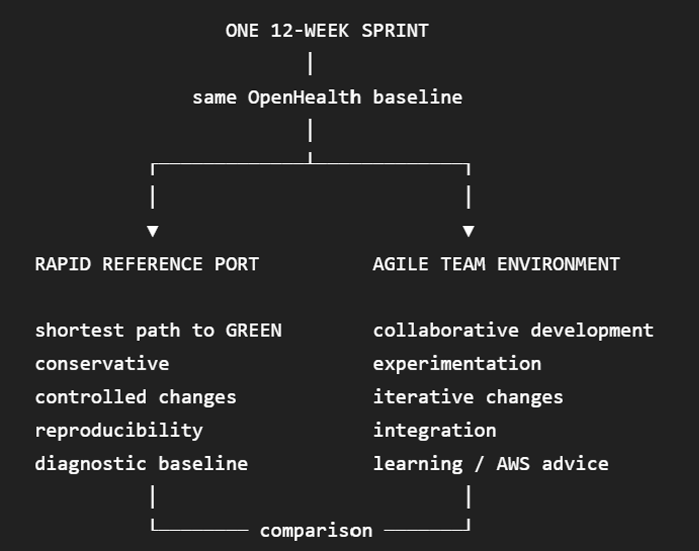

# OpenHealth-CDI AWS Rapid Reference Port

## 1. Purpose

This document defines the Rapid Reference Port of the OpenHealth-CDI reference implementation to AWS.

The work is part of a single 12-week sprint organised around two parallel tracks:



The two tracks start from the same OpenHealth baseline but have different purposes.

The **Rapid Reference Port**, documented here, moves the current OpenHealth implementation to AWS with the smallest practical number of changes. Its purpose is to establish a reproducible AWS GREEN baseline.

The **Agile Team Environment** explores AWS-native substitutions, integration mechanisms and architectural improvements. That work is documented separately in [AWS-REFACTORING.md](AWS-REFACTORING.md).

The separation is deliberate.

```text
Rapid Reference Port
    same OpenHealth
    different host environment
    minimum change
    reproducibility
    diagnostic baseline

AWS Refactoring
    same architectural invariants
    AWS-native substitutions
    experimentation
    iterative change
```

The Rapid Reference Port therefore answers one question:

> **Can the existing OpenHealth reference implementation execute on AWS without changing its governance semantics?**

---

## 2. Porting principle

The Rapid Reference Port treats AWS primarily as a new host environment.

The local deployment is:

```text
WSL / Linux
    ↓
Docker
    ↓
OpenTofu
    ↓
OpenHealth
```

The AWS reference port becomes:

```text
AWS EC2 Linux
    ↓
Docker
    ↓
OpenTofu
    ↓
OpenHealth
```

The application architecture above Docker remains unchanged.

The first port does not attempt to replace Docker with ECS, local secrets with Secrets Manager, Docker volumes with EFS, nginx with an AWS trust service, or OpenHealth admission with AWS IAM.

Those questions belong to [AWS-REFACTORING.md](AWS-REFACTORING.md).

The governing rule for this document is therefore:

> **Port first. Refactor second.**

---

## 3. Reference-port boundary

The complete current OpenHealth container topology is retained on one AWS Linux host.

```text
AWS
 │
 └── EC2 Linux host
       │
       ├── Docker
       ├── OpenTofu
       ├── NVIDIA runtime
       │
       └── OpenHealth
             │
             ├── fc
             │    ├── verifier-proxy
             │    ├── verifier-app
             │    ├── issuer-proxy
             │    ├── issuer-hospitala
             │    ├── issuer-hospitalb
             │    ├── holder-signer
             │    ├── fc-hub
             │    ├── redis
             │    ├── flower-server
             │    ├── flower-client-a
             │    ├── flower-client-b
             │    ├── flower-client-c
             │    └── fcac-frontend
             │
             └── agent-edge
                  └── hal
```

The same `main.tf`, Dockerfiles, policy, constitution, MOU, application code and conformance semantics are used.

AWS infrastructure exists only to provide the machine on which this reference deployment executes.

---

## 4. AWS resources required

The Rapid Reference Port deliberately requires a small AWS footprint.

The minimum AWS resources are:

```text
GPU-capable EC2 Linux instance
persistent EC2 storage
network connectivity
security group
AWS credentials required to operate the instance
```

The EC2 host must provide:

```text
Docker
NVIDIA driver
NVIDIA Container Toolkit
OpenTofu
Git
curl
jq
Python 3
OpenSSL
```

The instance must have sufficient CPU, memory and disk capacity for the complete OpenHealth container set and sufficient GPU capability for the existing PathMNIST Flower clients.

No ECS cluster, ECR repository, EFS filesystem, managed Redis service or AWS-native policy service is required for the Rapid Reference Port.

The Rapid Reference Port uses a GPU-capable EC2 host so that the complete CUDA reference workload remains available. The initial deployment defaults to **compute_backend = "cpu"** to reduce GPU execution dependencies during bootstrap and validation. Switching to cuda changes the execution profile, not the governance architecture.

---

## 5. Network setup

The reference port does not require a new application networking architecture.

The EC2 instance may use an existing suitable VPC and subnet.

For the minimum reference deployment, the security group should expose only what is required to operate the host.

A typical initial configuration is:

```text
operator → EC2 SSH             ALLOW
EC2 → Internet HTTPS           ALLOW
all unnecessary inbound paths  DENY
```

The OpenHealth dashboard remains bound to host loopback exactly as in the local deployment:

```text
127.0.0.1:8082
```

The Hub remains bound to:

```text
127.0.0.1:8080
```

The dashboard can therefore be reached from the operator workstation through an SSH tunnel rather than by modifying the OpenHealth ingress architecture.

For example:

```bash
ssh -L 8082:127.0.0.1:8082 <user>@<ec2-host>
```

The local browser can then use:

```text
http://127.0.0.1:8082
```

This preserves the existing deployment behaviour.

The verifier and issuer mTLS edges remain published by Docker on the interface selected by the OpenTofu `edge_bind_ip` variable. The default value `0.0.0.0` exposes the ports on the EC2 host interfaces, while `verifier.local` retains the logical TLS identity used by clients.
---

## 6. EC2 host address and verifier identity

Determine the EC2 private address:

```bash
hostname -I
```

Select the address used by the OpenHealth deployment:

```bash
export HOST_IP=<ec2-private-ip>
```

The verifier logical TLS identity remains:

```text
verifier.local
```

On the EC2 Linux host, map that name to the address on which the verifier edge is published:

```text
<HOST_IP> verifier.local
```

For example:

```bash
echo "${HOST_IP} verifier.local" | sudo tee -a /etc/hosts
```

Verify:

```bash
getent hosts verifier.local
```

The important invariant is unchanged:

```text
logical identity
verifier.local

        ↓

TLS verification

        ↓

verifier edge
```

The AWS port must not replace this with an IP address combined with disabled TLS verification.

---

## 7. Workspace layout

Use the same deterministic workspace layout as the local reference deployment:

```text
<workspace>/
├── data/
│   └── pathmnist.npz
└── openhealth-cdi/
```

For example:

```bash
mkdir -p CODEX
cd CODEX

mkdir -p data

curl -L \
  "https://zenodo.org/records/10519652/files/pathmnist.npz?download=1" \
  -o data/pathmnist.npz
```

Verify the dataset:

```bash
md5sum data/pathmnist.npz
```

Expected:

```text
a8b06965200029087d5bd730944a56c1  data/pathmnist.npz
```

Then clone the repository:

```bash
git clone https://github.com/onzelf/openhealth-cdi.git
cd openhealth-cdi
git checkout main
```

Record the source baseline:

```bash
git status
git branch --show-current
git rev-parse HEAD
```

The commit used for the AWS port must be recorded together with the local GREEN baseline.

---

## 8. Runtime material

A Git clone alone is not a complete OpenHealth runtime.

The following local material is intentionally excluded from Git and must be provisioned on the EC2 host:

```text
verifier certificates
organisation administrator certificates
evidence-signing keys
holder keys
governance state
model/run artefacts
Hal reasoning-runtime secret
```

The relevant repository paths are documented in [DEPLOYMENT.md](DEPLOYMENT.md).

For the Rapid Reference Port, existing reference trust material may be transferred to the EC2 host when the objective is to reproduce the same reference identities.

Do not copy the local OpenTofu state file to AWS.

The AWS host represents a new Docker substrate and therefore requires its own OpenTofu state.

In particular, do not copy:

```text
src/infra/tofu/terraform.tfstate
src/infra/tofu/terraform.tfstate.*
```

from the local machine.

---

## 9. OpenTofu bootstrap on EC2

From the repository root:

```bash
cd src/infra/tofu
```

Initialise OpenTofu:

```bash
tofu init
```

Validate:

```bash
tofu validate
```

Review the initial deployment:

```bash
tofu plan 
```

Then create the reference deployment:

```bash
tofu apply  -auto-approve
```

This initial apply creates the Docker networks, persistent Docker volumes and application containers on the new EC2 host.

The first AWS deployment is therefore different from an ordinary later cold start.

`demo_start.sh` assumes that the persistent reference state already exists and has passed its preflight checks. It should not be used to manufacture missing first-deployment state.

---

## 10. Persistent identities

The AWS port must preserve the distinction between host-backed and Docker-volume-backed state.

Human holder keys are stored in the host-backed OpenHealth vault:

```text
src/vfp-governance/verifier/vault/holder_keys/
```

The expected reference identities include:

```text
Audrey.privhex
Bob.privhex
Charlie.privhex
```

The holder-signer mounts this directory read-only.

Issuer registration state is stored separately in the Docker volumes:

```text
issuer-registry-hospitala
issuer-registry-hospitalb
```

These are new volumes on the first EC2 deployment and therefore do not automatically contain the registrations present on the local machine.

The AWS bootstrap must either restore the reference issuer registries or re-register the existing holder identities using the public identity derived from the existing private keys.

It must not generate replacement Audrey or Bob private keys merely to populate an empty issuer registry.

The relation that must be preserved is:

```text
existing private key
        ↓
derived public key + JKT
        ↓
issuer registration
        ↓
ECT minting
```

The private key remains unchanged.

---

## 11. Hal identity

Hal uses its own Docker volume:

```text
hal-identity
```

mounted at:

```text
/var/lib/hal/identity
```

On a fresh AWS deployment Hal creates its holder identity if the volume is empty.

Once created, that identity becomes persistent reference state.

Subsequent container recreation must reuse the same `hal-identity` volume.

Deleting the volume changes Hal's cryptographic identity and is therefore not an ordinary restart operation.

---

## 12. PathMNIST availability

The host dataset is expected at:

```text
<workspace>/data/pathmnist.npz
```

`demo_start.sh` resolves it by default as:

```bash
PATHMNIST_HOST="${PATHMNIST_HOST:-${REPO_ROOT}/../data/pathmnist.npz}"
```

The Flower server requires the runtime copy:

```text
/tmp/medmnist/pathmnist.npz
```

The cold-start script therefore performs:

```bash
docker exec flower-server mkdir -p /tmp/medmnist

docker cp \
  "${PATHMNIST_HOST}" \
  flower-server:/tmp/medmnist/pathmnist.npz
```

and verifies that the file is visible before reporting the deployment ready.

---

## 13. Establish the initial AWS GREEN baseline

After the initial EC2/OpenTofu bootstrap and required identity restoration, establish or select a valid A+B governance envelope and export its identifier:

```bash
export EID=<active-envelope-id>
```

The AWS reference deployment should then be validated using the same application-level assertions as the local baseline.

First verify the host-side verifier path:

```bash
cd src/tests
./Test2B_mint_ect.sh "$EID"
```

This exercises:

```text
verifier.local
        ↓
TLS
        ↓
Gatekeeper /health
        ↓
active envelope
        ↓
ECT minting
```

Inspect the live governance boundary:

```bash
curl -s http://127.0.0.1:8080/administration/boundary | jq '
{
  selected_envelope_id,
  holders: [.holders[] | {principal, enrollment, can_mint}]
}'
```

Audrey and Bob should report:

```text
enrollment = enrolled
can_mint = true
```

Verify the issuer registries:

```bash
docker exec issuer-hospitala \
  python -c 'import requests,json; print(json.dumps(requests.get("http://127.0.0.1:8080/members").json(),indent=2))'

docker exec issuer-hospitalb \
  python -c 'import requests,json; print(json.dumps(requests.get("http://127.0.0.1:8080/members").json(),indent=2))'
```

Verify PathMNIST:

```bash
docker exec flower-server \
  test -s /tmp/medmnist/pathmnist.npz \
  && echo "PathMNIST OK"
```

Verify the persisted model:

```bash
docker exec flower-server \
  sh -c 'find /vault/runs -name model.pt -type f -print -quit | grep -q .' \
  && echo "Model OK"
```

These checks establish that the AWS runtime contains the same essential reference state required by the local deployment.

---

## 14. Normal AWS cold start

Once the AWS reference deployment has been bootstrapped and validated, subsequent cold starts use the same controlled startup procedure as the local deployment:

```bash
VERIFIER_IP="$HOST_IP" ./src/tools/demo_start.sh
```
> local WSL    verifier.local → 127.0.0.1
  EC2          verifier.local → EC2 private address

Before modifying containers, `demo_start.sh` validates:

```text
Docker availability
verifier.local
OpenTofu ownership
fc network
agent-edge network
issuer persistent volumes
Hal identity volume
human holder keys
issuer registrations
persisted model
PathMNIST source dataset
```

If a required invariant is inconsistent, the script stops before removing the existing container layer.

When the preflight succeeds, the script recreates the disposable containers through OpenTofu and performs its runtime validation.

A successful script exit is followed by the independent checks described above.

---
### Flower training timeout on EC2

The Rapid Reference Port keeps the Flower server and all organisational Flower clients on the same EC2 host and Docker network. Their Flower gRPC traffic therefore does not traverse an AWS load balancer or NAT Gateway.

The Flower server does not configure a round timeout. The current `ServerConfig` specifies only the number of rounds, leaving Flower's `round_timeout` at its default `None`.

The local regression harness does, however, impose a wall-clock timeout on the complete training lifecycle. Because GPU execution time may differ on the selected EC2 instance, the initial AWS validation should use a longer test timeout:

```bash
./Test1B_postEnvelope.sh \
  "$EID" \
  local-pathmnist-ab-001 \
  3600
```

This changes only the test waiting period. It does not change the Flower training semantics.

If Flower clients are later distributed across separate AWS compute instances or routed through AWS networking services, long-lived connection idle timeouts must be reconsidered separately. That belongs to the AWS refactoring track rather than the Rapid Reference Port.
---

## 15. What the Rapid Reference Port must not change

The following remain OpenHealth responsibilities in the AWS reference port:

```text
MOU
constitution
policy.json
governance envelope
KYO quorum
issuer authority
capability profiles
ECT
DPoP
policy_hash binding
Gatekeeper ALLOW / DENY
signed decision evidence
Mode 1A sponsorship
Mode 1B bounded-agent admission
```

AWS hosting must not silently replace any of these mechanisms.

Similarly:

```text
EC2 identity ≠ federation identity
AWS IAM permission ≠ OpenHealth capability
security-group reachability ≠ admission
AWS account membership ≠ federation membership
```

The AWS platform hosts the federation implementation. It does not constitute the federation.

---

## 16. Rapid Reference Port acceptance criterion

The left leg of the sprint is GREEN when the EC2 deployment demonstrates the same required OpenHealth behaviour as the local reference baseline.

At minimum:

```text
same source commit deployed
same executable policy
A+B envelope valid
Audrey issuer registration valid
Bob issuer registration valid
ECT minting valid
DPoP holder binding valid
Gatekeeper ALLOW / DENY valid
PathMNIST workload available
persisted model available
A+B governed model use valid
Mode 1A valid
Mode 1B valid
signed governance evidence valid
```

The result is then:

```text
LOCAL GREEN
     │
     │ same OpenHealth baseline
     ▼
AWS EC2 GREEN
```

This AWS deployment becomes the stable diagnostic baseline for the second leg of the sprint.

AWS-native substitutions and experiments are then evaluated separately in [AWS-REFACTORING.md](AWS-REFACTORING.md).

---

## 17. Relationship to AWS refactoring

The Rapid Reference Port deliberately stops once portability and conformance have been demonstrated.

Questions such as:

```text
Docker → ECS
Docker networking → VPC-native task networking
local secrets → Secrets Manager
Docker volumes → EFS
local Redis → managed Redis
nginx trust edge → AWS-native trust mechanism
operational authorisation → Verified Permissions
DNS → Route 53
MOU interpretation → Bedrock
```

belong to the Agile Team Environment.

They are documented in:

[AWS-REFACTORING.md](AWS-REFACTORING.md)

The Rapid Reference Port provides the comparison baseline against which those changes can be evaluated.
