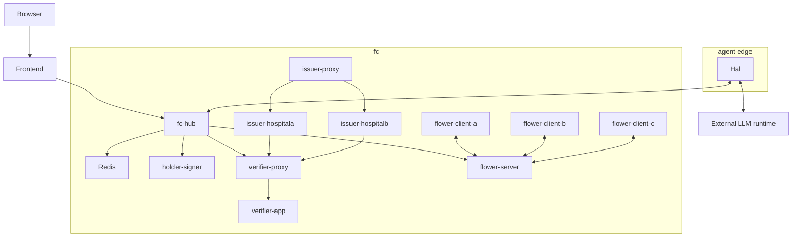
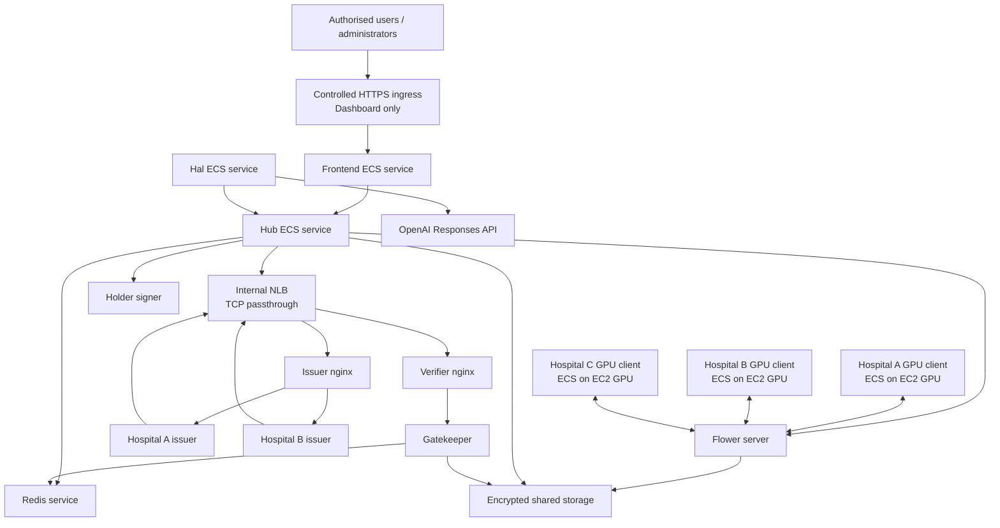
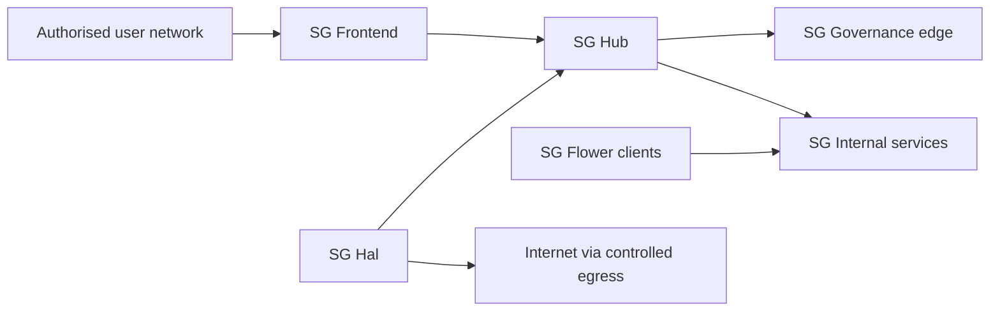

# OpenHealth-CDI AWS Porting Guide
## 1. Purpose of this document
This document defines how the OpenHealth-CDI local Docker/OpenTofu reference implementation should be transferred to AWS without changing the federation architecture that the local implementation demonstrates. The objective of the first AWS port is architectural equivalence, not cloud-native redesign. AWS services may replace local mechanisms, but they must preserve the same authority-bearing relations, trust boundaries, execution constraints, and observable conformance properties.
The local implementation is intentionally concrete. Docker networks, local nginx proxies, loopback bindings, host-mounted files, named Docker volumes, and local service names make the architecture executable on one machine. None of those mechanisms should be copied to AWS merely because it appears in `src/infra/tofu/main.tf`. Before replacing any local mechanism, the porting team must determine whether it is an implementation choice or whether it realises an architectural constraint.
The governing rule for the port is:
> **Implementation choices may be replaced. Architectural constraints may only be replaced by an AWS mechanism that preserves the same observable invariant.**
The architectural and governance semantics that must survive the port are defined in [ARCHITECTURE.md](ARCHITECTURE.md), [GOVERNANCE.md](GOVERNANCE.md), [SCENARIOS.md](SCENARIOS.md), and [MODE1B.md](MODE1B.md). The local deployment and test procedures are described in [DEPLOYMENT.md](DEPLOYMENT.md) and [TESTING.md](TESTING.md).
## 2. Scope of the first AWS port
The first AWS deployment should reproduce the behaviour of the research reference implementation with the smallest practical number of application changes. It should support the A+B baseline, Mode 1A sponsored contribution, Mode 1B bounded computational participation, the dashboard, issuer-owned capability assignment, holder-bound DPoP, governance-envelope establishment, Gatekeeper admission, signed evidence, PathMNIST federated training, model use, Hal's bounded inference and rebind operations, derivative release, and the contextual Audrey/Bob Mode 1B experiment.
The first port is not intended to redesign OpenHealth-CDI for production-scale availability, introduce a new IAM architecture, replace the federation capability model with AWS IAM, redesign the model-storage format, create a generic AI-agent containment platform, or replace every container with a managed AWS service.
Those activities may be considered after architectural equivalence has been established.
> 🔑 **Takeaway**
> - **Port first. Optimise second.**
> - A cloud-native redesign performed before conformance is established makes it impossible to know whether a changed result comes from the platform or from a changed architecture.
## 3. The local reference topology
The current local deployment contains two Docker networks. `fc` contains federation-internal services and `agent-edge` contains Hal. The Hub joins both and provides the intended operational aperture between Hal and the federation.
The principal local relationships are:



AWS does not need to reproduce the Docker objects shown in this diagram. It must preserve the relationships represented by the arrows and the prohibited relationships that are intentionally absent.
## 4. Proposed AWS baseline
The recommended first-port baseline uses Amazon ECS as the common container orchestration layer. CPU-only application services can run on Fargate. The GPU-dependent Hospital A, Hospital B, and Hospital C Flower clients should run on ECS with GPU-capable EC2 capacity because the current workload requests NVIDIA GPU access and Fargate does not provide the ECS GPU resource.
All ECS services should use `awsvpc` networking so that each task receives an ENI and can be controlled through security groups. Service-to-service naming should use ECS Service Connect or an equivalent managed ECS service-discovery mechanism rather than depending on transient task IP addresses.
The verifier and issuer mTLS boundaries should initially remain nginx-based. An internal Network Load Balancer using **TCP listeners**, not TLS listeners, should pass the encrypted connections unchanged to the existing nginx trust edges. TLS and client-certificate validation therefore continue to terminate where they terminate in the local reference implementation.
The baseline can be represented as:



This is a porting baseline, not a final production architecture.
## 5. Translate invariants, not Docker objects
The local implementation should be classified before any AWS resource is created.

| Local mechanism | Classification | Recommended AWS realisation | Invariant that must survive |
| --- | --- | --- | --- |
| Docker network `fc` | implementation choice | `awsvpc` + private subnets + task security groups | federation-internal services are not generally reachable |
| Docker network `agent-edge` | implementation choice implementing a constraint | Hal task SG and restricted service relationships | Hal can use the intended Hub path without acquiring privileged federation access |
| Hub on both networks | architectural relationship | Hub SG permitted from frontend/Hal and permitted to required federation services | Hub remains the controlled operational aperture |
| Hal only on `agent-edge` | constraint implementation | dedicated Hal SG | Hal cannot directly use verifier-app, issuers, holder-signer, Redis, or Flower internals |
| Hub `127.0.0.1:8080` | local implementation choice | private ECS service with no public listener | Hub is not unintentionally public |
| Dashboard `127.0.0.1:8082` | local implementation choice | controlled HTTPS ingress to frontend | only the presentation tier is exposed to intended users |
| verifier nginx | implementation choice currently carrying a trust constraint | nginx ECS service behind NLB TCP passthrough | authenticated federation identity originates from verified TLS client material |
| issuer nginx | implementation choice currently carrying a trust constraint | nginx ECS service behind NLB TCP passthrough | issuer client-certificate authentication remains intact |
| `$ssl_client_s_dn` | current trust mechanism | preserve by terminating mTLS at nginx | backend identity cannot become an arbitrary application-supplied value |
| Redis container | implementation choice | Redis-compatible ECS or managed AWS service | Hal/public paths cannot reach federation coordination state |
| holder-signer container | implementation choice carrying key-custody constraint | private ECS service with restricted key storage | frontend and Hal cannot access human holder private keys |
| local `/vault` | implementation choice | encrypted EFS for first port | model/run artefacts and governance evidence remain available with their existing file semantics |
| issuer Docker volumes | implementation choice | encrypted EFS access points | issuer registration survives task replacement |
| `hal-identity` volume | implementation choice carrying identity-persistence constraint | encrypted EFS access point restricted to Hal | Hal's holder identity survives task replacement |
| Flower server port | implementation choice | private ECS service port | only intended participants and Hub reach the backend |
| GPU Docker clients | implementation choice with computational requirement | ECS on GPU-capable EC2 capacity | CUDA workload remains executable |
| local LLM secret file | implementation choice | AWS Secrets Manager injection | only Hal receives the external reasoning credential |
| local service DNS | implementation choice | ECS Service Connect / managed discovery | task replacement does not require manual proxy restart |
| envelope files | implementation choice | encrypted shared storage | governance state remains distinct from model-run state |
| model run pointer | implementation choice | preserve file semantics initially | model lifecycle remains distinct from governance-envelope lifecycle |

The table should be treated as the porting contract.
## 6. Platform translation warnings
Several local mechanisms have no literal AWS equivalent. Reproducing their names without reproducing their behaviour would create a false sense of conformance.
Docker bridge membership is one example. `Test5A_agent_isolation.sh` can inspect whether Hal belongs to `agent-edge` and whether federation services belong to `fc`. AWS does not have Docker bridge membership as the relevant security primitive. The equivalent property must be expressed through task ENIs, security groups, routing, and the allowed service relationships.
Loopback publication is another example. `127.0.0.1:8080` prevents the local Hub from becoming a LAN service. There is no useful AWS equivalent to "bind the ECS service to loopback". The AWS invariant is that the Hub remains private and is reachable only from authorised internal callers.
Docker service names also behave differently from ECS service discovery. A recreated Docker container may receive another address, and long-running nginx instances in the local environment have previously required restart after upstream replacement. AWS should not reproduce that operational defect. Service discovery must tolerate task replacement without manual proxy restarts.
TLS termination is the most important example. Moving TLS from nginx to an AWS load balancer changes where client identity is established. An application that continues returning HTTP 200 after such a change may nevertheless have changed its trust architecture.
> ⚠️ **Porting constraint**
> - A successful network connection is not evidence that the port preserved the architecture.
> - The question is whether the **same identity, authority and execution invariants** still determine the result.
## 7. ECS networking model
All application tasks should use `awsvpc` networking. This gives each task its own network interface and allows security groups to express task-level reachability.
The initial deployment should use private subnets for application tasks. Only explicitly selected ingress components should receive user-facing traffic.
Security-group references should be used whenever possible instead of broad CIDR permissions. The design intent is to express allowed relationships rather than to place all application tasks in one permissive subnet and rely on application ports for separation.
A simplified SG relationship is:



There should be no general `Hal → Internal` permission.
## 8. Recommended security-group matrix
The first AWS implementation should make the intended service relationships explicit.

| Source | Destination | Port / protocol | Expected |
| --- | --- | --- | --- |
| authorised user ingress | frontend | HTTPS | ALLOW |
| frontend | Hub | application port 8080 | ALLOW |
| arbitrary internet | Hub | any | DENY |
| Hub | verifier NLB | TCP 8443 | ALLOW |
| issuer services | verifier NLB | TCP 8443 | ALLOW |
| authorised admin path | verifier NLB | TCP 8443 | ALLOW subject to mTLS |
| authorised admin path | issuer NLB listener | TCP 9443 | ALLOW subject to mTLS |
| Hub | holder-signer | 8090 | ALLOW |
| Hub | Redis | 6379 | ALLOW |
| Gatekeeper | Redis | 6379 | ALLOW |
| Hub | Flower server | 8081 | ALLOW |
| Flower clients | Flower server | Flower protocol port | ALLOW |
| Hal | Hub | 8080 | ALLOW |
| Hal | OpenAI API through egress | HTTPS 443 | ALLOW |
| Hal | verifier-app direct | any | DENY |
| Hal | issuer services direct | any | DENY |
| Hal | holder-signer | any | DENY |
| Hal | Redis | any | DENY |
| Hal | Flower internals | any | DENY |
| public internet | verifier/issuer task directly | any | DENY |
| public internet | Redis/signer/Flower | any | DENY |

AWS can therefore strengthen the local Mode 1B boundary. Where the local Docker environment may permit physical routing to a host-published mTLS edge while denying useful access cryptographically, AWS security groups can normally deny the direct Hal path before TLS is attempted.
## 9. The Hub must remain private
The local Hub is published only on `127.0.0.1:8080`. The AWS equivalent is not to expose port 8080 through a public load balancer.
The recommended AWS design places the Hub in private subnets and exposes it only through service-to-service connectivity. The frontend can call the Hub through Service Connect or equivalent private discovery. Hal can call the Hub through the explicit Hal-to-Hub SG relationship.
Local tests that currently call `http://127.0.0.1:8080` must be adapted rather than forcing the AWS Hub to become publicly reachable solely to satisfy test assumptions.
A dedicated test-runner task inside the VPC should be used for AWS acceptance testing of private application endpoints.
## 10. Dashboard ingress
The frontend is the normal user-facing application surface. An AWS load balancer can provide HTTPS ingress to the frontend while the Hub and all federation-internal services remain private.
The load balancer used for the dashboard is not part of the federation mTLS boundary described below. Ordinary HTTPS termination for the presentation tier must not be confused with the separate mTLS identity semantics used by verifier and issuer operations.
Authentication of dashboard users may be strengthened later using AWS-native mechanisms without replacing the federation capability architecture behind the application.
## 11. Preserve the existing mTLS trust boundary
The current verifier nginx receives the TLS client certificate, validates it against the federation CA, derives the verified client subject DN, and restricts protected routes according to that verified identity. The Hub identity is required for `/admission/check`, while founding-organisation administrator identities are required for protected administrative routes.
The issuer nginx similarly requires a valid client certificate and restricts member registration to the corresponding organisational administrator identity.
The safest first AWS port leaves those semantics unchanged.
The preferred baseline is:
```text
client
   ↓ TLS + client certificate
NLB TCP listener
   ↓ encrypted TCP unchanged
nginx target
   ↓ terminates TLS and verifies client certificate
application
```
This allows the existing nginx trust logic and application headers to remain authoritative.
## 12. NLB listener configuration
A Network Load Balancer **TLS** listener terminates TLS at the load balancer. That is not the desired first-port behaviour.
The baseline should use an NLB **TCP** listener so that encrypted bytes pass through to nginx.
A concrete first-port mapping is:
```text
TCP 8443 → verifier-nginx target group :8443
TCP 9443 → issuer-nginx target group   :8443
```
The listener and target-group protocols should remain TCP for this path.
The NLB does not need to understand the federation client certificate. nginx does.
TCP health checks can be used for the mTLS proxy target groups so that target health does not depend on synthesising a client certificate for the health probe.
> 🔑 **Takeaway**
> - **NLB TCP passthrough preserves the current trust boundary.**
> - An NLB TLS listener would move that boundary and is therefore not an equivalent drop-in replacement.
## 13. Why ALB mTLS is not the first-port baseline
AWS Application Load Balancers support mutual TLS. They can either verify the client certificate at the ALB or forward certificate information to the target.
That capability is useful, but adopting it changes the current OpenHealth-CDI trust architecture. Client identity would no longer originate from nginx's `$ssl_client_s_dn` derived directly from the TLS connection. The target would instead receive ALB-generated `X-Amzn-Mtls-*` certificate headers or the encoded client certificate chain.
Such a design can be valid, but it requires explicit decisions about which ALB mode is used, how backend applications trust the ALB-supplied identity, how direct access to the backend is prevented, how existing nginx checks are replaced, and how all affected conformance tests are rewritten.
That is a second-stage architecture change, not a minimal first port.
> ⚠️ **Trust-boundary warning**
> - "ALB supports mTLS" does not mean that replacing nginx termination with ALB termination preserves the existing trust semantics automatically.
> - If ALB mTLS is adopted later, treat it as a deliberate architecture change and revalidate the complete identity path.
## 14. Preserve logical service identity
The local implementation uses logical names including:
```text
verifier.local
issuer-hospitala.local
issuer-hospitalb.local
```
These names appear not only in ordinary networking but also in certificate validation and DPoP request binding. Hal's current DPoP target is `https://verifier.local/admission/check`.
The AWS platform may use different DNS infrastructure, but hostname changes must therefore be coordinated across certificates, DPoP HTU configuration, nginx routing, frontend configuration, Hal configuration, tests, and any private DNS aliases.
Changing only the Route 53 name or only the certificate SAN would break the relation even if network routing remained correct.
For the first port, preserving the existing logical names through controlled private DNS aliases is the lowest-change approach. A later renaming can be performed as one coherent migration.
## 15. ECS service discovery
Docker container names currently provide convenient service discovery for internal services such as `redis`, `flower-server`, `fc-hub`, and `holder-signer`.
AWS tasks are replaceable and their IP addresses must not become configuration.
The recommended baseline is ECS Service Connect for private service-to-service discovery where it fits the application topology. Stable client aliases should preserve the logical application names expected by the current containers.
The acceptance criterion is not the use of Service Connect itself. The acceptance criterion is that task replacement updates service reachability automatically and does not require manually restarting unrelated proxies because an upstream IP changed.
## 16. GPU workload placement
The local Flower clients explicitly request GPU access and use CUDA. The AWS compute platform must preserve that computational requirement.
The three organisational Flower clients should therefore use ECS capacity backed by GPU-capable EC2 instances. An ECS GPU-optimised AMI should provide the NVIDIA driver and container runtime expected by ECS GPU scheduling.
The Flower client task definition must declare the required GPU resource rather than assuming that the default container runtime exposes the device.
CPU-only services such as Hub, verifier, issuers, frontend, Hal, Redis, holder-signer, and the current Flower server can run on Fargate where compatible.
This produces a mixed-capacity ECS environment:
```text
Fargate capacity
    Hub
    frontend
    verifier
    issuers
    signer
    Hal
    Flower server
    other CPU services

EC2 GPU capacity
    flower-client-a
    flower-client-b
    flower-client-c
```
The exact EC2 GPU family is an operational choice. CUDA compatibility, capacity, cost, and the existing client image requirements should determine that choice.
## 17. Do not change the analytical workload during the platform port
The initial AWS port should preserve the current PathMNIST partition profile, partition seed, training fraction, cancer-class allocation, rounds, local epochs, batch size, learning rate, and aggregation behaviour unless a platform constraint requires otherwise.
Changing the platform and the analytical experiment simultaneously would make comparison harder.
The same principle applies to the external reasoning model. Preserve the currently configured Hal reasoning model during initial port acceptance. Changing the reasoning model belongs to a separate experiment after the AWS environment is known to be equivalent.
## 18. Persistent model and governance storage
The local implementation shares the verifier vault between the Flower server and Hub and uses filesystem paths for model/run metadata and evidence.
The first AWS port should preserve those file semantics rather than redesigning the application around S3 and DynamoDB immediately.
Encrypted Amazon EFS with service-specific access points provides a low-change first-port mapping for:
```text
/vault
governance mutable state
issuer registry state
human holder-key state where required
Hal identity persistence
```
Access must remain restricted according to service responsibility. A single shared filesystem must not mean that every task receives every mount.
The Hub and Flower server need the model/run areas they currently use. The Gatekeeper needs the governance state and evidence areas it owns. The holder-signer needs human holder private keys. Hal needs only its own identity path. The frontend must not receive holder-key storage.
## 19. Hal identity persistence
The local `hal-identity` Docker volume preserves Hal's Ed25519 holder identity across container recreation.
An ECS task's ephemeral filesystem is not an equivalent replacement. If Hal regenerated its private key every time a task restarted, its JKT would change and the issuer registration would no longer represent the same holder.
The first AWS port should therefore mount a dedicated encrypted persistent location at:
```text
/var/lib/hal/identity
```
Only the Hal service should receive this mount.
The Mode 1B credential test must verify that the JKT held by the running AWS Hal task matches the JKT registered with Hospital A's issuer.
## 20. Human holder-key custody
The current holder-signer simulates custodial protection of human holder private keys. Those keys are mounted read-only into the signer and are deliberately absent from the frontend and Hal.
The AWS port must preserve that custody relation.
The first port can retain the file-based signer contract using encrypted persistent storage restricted to the holder-signer task. The exact AWS storage mechanism may later be strengthened, but moving the keys into frontend environment variables, general application storage, or a shared unrestricted filesystem would violate the reference architecture.
## 21. Certificate and private-key material
The local verifier and issuer nginx services expect certificate files. The Hub and organisation issuers also use certificate/private-key material for mTLS client identity.
AWS must not bake private keys into container images or commit them into infrastructure source.
The recommended port stores sensitive private-key material in AWS-managed secret storage and materialises the required files into task-local storage at startup, or uses another AWS-controlled mechanism that preserves the expected file interfaces without exposing the keys to unrelated services.
Public CA and certificate material can be distributed separately from private keys.
The important invariants are:
```text
verifier private key → verifier trust-edge task only
issuer-proxy private key → issuer trust-edge task only
Hub client private key → Hub only
Hospital A admin private key → authorised Hospital A administrative path only
Hospital B admin private key → authorised Hospital B administrative path only
human holder private keys → holder-signer only
Hal private holder key → Hal only
```
## 22. Reasoning-runtime backend is a Phase 0 decision
Mode 1B requires an external reasoning runtime, but the federation architecture does not require that the runtime be reached through OpenAI's public API. The local reference implementation currently calls the OpenAI Responses API directly and uses GPT-5.6 Luna. The AWS port may preserve that direct path or may use Amazon Bedrock, provided that the first-port configuration preserves the reasoning semantics used by the reference implementation.
Amazon Bedrock supports OpenAI-compatible Responses API endpoints and OpenAI GPT-5.6 models. Bedrock can therefore host the reasoning runtime without requiring Mode 1B to be redesigned around a different model family or a different agent API.
The reasoning-runtime backend must be agreed before Mode 1B porting begins because it determines Hal's endpoint configuration, model identifier, authentication mechanism, outbound network requirements, task configuration, and acceptance test.
> 🔑 **Takeaway**
> - **OpenHealth-CDI depends on a bounded reasoning-runtime interface, not on ownership of the runtime by a particular cloud provider.**
> - The first AWS port should preserve the existing reasoning experiment rather than changing the model at the same time as the platform.
## 23. Preferred Bedrock baseline
If AWS proposes Amazon Bedrock, the preferred first-port baseline is the Bedrock OpenAI-compatible Responses API using the same OpenAI model family exercised by the reference implementation.
The current local implementation uses GPT-5.6 Luna through the OpenAI Responses API. The corresponding Bedrock deployment should therefore use the Bedrock-supported GPT-5.6 Luna model and the OpenAI-compatible Responses endpoint where available in the selected AWS Region and inference profile.
This preserves the structure of Hal's existing reasoning request. Hal supplies a prompt, a finite set of available actions, and a bounded output size. The reasoning runtime returns the selected action and rationale through the Responses API. Federation governance remains outside that exchange.
The Bedrock endpoint, model identifier, and credential are deployment configuration and must not be hard-coded as properties of Hal's governance identity.
## 24. Bedrock is not permission to substitute the reasoning experiment
Bedrock provides access to several model families. That does not mean that Nova, Claude, Llama, or another Bedrock-hosted model should replace the current OpenAI model during the initial platform port.
Changing the cloud execution platform and changing the reasoning model simultaneously would alter two experimental dimensions. If the contextual Mode 1B result changed, it would no longer be possible to determine whether the cause was the AWS port, API behaviour, or the new model.
A different Bedrock model can be evaluated after AWS architectural equivalence has been established. Such an evaluation would be a new reasoning-runtime experiment rather than part of port acceptance.
> ⚠️ **Porting constraint**
> - **Bedrock is an acceptable execution platform. An arbitrary Bedrock model is not automatically an equivalent reasoning runtime.**
> - Platform substitution and model substitution must be tested separately.
## 25. Hal must make the reasoning endpoint configurable
The current reference implementation uses the OpenAI Responses API directly. For AWS portability, the reasoning endpoint and model identifier should become deployment configuration rather than source-code constants.
The intended abstraction is conceptually:
`REASONING_RESPONSES_URL`
`REASONING_MODEL`
The local configuration can continue to resolve these values to the OpenAI public Responses endpoint and GPT-5.6 Luna.
The AWS Bedrock configuration can resolve them to the selected regional Bedrock OpenAI-compatible Responses endpoint and the corresponding Bedrock inference-profile model identifier.
This change does not create a generic model abstraction layer and should not alter Hal's reasoning contract. It makes an already external execution dependency configurable.
## 26. Reasoning-runtime credentials
The credential supplied to Hal depends on the selected runtime backend.
If the AWS reference deployment continues to call OpenAI directly, Hal requires the OpenAI API credential already used by the local implementation.
If the deployment uses the Bedrock OpenAI-compatible endpoint, Hal must instead receive the corresponding Bedrock authentication material. Bedrock supports API-key authentication for its OpenAI-compatible endpoint and can also support AWS credential-based authentication for HTTP requests.
The credential must be available before Mode 1B deployment and acceptance testing, but **an OpenAI-issued API key is not an architectural prerequisite for the AWS port**.
Whichever mechanism is selected, the credential belongs only to the reasoning-runtime relationship. It must not grant federation authority, must not be distributed to the Hub, Gatekeeper, issuers, or frontend, and must not appear in Git, logs, documentation, or ordinary infrastructure state.
## 27. Redis
Redis is coordination infrastructure rather than a source of federation authority.
The AWS port may initially retain Redis as a private ECS service or replace it with an AWS-managed Redis-compatible service. Either approach can preserve application semantics if the connection string and availability behaviour remain compatible.
The architectural condition is that Redis remains private to the services that require it. Hal, the dashboard client, and general user ingress do not require direct Redis access.
## 28. Flower server
The Flower server is a private computational service. It should not be exposed to the public internet.
The Hub requires the Flower control API. The organisational Flower clients require the Flower training protocol endpoint.
These are separate service relationships and can be represented through security-group permissions even if they terminate on the same task.
The current server runs the control-side model execution on CPU. It does not require GPU capacity merely because the organisational clients do.
## 29. Flower clients
Hospital A, Hospital B, and Hospital C should remain distinguishable services or task identities even if they use the same container image.
This distinction supports provenance, configuration, operational inspection, and Mode 1A interpretation.
Hospital C's technical ability to connect to the Flower server must not be used as evidence that Hospital C has founding governance standing. The AWS network merely permits the runtime relationship after the governance path has established the corresponding operational participation.
The compute platform therefore preserves the same distinction already present locally:
```text
computational participation ≠ constitutional membership
```
## 30. Issuer boundaries
Hospital A and Hospital B issuers remain independent logical issuing authorities in AWS.
They may run from the same ECS cluster and even use the same image, but their entitlement configuration, registry state, mTLS client identity, organisation identifier, and administrative registration authority must remain distinct.
AWS IAM roles may help protect their AWS resources. AWS IAM must not replace the federation rule that Hospital A's issuer determines Hospital A holder capability and Hospital B's issuer determines Hospital B holder capability.
The issuer registration test must be adapted to verify that an identity authorised for Hospital B cannot replace a Hospital A holder registration.
## 31. Governance state
Governance envelopes, decisions, evidence, policy references, and model-run state must remain distinct data concepts after migration.
Using one EFS filesystem, one database cluster, or one AWS account does not imply that those records have become one lifecycle.
The selected envelope continues to govern the current operation. The model run continues to describe analytical provenance.
AWS resource organisation should make this distinction easier to preserve, not hide it behind one generic "application state" abstraction.
## 32. Logging
Each service should send operational logs to CloudWatch Logs or the agreed AWS logging destination.
Logging must not become the only governance evidence mechanism. Signed Gatekeeper decision evidence remains a separate research artefact.
CloudWatch logs are useful for diagnosing service and platform behaviour. Governance evidence is used to establish the result of a governed relation.
Sensitive values, private keys, ECT bearer material where not required for evidence, DPoP private material, and `OPENAI_API_KEY` must not be written to operational logs.
## 33. Test-runner placement
Several local tests assume that they execute on the Docker host and can access `127.0.0.1`, Docker networks, mounted state paths, and the Docker command.
Those assumptions are not valid in ECS.
The AWS port should include an ephemeral **test-runner task** in the private application VPC. It should contain the repository test utilities required for network and HTTP probes and should receive only the credentials and mounts needed by the acceptance test being executed.
The test runner should be used to reach private Hub, verifier, issuer, and runtime endpoints without making those services public for the sake of testing.
Platform-specific checks such as Docker network inspection must be replaced by AWS topology checks rather than emulated.
## 34. Local tests are not automatically cloud acceptance tests
A GREEN local test establishes an invariant of the local implementation. It does not prove that the same invariant survives after its implementation mechanism has been replaced.
For example:
```text
local Test5A
    inspect Docker network membership
AWS equivalent
    inspect/attempt task-SG reachability
```
The question is not whether the shell script can be executed unchanged. The question is whether the same prohibited and permitted relationships are observable.
> 🔑 **Takeaway**
> - **Do not preserve the test implementation when the platform changes. Preserve the assertion.**
## 35. Test translation matrix
The principal local conformance families map to AWS as follows.

| Local test | Local mechanism | AWS acceptance equivalent |
| --- | --- | --- |
| `Test00_verifyDockerGPU.sh` | Docker/NVIDIA GPU | ECS GPU task successfully receives declared GPU resource |
| `Test1A_createEnvelope.sh` | LAN mTLS + local service | establish fresh A+B envelope through AWS mTLS path |
| `Test1B_postEnvelope.sh` | local Hub/Flower | start AWS training run and verify envelope-associated run manifest |
| `Test2C_issuer_mint.sh` | Docker issuer + LAN mTLS | AWS issuer resolves assignment and rejects caller-selected profile |
| `Test2E_fcac_conformance.sh` | local signed evidence | verify AWS-produced envelope and decision signatures |
| `Test2F_issuer_registration_boundary.sh` | LAN issuer mTLS | cross-organisation registration attempt remains denied |
| `Test3E_dashboard_policy_scope.sh` | loopback frontend API | AWS frontend/Hub still contain no duplicated policy scope |
| `Test4A_dpop_replay_protection.sh` | local admission endpoint | replay remains denied through AWS governance path |
| `Test4B_dpop_iat_freshness.sh` | local admission endpoint | stale/future proofs remain denied |
| `Test4C_sponsorship_regression.sh` | local issuer + evidence | sponsorship semantics remain unchanged |
| `Test5A_agent_isolation.sh` | Docker networks/mounts | AWS SG reachability + task secret/storage custody tests |
| `Test5C_agent_credential_admission.sh` | local Hal + issuer | AWS Hal JKT, issuer binding and bounded capability |
| `Test5D_mode1b_table7_conformance.sh` | local Mode 1B | same five governance decisions in AWS |
| `Test5E_mode1b_contextual_agent.sh` | local Hal + OpenAI | same four contextual requester-resource cases in AWS |

The AWS acceptance suite should preserve the expected reasons as well as the expected ALLOW/DENY outcomes where those reasons constitute part of the conformance claim.
## 36. AWS Mode 1B isolation acceptance
The AWS equivalent of the local Hal isolation test should explicitly prove both permitted and prohibited relationships.
Required positive checks:
```text
Hal → Hub                    PERMITTED
Hal → external OpenAI HTTPS  PERMITTED
```
Required negative checks:
```text
Hal → verifier-app direct    DENIED
Hal → issuer A direct        DENIED
Hal → issuer B direct        DENIED
Hal → issuer proxy direct    DENIED unless explicitly required by design
Hal → holder-signer          DENIED
Hal → Redis                  DENIED
Hal → Flower server internals DENIED
Hal → human holder-key storage DENIED
Hal → governance evidence private key DENIED
```
The test should also confirm that the Hal task receives its own persistent holder identity and the OpenAI secret but not federation-private credential material.
This AWS test is stronger than merely asserting that Hal belongs to a particular security group.
## 37. mTLS acceptance
Before application-level conformance testing, verify the AWS governance edge independently.
The acceptance sequence should demonstrate:
```text
valid Hub certificate → verifier admission endpoint reaches Gatekeeper
missing certificate → rejected
wrong organisational certificate → rejected where endpoint identity does not match
valid Hospital A admin certificate → permitted on Hospital A authorised admin path
Hospital B admin certificate → cannot perform Hospital A-only issuer registration
```
The result must originate from the TLS-authenticated edge rather than from an arbitrary header supplied by the test client.
## 38. Service-replacement acceptance
The AWS environment should explicitly test a property that the local environment handled imperfectly.
Replace or redeploy one Hub, issuer, or backend ECS task and verify that dependent services discover the replacement without manually restarting an unrelated proxy.
A successful AWS port should therefore eliminate the local stale-nginx-upstream operational failure rather than reproduce it.
This is a platform improvement that does not change federation semantics.
## 39. Model and envelope lifecycle acceptance
AWS acceptance must demonstrate that the platform does not collapse governance and analytical state.
A useful test is:
1. produce or select a model run
2. establish a later valid governance envelope
3. perform a governed operation over the existing model
4. verify that the operation evidence identifies the current envelope
5. verify that model provenance continues to identify the original model run
The AWS storage design passes only if both histories remain inspectable.
## 40. Recommended porting phases
The port should proceed in dependency order rather than by moving containers arbitrarily.
### Phase 0 — prerequisites and frozen semantics
Before application porting begins:
```text
confirm AWS account and Region
confirm VPC/subnet model
agree the Mode 1B reasoning-runtime backend, endpoint, model and authentication mechanism
provision the corresponding reasoning-runtime credential before deploying Hal
identify task execution roles
freeze the source commit being ported
record current local GREEN conformance baseline
record current policy and constitution hashes
record current container/image requirements
```
> Bedrock is acceptable for the AWS port provided that the first-port configuration preserves the reasoning-runtime semantics of the reference implementation. The baseline should therefore use the OpenAI-compatible Bedrock Responses API with the same OpenAI model family used by Hal, rather than replacing the reasoning model with a different Bedrock model during the platform migration. Model substitution is a separate experiment and is not part of porting conformance.
No AWS implementation decision should silently redefine governance during this phase.

### Phase 1 — images and base compute
Build the existing images and publish them to Amazon ECR. Establish the ECS cluster, Fargate capacity, and GPU EC2 capacity provider. Verify that the Flower client image runs on the selected GPU capacity before integrating the governance stack.
### Phase 2 — private networking and discovery
Create the `awsvpc` security-group relationships and service discovery. Deploy private Redis, holder-signer, Hub, Flower server, issuers, Gatekeeper, and Hal without user-facing ingress. Verify private service-to-service connectivity.
### Phase 3 — persistent state and identities
Attach the required encrypted persistent storage. Restore or initialise issuer registries, governance state, model vault, human holder keys, and Hal identity according to the target acceptance plan. Verify mount isolation before enabling application operations.
### Phase 4 — mTLS trust edges
Deploy verifier nginx and issuer nginx behind NLB TCP passthrough. Verify server certificates, CA trust, client-certificate checks, endpoint-specific identities, and issuer-registration separation before moving to application tests.
### Phase 5 — dashboard and governance workflow
Expose only the frontend through the intended controlled ingress. Verify A+B KYO envelope establishment, ECT minting, dashboard boundary selection, and signed admission evidence.
### Phase 6 — federated workload
Deploy the three GPU organisational clients and execute the A+B and Mode 1A analytical workflows. Verify run artefacts and provenance.
### Phase 7 — Mode 1B
Deploy Hal with its persistent holder identity, injected OpenAI secret, Hub connectivity, and controlled external egress. Run the translated Mode 1B isolation test, credential test, Table 7 conformance, and contextual requester-resource experiment.
### Phase 8 — full AWS acceptance
Run the complete AWS-adapted regression suite and record the resulting architecture, SG matrix, task definitions, image digests, policy hash, evidence, model run, envelope IDs, and known platform-specific differences.
## 41. What must exist before Phase 1
The following prerequisites are therefore blocking:
```text
AWS account and target Region
networking ownership agreed
ECR repositories available
ECS execution-role pattern agreed
OPENAI_API_KEY provisioned in Secrets Manager
secret ARN available to the Hal deployment
GPU capacity strategy agreed
mTLS certificate migration strategy agreed
source commit frozen
local regression baseline recorded
```
In particular, the OpenAI secret should not be deferred until the end of the project because Mode 1B networking and task-definition work depends on it.
## 42. AWS IAM is complementary, not substitutive
AWS IAM should be used to control access to AWS resources such as ECR, Secrets Manager, EFS integrations, CloudWatch, and other platform services.
It must not silently replace the OpenHealth-CDI capability and admission architecture.
For example, an ECS task role permitting access to an EFS mount does not mean that Audrey has `query_model`. A security group allowing the Hub to reach verifier nginx does not mean that the underlying requester operation is authorised. A task execution role capable of retrieving the OpenAI secret does not give Hal a federation capability.
AWS IAM governs AWS infrastructure relationships. OpenHealth-CDI governance determines participation in the federated activity.
## 43. Task execution roles versus application task roles
The distinction between ECS task execution roles and application task roles should be preserved deliberately.
The execution role performs platform operations required to launch the task, such as pulling images, writing configured logs, and retrieving Secrets Manager values injected at startup.
The application task role grants AWS API permissions to code running inside the container.
Most OpenHealth-CDI application containers should require little or no AWS API authority if their state is presented through mounted files and network services.
Hal in particular does not need a broad AWS task role merely because its execution role retrieves `OPENAI_API_KEY` during task startup.
## 44. Do not expose internal services for convenience
A common porting shortcut is to add public or broadly reachable load balancers because local tests previously accessed a host port.
That changes the attack surface and can invalidate the Mode 1B and governance-boundary claims.
The correct approach is to move the test harness into the AWS private environment, not to move private services into the public environment.
The Hub, Redis, holder-signer, Flower backend, issuer applications, Gatekeeper application, and Hal internal endpoint should remain private.
## 45. Do not flatten security groups into one application SG
Placing every ECS task in the same permissive security group would reproduce the object inventory while eliminating an important trust relationship.
At minimum, Hal, Hub, frontend, governance-edge proxies, federation-internal services, GPU clients, and persistent storage should have distinguishable access policies.
Security-group structure should express allowed relations rather than merely encode "all OpenHealth services may talk to all OpenHealth services".
## 46. Do not move client identity into unchecked HTTP headers
If the first port uses NLB TCP passthrough, this problem does not arise because nginx continues deriving identity from its own TLS session.
If an ALB mTLS architecture is adopted later, the backend must treat the ALB as a new trust component. Targets must not also be reachable through a path on which a caller can supply lookalike certificate headers directly.
The new identity path must be documented and tested before the old nginx-derived identity mechanism is removed.
## 47. Do not treat security-group denial as the complete governance model
AWS networking can strengthen isolation. It cannot replace capability evaluation.
A security group can prevent Hal from reaching Redis. It cannot determine whether Bob may consume mucus, whether Audrey may query cancer-associated tissue, whether Charlie has sponsorship, or whether a derivative may be released.
The Gatekeeper and capability model therefore remain necessary after the AWS port.
## 48. Do not treat container type as participant type
An ECS task is an execution object. It is not a federation role.
Hospital C's Flower task does not become a founding organisation because it runs in the same ECS cluster as A and B. Hal does not become privileged because it uses a distinct task definition. Audrey and Bob do not obtain authority from the frontend task through which they interact.
The federation continues to be defined by governance relations rather than deployment objects.
## 49. Observability
The AWS deployment should record enough platform metadata to explain execution without replacing signed federation evidence.
Useful AWS operational evidence includes:
```text
ECS task revisions
container image digests
service deployment timestamps
security-group revisions
load-balancer target health
CloudWatch service logs
GPU task placement
Secrets Manager secret version metadata without secret value
EFS mount configuration
```
These records complement the existing OpenHealth-CDI decision and model-run evidence.
## 50. Failure classification in AWS
AWS introduces new failure classes that do not exist locally.
An ECS task that cannot start because it cannot retrieve a secret is a platform execution-role or secret-access failure.
A Hal task that starts but cannot call the OpenAI API is an egress, DNS, TLS, credential, or provider-availability failure.
A Hub that cannot reach nginx through the NLB is a platform networking failure.
An nginx target that receives the connection but rejects the wrong certificate is potentially correct trust-boundary behaviour.
A valid mTLS request that reaches the Gatekeeper and receives an unexpected governance decision is a federation-policy or admission failure.
An ALLOW followed by model-runtime failure is an execution failure.
An operation that executes despite the required Gatekeeper DENY is an architecture failure.
These classes should remain distinct during troubleshooting.
## 51. Preferred AWS workshop position
The AWS porting team should be given a concrete baseline rather than an open-ended request to redesign the system.
The recommended statement is:
> **Preferred baseline: preserve the current mTLS semantics using an NLB TCP listener with TLS terminating at the existing nginx trust edge. Please confirm that this is compatible with the target ECS deployment model.**
This gives AWS engineers a specific architecture to validate while leaving room for a platform constraint to be identified.
If AWS proposes ALB mTLS instead, the proposal should be evaluated as a change of trust-boundary implementation with explicit conformance consequences rather than accepted merely as a managed-service substitution.
## 52. Port acceptance criteria
The AWS port is accepted only when all of the following are demonstrable:
```text
A+B governance envelope can be established
policy-owned A+B constitution and 2/2 quorum remain intact
Hospital A and B issuer authority remains separate
caller-selected entitlement remains impossible
holder-bound DPoP remains enforced
replay and freshness protections remain effective
signed ALLOW and DENY evidence remains verifiable
A+B federated training completes on AWS GPU clients
model artefact and model-run provenance remain inspectable
Mode 1A sponsored contribution remains distinct from membership
Charlie cannot use contribution authority as model-query authority
Hal preserves a stable holder identity across task replacement
Hal receives the bounded-agent capability and A+B sponsorship
Hal can reach Hub
Hal can reach the configured OpenAI reasoning service
Hal cannot directly reach privileged federation internals
Hal receives no human holder keys or governance evidence private key
Table 7 retains DENY / ALLOW / ALLOW / ALLOW / DENY
Audrey/Bob contextual Mode 1B matrix remains unchanged
source, rebind and derivative release remain separate decisions
current governance envelope does not rewrite model provenance
task replacement does not require manual stale-DNS recovery
Hub and internal services are not unintentionally public
```
A port that merely reproduces the dashboard visually or starts all ECS tasks does not satisfy these criteria.
## 53. Evidence to hand back after porting
The AWS porting team should return enough information for another engineer to reproduce and inspect the target deployment.
The handover should include:
```text
AWS Region
ECS cluster and capacity-provider description
task-definition revisions
container image digests
service-discovery mapping
security-group relation matrix
load-balancer listener and target mapping
mTLS termination point
certificate identity mapping
persistent-storage mapping
Secrets Manager secret names and ARNs without values
Hal egress design
GPU instance/capacity configuration
AWS-adapted test procedures
full acceptance results
known deviations from local implementation
```
The handover must explicitly identify every place where an AWS mechanism replaced a local mechanism and state which invariant that replacement preserves.
## 54. Porting summary
The AWS deployment should be understood as another realisation of the OpenHealth-CDI federation architecture rather than as a new architecture derived from AWS service categories.
Docker networks become task-level network policy. Loopback becomes private service exposure. Named volumes become controlled persistent storage. Docker GPU access becomes ECS GPU scheduling on EC2 capacity. Local service names become managed discovery. The local OpenAI `.env` file becomes a Secrets Manager value injected only into Hal. Local nginx mTLS remains nginx mTLS behind NLB TCP passthrough during the first port.
What must not change is the authority structure. Hospitals A and B remain the founding collaboration. Hospital C remains a sponsored contributor rather than an equivalent founder. Capability assignment remains issuer-owned. Holder proof remains distinct from transport authentication. Admission remains distinct from execution. Hal remains the governed computational participant rather than the LLM. Hal's execution path remains separated from privileged federation services. Rebind remains distinct from derivative release. Model provenance remains distinct from current governance state.
The port is successful when AWS mechanisms preserve these relationships and the translated conformance suite makes that preservation observable.
