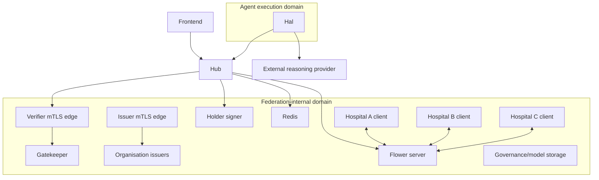

# OpenHealth-CDI AWS Refactoring Guide

## 1. Purpose

This document defines the Agile Team Environment used to investigate AWS-native realisations of the OpenHealth-CDI architecture.

The Rapid Reference Port is documented separately in [AWS-PORTING.md](AWS-PORTING.md). It provides the stable EC2/Docker/OpenTofu baseline against which the changes described here are evaluated.

This track may replace local implementation mechanisms with AWS services, but every substitution must preserve the observable relations among:

- governance envelope;
- issuer;
- holder;
- sponsor;
- capability;
- requester;
- resource;
- Gatekeeper decision;
- execution path;
- evidence.

The governing rule is:

> **Implementation mechanisms may change. Architectural invariants must remain observable and testable.**

The local reference deployment is documented in [DEPLOYMENT.md](DEPLOYMENT.md), the Rapid Reference Port in [AWS-PORTING.md](AWS-PORTING.md), and the executable invariants in [TESTING.md](TESTING.md).

---

## 2. Scope of the AWS refactoring track

The Agile Team Environment starts from a GREEN Rapid Reference Port and investigates controlled AWS-native substitutions.

Candidate changes include container orchestration, networking, service discovery, persistent storage, secret management, operational observability, trust-edge implementation, and other AWS mechanisms that may improve the deployment without changing the OpenHealth federation model.

The refactoring track must **not**:

- replace federation governance with AWS IAM;
- redesign the ECT model without explicit architectural justification;
- collapse issuer, sponsor, holder, and execution authority into one AWS role;
- infer federation membership from AWS infrastructure ownership;
- replace signed OpenHealth governance evidence with AWS operational logging;
- accept an AWS substitution merely because connectivity or service health is GREEN.

Each proposed substitution must identify the OpenHealth relation and invariant that it preserves and the acceptance test that demonstrates equivalence.

---

## 3. Compute profiles

The v1.1.0 reference deployment supports two Flower-client compute profiles:

```text
cpu
cuda
```

This changes the AWS baseline materially.

### CPU profile

The A, B, and C Flower clients can run as ordinary CPU container workloads.

This makes ECS on Fargate a valid first-port option for the complete application stack if its CPU and memory requirements are acceptable.

### CUDA profile

When GPU acceleration is required, Flower clients must run on GPU-capable compute such as ECS on EC2 GPU instances.

The CUDA profile also requires the appropriate NVIDIA runtime and container configuration.

### Porting invariant

CPU versus CUDA is an execution-profile choice. It is **not** a governance distinction.

The same governance and admission tests must pass for either profile.

The AWS deployment must make the selected backend explicit. A host or task intended for CUDA must fail if its GPU stack is unavailable rather than silently changing the experiment to CPU.

---

## 4. Local reference relationships

The local implementation uses two Docker networks:

```text
fc
agent-edge
```

`fc` contains federation-internal services.

`agent-edge` contains Hal.

The Hub joins both and is the controlled application aperture between Hal and the federation.

The important relationships are:



The AWS implementation does not need Docker networks. It must preserve the permitted and prohibited relationships represented by this topology.

---

## 5. Candidate AWS-native baseline

A conservative first refactoring baseline can use:

- Amazon ECS for container orchestration;
- `awsvpc` networking;
- private subnets for application services;
- security groups for service-level reachability;
- ECS Service Connect or equivalent private service discovery;
- an HTTPS load balancer for the dashboard only;
- internal NLB TCP passthrough for verifier and issuer mTLS edges;
- encrypted EFS for first-port file-compatible persistent state;
- AWS Secrets Manager for the external reasoning credential;
- Fargate for CPU services where suitable;
- GPU EC2 capacity only when the CUDA profile is selected.

This is an experimental AWS-native baseline evaluated against the Rapid Reference Port, not a final production architecture.

---

## 6. Translate invariants, not Docker objects

| Local mechanism | AWS candidate | Invariant to preserve |
| --- | --- | --- |
| Docker `fc` network | private ECS tasks + security groups | federation-internal services are not generally reachable |
| Docker `agent-edge` | dedicated Hal task/service SG | Hal can use the Hub without privileged federation access |
| Hub on both networks | explicit SG relations | Hub remains the controlled application aperture |
| Hal only on `agent-edge` | no Hal SG path to internal services | admission remains load-bearing |
| `127.0.0.1:8080` Hub publication | private Hub service | Hub is not public |
| `127.0.0.1:8082` frontend | controlled HTTPS ingress | presentation tier can be exposed without exposing internals |
| verifier nginx | nginx behind NLB TCP passthrough | verified mTLS client identity remains authoritative |
| issuer nginx | nginx behind NLB TCP passthrough | issuer admin identity remains authoritative |
| holder-signer | restricted private service | human private holder keys remain outside frontend/Hal custody |
| Redis container | private Redis or managed equivalent | coordination state remains unreachable from Hal/public paths |
| local vault | encrypted persistent storage | governance evidence and model artefacts remain available |
| issuer registry volumes | encrypted persistent storage | holder registration survives task replacement |
| `hal-identity` volume | Hal-only persistent storage | Hal JKT survives task replacement |
| local secret file | Secrets Manager | reasoning credential is available to Hal only |
| Docker DNS names | Service Connect/private DNS | service replacement does not require manual address repair |
| CPU/CUDA environment | task definition / capacity selection | selected compute backend is explicit and testable |

The AWS port should be reviewed against this table before architectural optimisation.

---

## 7. Networking model

Use `awsvpc` networking so each task receives an ENI and can be governed through security groups.

Do not reproduce the local topology by putting all tasks in one permissive security group.

The intended access graph is approximately:

```text
User -> Frontend
Frontend -> Hub
Hal -> Hub
Hal -> external reasoning provider

Hub -> verifier mTLS edge
Hub -> holder-signer
Hub -> Redis
Hub -> Flower server

Flower clients -> Flower server

Gatekeeper -> Redis

Administrators -> verifier/issuer mTLS edges
```

There must be no ordinary:

```text
Hal -> verifier-app
Hal -> organisation issuers
Hal -> holder-signer
Hal -> Redis
Hal -> Flower internals
```

path.

---

## 8. Security-group matrix

A first-port matrix should explicitly encode the allowed relationships.

| Source | Destination | Expected |
| --- | --- | --- |
| authorised user ingress | frontend HTTPS | ALLOW |
| frontend | Hub | ALLOW |
| public internet | Hub | DENY |
| Hub | verifier mTLS NLB | ALLOW |
| authorised admin path | verifier mTLS NLB | ALLOW subject to mTLS |
| authorised admin path | issuer mTLS NLB | ALLOW subject to mTLS |
| Hub | holder-signer | ALLOW |
| Hub | Redis | ALLOW |
| Gatekeeper | Redis | ALLOW |
| Hub | Flower server | ALLOW |
| Flower A/B/C | Flower server | ALLOW |
| Hal | Hub | ALLOW |
| Hal | external reasoning provider | ALLOW |
| Hal | verifier-app direct | DENY |
| Hal | issuer services direct | DENY |
| Hal | holder-signer | DENY |
| Hal | Redis | DENY |
| Hal | Flower internals | DENY |
| public internet | federation internal services | DENY |

Where AWS can deny a path earlier than the local implementation, strengthening the boundary is acceptable provided the application semantics remain unchanged.

---

## 9. Preserve the mTLS trust boundary

The local verifier nginx terminates TLS, validates the client certificate against the federation CA, and derives the verified client identity.

The issuer edge uses the same architectural pattern for organisation-administrative authority.

The safest initial AWS-native substitution preserves that trust boundary:

```text
client
  |
  | TLS + client certificate
  v
internal NLB TCP listener
  |
  | encrypted TCP passthrough
  v
nginx
  |
  | certificate verification and trusted identity extraction
  v
application
```

Use NLB **TCP**, not NLB TLS termination, for the initial refactoring baseline.

This keeps the existing nginx verification semantics authoritative.

---

## 10. Why not move mTLS termination immediately

AWS load balancers can terminate or participate in mutual TLS, but doing so changes where federation identity is established.

That may be a valid later design, but it requires a new trust analysis.

If mTLS terminates at an AWS service, the backend must establish:

- which AWS-generated headers or forwarded certificate data are authoritative;
- that direct backend access cannot bypass those headers;
- that spoofed identity headers cannot be injected by another caller;
- that existing route-level identity semantics are preserved;
- that acceptance tests verify the new trust boundary.

Therefore, AWS-native mTLS termination is not a drop-in replacement merely because the resulting request reaches the same application endpoint.

---

## 11. Stable service identity

The local reference uses:

```text
verifier.local
```

as the stable verifier TLS identity.

On AWS, do not reproduce the local `/etc/hosts` mechanism.

Provide a stable private DNS identity through Route 53 private DNS, Service Connect, or an equivalent managed mechanism.

The key distinction remains:

```text
service identity != task IP != listener bind address
```

Task replacement must not require editing client configuration with a new IP address.

---

## 12. Hub privacy

The local Hub is exposed only on host loopback for testing.

The AWS equivalent is a private service with no direct public listener.

The frontend may reach it through private service discovery.

Hal may reach it through the explicit Hal-to-Hub security-group relation.

AWS acceptance tests should run from a test-runner task or other authorised VPC context rather than exposing the Hub publicly just to preserve a local test command.

---

## 13. Dashboard ingress

The dashboard is the normal user-facing application surface.

It can be exposed through controlled HTTPS ingress.

This presentation-tier TLS termination is separate from the federation mTLS boundary.

Do not infer federation authority from successful dashboard authentication.

The frontend remains an application client of the Hub. It is not an issuer and does not own policy.

---

## 14. Persistent governance state

The local implementation stores several forms of state that must remain distinct:

```text
governance envelopes
decision evidence
issuer registration
holder identities
model/run artefacts
Hal identity
```

For an initial AWS-native storage substitution, encrypted EFS can preserve the existing file-oriented semantics with minimal application change.

Later migrations to S3, DynamoDB, RDS, or another service are possible, but each storage redesign must preserve the relationships and persistence semantics currently relied upon by the application and tests.

Do not merge model provenance and governance-envelope state into one lifecycle simply because AWS offers a convenient common datastore.

---

## 15. Hal identity persistence

Hal owns a persistent Ed25519 holder identity.

Locally it is stored in the `hal-identity` volume.

The AWS port needs equivalent Hal-only persistent storage.

Task replacement must not silently generate a new Hal JKT unless identity rotation is intentional.

If the JKT changes, existing issuer registration must be treated as stale and re-established explicitly.

---

## 16. Human holder-key custody

Human holder keys used by the signer are distinct from Hal's identity.

The AWS port must preserve the custody boundary:

```text
Hal does not receive human holder private keys
frontend does not receive human holder private keys
issuer does not become holder
```

The refactoring track can retain the holder-signer service while moving its protected storage to an AWS-managed encrypted mechanism.

A later HSM/KMS redesign is possible, but should be treated as a separate cryptographic implementation change.

---

## 17. External reasoning credential

The local Hal container reads the OpenAI credential from a mounted file.

On AWS, inject the credential from AWS Secrets Manager or an equivalent secrets service.

Only the Hal task should receive it.

The external reasoning credential is not a federation credential and must not be reused as one.

Outbound network access should be limited to the reasoning service and other explicitly required destinations.

---

## 18. CPU deployment on ECS

For the CPU profile, all OpenHealth-CDI containers can initially be treated as ordinary CPU services.

A practical baseline is ECS/Fargate with private networking, subject to measured memory and CPU requirements.

The Flower image can remain the same CUDA-capable PyTorch image used by the portable local deployment. Runtime selection uses:

```text
DEVICE=cpu
```

No NVIDIA runtime is required for that task.

The AWS port should not assume that the presence of a CUDA-capable wheel means GPU infrastructure is mandatory.

---

## 19. CUDA deployment on ECS

For the CUDA profile, Flower clients require GPU-capable compute.

Use ECS on EC2 GPU capacity or another AWS container environment that exposes the required NVIDIA GPU runtime.

The selected task definition must provide:

```text
DEVICE=cuda
```

and appropriate GPU resource allocation.

The AWS equivalent of `Test0A_verifyDockerGPU.sh` must validate:

- GPU hardware is assigned;
- the NVIDIA runtime is operational;
- PyTorch sees CUDA;
- the expected CUDA runtime is available.

A CUDA-intended deployment must fail if those checks fail.

---

## 20. Compute selection in AWS

The local `compute.auto.tfvars` file is a single-host deployment mechanism.

AWS does not need to reproduce that file literally.

It does need an explicit equivalent deployment parameter such as:

```text
compute_backend = cpu
```

or:

```text
compute_backend = cuda
```

The selected value should determine:

- task environment `DEVICE`;
- Fargate versus GPU-capable capacity;
- GPU resource declarations where applicable;
- corresponding acceptance checks.

Compute selection must remain deployment configuration, not application policy.

---

## 21. Service discovery

The local Docker deployment can require nginx restart after upstream container replacement because an old Docker address may remain cached.

AWS should not reproduce this weakness.

Use ECS Service Connect, Cloud Map, private DNS, or another mechanism that tolerates task replacement.

A service replacement should not require editing application configuration or restarting unrelated proxies solely because a task IP changed.

---

## 22. Certificate and bootstrap strategy

The local clean-clone deployment creates demonstration CA and leaf certificates with repository bootstrap scripts.

The AWS refactoring track has two candidate strategies.

### Compatibility strategy

Generate the same reference trust material in a controlled bootstrap environment and install it into AWS secret/storage mechanisms.

This minimises application change.

### Managed-certificate strategy

Replace parts of local certificate storage with AWS-managed mechanisms.

This is acceptable only if the resulting identity and mTLS semantics remain equivalent and are re-tested.

Do not generate replacement certificates automatically during routine ECS task restart.

Certificate creation and task recreation are different lifecycle events.

---

## 23. Member bootstrap

The local v1.1.0 deployment separates:

```text
identity/key provisioning
```

from:

```text
issuer enrollment
```

because issuers do not exist until after deployment.

The same distinction applies in AWS.

After issuer services become operational, run the AWS equivalent of:

```text
bootstrap_members.sh
```

to establish or verify Audrey, Bob, and Charlie registrations.

The bootstrap must fail on conflicting existing JKT/public-key state rather than silently overwriting it.

---

## 24. Governance envelope bootstrap

The KYO ceremony remains a governance operation after the AWS port.

The AWS environment must preserve:

- two independent founding administrator identities;
- Hospital A and Hospital B approval;
- the same quorum semantics;
- signed governance-envelope evidence.

Moving the services to AWS does not make the cloud operator a constitutional participant.

AWS IAM permissions used to deploy infrastructure are operational cloud permissions, not OpenHealth federation authority.

---

## 25. AWS acceptance testing

> Do not declare an AWS-native refactoring equivalent merely because all ECS services are healthy.

The local tests must be classified into two groups.

### Directly reusable semantic tests

Tests whose assertions use application APIs, credentials, capabilities, signed evidence, or model behaviour can often be reused with endpoint adaptation.

Examples include:

```text
Test1B
Test1C analytical assertions
Test2 family
Test3 family
Test4 family
Test5C
Test5D
Test5E
```

### Mechanism-specific tests

Tests that directly inspect Docker objects need AWS equivalents.

The principal example is:

```text
Test5A_agent_isolation.sh
```

The AWS version must inspect or probe:

- Hal task networking;
- Hub reachability;
- absence of Hal-to-internal SG routes;
- governed edge accessibility;
- Hal key custody;
- mount/secret exposure.

The invariant remains the same even though the assertion mechanism changes.

---

## 26. AWS equivalent of the delivery preflight

The local Test0B checks containers, local endpoints, Docker topology, and the mTLS edges.

The AWS deployment should provide an equivalent preflight that checks:

- ECS services/tasks healthy;
- selected governance envelope visible;
- Flower backend registered and ready;
- frontend-to-Hub private path;
- verifier TLS/mTLS edge;
- issuer mTLS edges;
- Hal identity present;
- reasoning credential injected;
- selected CPU/CUDA backend operational;
- AWS Hal-isolation test GREEN.

The AWS preflight should be non-destructive.

---

## 27. AWS equivalent of the final delivery regression

The local top-level delivery gate is:

```text
Test0C
```

which composes:

```text
delivery preflight
Hal isolation
Hal credential admission
Table 7 decision plane
contextual Mode 1B execution
```

The AWS port should preserve this composite acceptance structure.

The literal shell script may change because endpoint discovery and isolation assertions change, but the final release condition should remain equivalent:

```text
ALL DELIVERY GATES GREEN
```

---

## 28. Mode 1B acceptance criterion

Mode 1B is not proven by Hal obtaining an ECT or by Hal successfully invoking the Hub.

The AWS deployment must establish simultaneously that:

- Hal has its own persistent holder identity;
- Hal receives only the bounded capability;
- Hal cannot directly use privileged federation internals;
- Hal can reach the Hub;
- the Hub remains the controlled aperture;
- source DENY remains effective;
- permitted Hal transformation is admitted;
- derivative release is separately admitted;
- privileged Hal operations are denied;
- decision evidence is signed and inspectable.

This is the AWS translation of the local load-bearing admission argument.

---

## 29. Mode 1A acceptance criterion

Hospital C remains an operational data source, not a third founding member.

Charlie remains sponsored through Hospital A while Hospital C remains provenance.

The AWS port must not infer federation membership from:

- ECS service ownership;
- VPC placement;
- security-group membership;
- data location;
- AWS account ownership.

Cloud topology is not constitutional membership.

---

## 30. Observability and evidence

AWS logging may improve operational visibility, but CloudWatch logs do not replace signed OpenHealth governance evidence.

Keep distinct:

```text
AWS operational logs
OpenHealth decision evidence
model/run provenance
```

They answer different questions.

A future audit pipeline may correlate them, but must not collapse them.

---

## 31. Failure classification during porting

Classify failures before changing architecture.

Typical classes include:

- AWS networking or service-discovery failure;
- mTLS trust-boundary failure;
- certificate/bootstrap failure;
- compute-profile failure;
- issuer or holder-registration failure;
- Gatekeeper/policy failure;
- execution failure;
- external reasoning dependency failure;
- architecture-equivalence failure.

An AWS task becoming reachable after a security-group change is not evidence that the correct architectural relation has been restored.

---

## 32. Refactoring sequence

Each AWS-native substitution should be introduced independently where practical:

```text
1. Start from the GREEN Rapid Reference Port.
2. Select one local implementation mechanism to replace.
3. Identify the architectural relation and invariant it currently realises.
4. Introduce the AWS-native mechanism in the Agile Team Environment.
5. Run the corresponding positive and negative acceptance tests.
6. Compare behaviour and evidence with the Rapid Reference Port.
7. Accept the substitution only when the invariant remains observable.
8. Freeze the accepted change before introducing the next substitution.
```

Starting with CPU removes GPU infrastructure as a confounding variable during the first architectural port.

---

## 33. Definition of refactoring success

The AWS refactoring track is successful when:

1. the reference application runs on AWS;
2. the selected CPU or CUDA compute profile is explicit and operational;
3. the A+B analytical path is reproducible;
4. the governance envelope and issuer relations remain intact;
5. holder-bound admission behaves as locally;
6. Mode 1A contribution authority remains distinct from membership and consumption;
7. the AWS equivalent of Hal isolation is GREEN;
8. Mode 1B capability and Table 7 conformance remain GREEN;
9. contextual Mode 1B execution remains governed;
10. signed decision evidence remains inspectable;
11. no AWS mechanism has silently become a substitute source of federation authority.

Only after these conditions hold should the deployment be treated as architecturally equivalent to the local v1.1.0 reference implementation.
