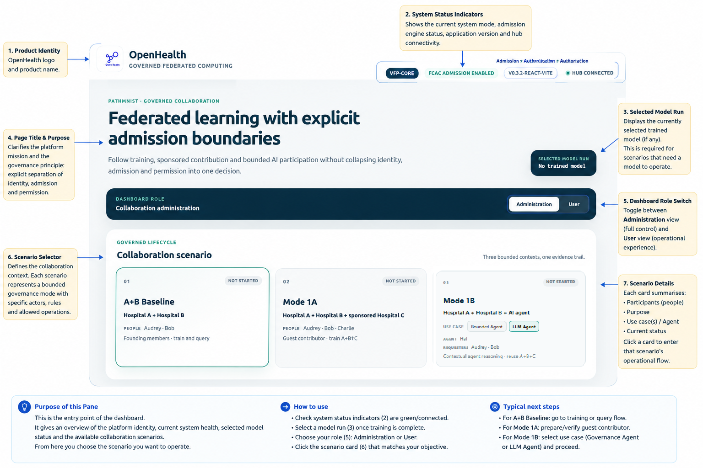
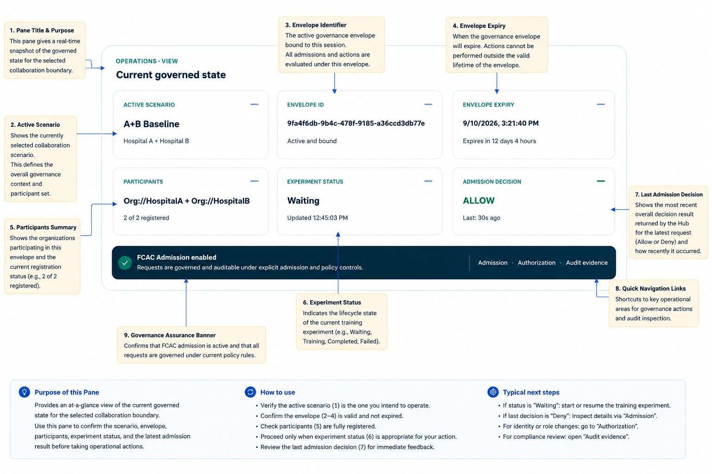
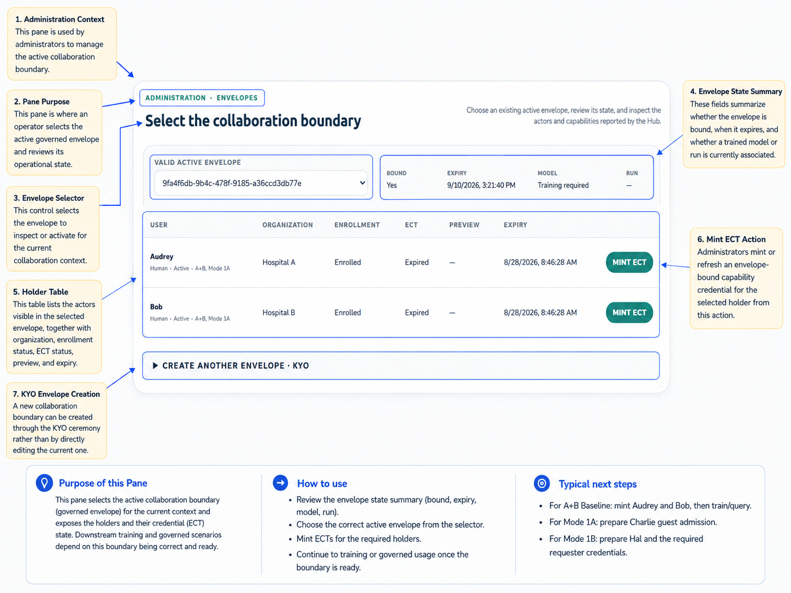
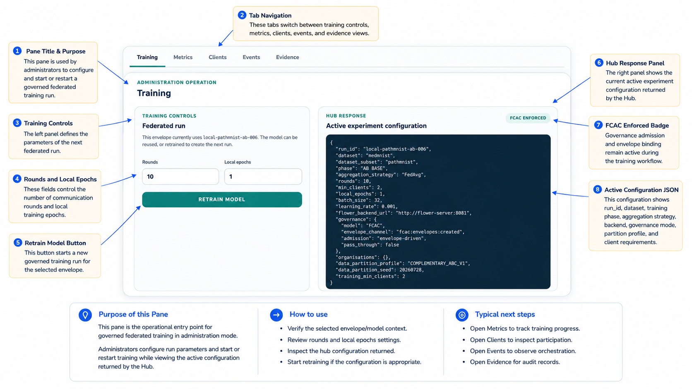
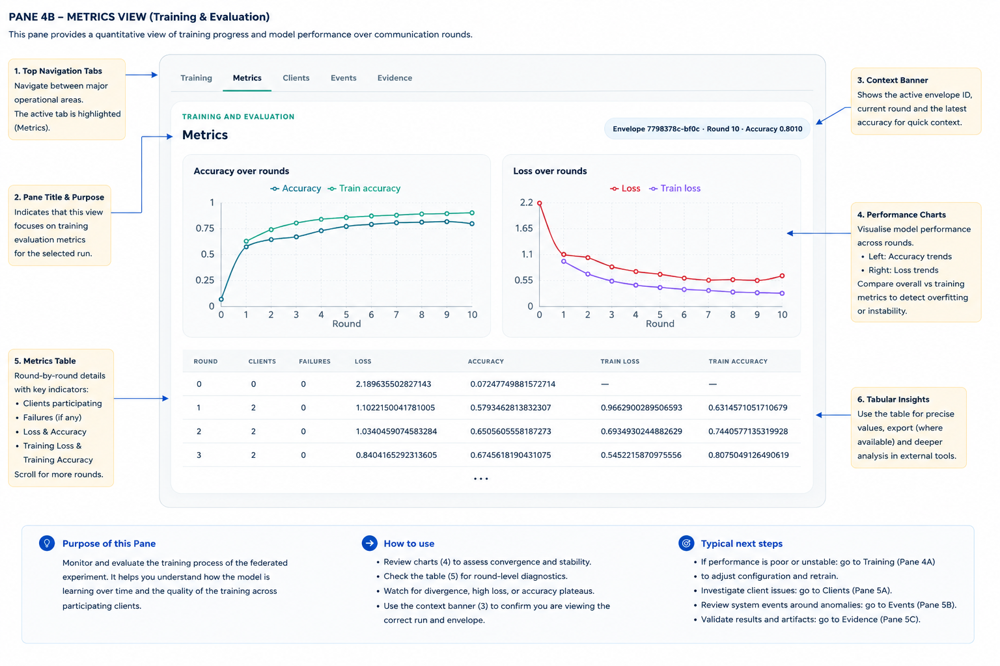
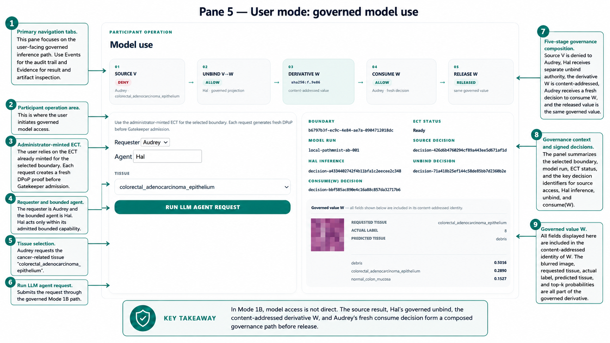

# OpenHealth-CDI Dashboard Navigation
## 1. Purpose of this guide
This document is a minimal visual guide to the OpenHealth-CDI dashboard. It explains where the principal controls and state indicators are located and how an operator moves between collaboration administration and participant operations.
The dashboard is deliberately organised around the governed lifecycle rather than around the underlying container inventory. The interface first establishes the collaboration context, then exposes the current governed state, collaboration-boundary administration, training and evaluation, and finally participant model use.
The screenshots in this guide are annotated operating views. Detailed architectural meaning belongs in [ARCHITECTURE.md](ARCHITECTURE.md), governance semantics in [GOVERNANCE.md](GOVERNANCE.md), scenario semantics in [SCENARIOS.md](SCENARIOS.md), and the Mode 1B computational-participant workflow in [MODE1B.md](MODE1B.md).
## 2. Look and feel
The interface uses a consistent visual grammar. Large cards identify the current collaboration scenario or operational workspace. Teal selection borders and controls indicate the active choice. Compact status fields expose the current envelope, model run, participant state, execution state, credential state, and admission result without hiding the underlying identifiers.
Administration and User are separate dashboard roles. Administration contains controls for collaboration boundaries, credentials, training, metrics, clients, events, and evidence. User mode exposes governed participant operations together with their admission and result state.
The interface should be read from context toward operation. First confirm which scenario and collaboration boundary are active. Then confirm the current model and credential state. Only then initiate training or model use.
> 🔑 **Takeaway**
> - The dashboard presents governance state but does not create governance authority.
> - Scenario selection, ECT minting, admission, execution, and evidence remain distinct operations even when they appear in one interface.
## 3. Pane 1 — dashboard entry and scenario selection

Pane 1 is the entry point to the dashboard. It provides the product identity, current system-status indicators, selected-model summary, role selector, and the three collaboration scenarios.
The **Administration / User** switch determines whether the operator is working with collaboration administration or participant operations.
The scenario cards select the operational context:
- **A+B Baseline** represents the founding Hospital A + Hospital B collaboration.
- **Mode 1A** adds the sponsored Hospital C contribution relation.
- **Mode 1B** adds Hal as the bounded computational participant.
Selecting a scenario changes the operational context presented by the dashboard. It does not itself establish a governance envelope, mint capability, or authorise an operation.
The normal next action in Administration mode is to confirm the collaboration boundary and current governed state before initiating an operation.
## 4. Pane 2 — current governed state

Pane 2 provides an at-a-glance view of the state currently being operated.
The pane reports the active scenario, selected governance-envelope identifier, current run/model identifier, participating organisations, execution status, and current admission summary.
The governance banner reinforces the separation among admission, authentication, and authorisation. These are related controls but not interchangeable concepts.
Before proceeding, the operator should verify that the displayed scenario, envelope, participants, and model correspond to the intended activity.
The **Run / model ID** and **Envelope ID** should not be interpreted as two names for the same lifecycle. A model may have been produced by an earlier analytical run and later used under a different active governance envelope.
> ⚠️ **Interpretation constraint**
> - **Envelope ID** identifies the current governed collaboration context.
> - **Run / model ID** identifies analytical state and model provenance.
> - One must not be inferred from the other.
## 5. Pane 3 — collaboration boundary and ECT administration

Pane 3 is used by administrators to select and inspect an active collaboration boundary.
The **Valid active envelope** selector determines which existing governance envelope is presented as the current application context. The state summary reports whether the envelope is bound, its expiry, whether an associated model is available, and the current run identifier when one is present.
The holder table reports the actors visible for the selected context together with their organisation, issuer enrolment state, ECT state, ECT preview where available, and credential expiry.
**MINT ECT** or **REMINT ECT** asks the appropriate organisation issuer to issue the envelope-bound capability currently assigned to that holder. The administrator does not choose the effective privilege in this operation. Capability assignment remains issuer-owned.
The collapsed **CREATE ANOTHER ENVELOPE · KYO** control starts the A+B envelope-establishment ceremony when a genuinely new collaboration boundary is required.
An existing active envelope should normally be reused rather than replaced simply because an ECT has expired or a model operation failed.
> 🔑 **Takeaway**
> - Selecting an envelope chooses the governance context.
> - Minting an ECT establishes a holder capability within that context.
> - These are separate operations.
## 6. Pane 4A — Administration training

Pane 4A is the main Administration training workspace.
The navigation bar provides access to:
`Training`
`Metrics`
`Clients`
`Events`
`Evidence`
The left side contains the federated-run controls. The operator can inspect or change the number of communication rounds and local epochs before starting or retraining the model.
The **RETRAIN MODEL** control starts a new governed training lifecycle for the selected scenario and collaboration context.
The right side displays the active experiment configuration reported by the Hub. This is useful for confirming the run identifier, dataset, training phase, aggregation strategy, number of rounds, client requirement, backend, governance mode, partition profile, and other execution parameters before training is started.
The **FCAC ENFORCED** badge indicates that the training workflow is operating through the governed application configuration. It should not be interpreted as a substitute for the signed conformance evidence produced by the governance path.
The normal next step after starting a run is to move to **Metrics** to follow training and then inspect **Clients**, **Events**, or **Evidence** where additional operational detail is required.
## 7. Pane 4B — Administration metrics

Pane 4B displays training and evaluation metrics for the selected model run.
The context banner identifies the active envelope, current round, and current accuracy so that the operator can confirm which run is being inspected.
The **Accuracy over rounds** chart compares evaluation accuracy with training accuracy. The **Loss over rounds** chart compares evaluation loss with training loss.
The table below the charts provides the precise values for each round, including participating clients, failures, loss, accuracy, training loss, and training accuracy.
The graphs are an operational and analytical view. They do not determine whether the training participants were authorised. Governance conformance is established by the admission and evidence paths documented elsewhere.
When a metric anomaly appears, use the **Clients** view to inspect participation, **Events** to inspect orchestration, and **Evidence** to inspect governance records associated with the activity.
## 8. Secondary Administration views
The dashboard also provides **Clients**, **Events**, and **Evidence** tabs. They are not given separate annotated screenshots because they are inspection views supporting the same governed lifecycle shown in Panes 4A and 4B.
**Clients** shows the configured and currently registered organisational participants.
**Events** presents application and orchestration events in reverse chronological order with expandable raw event content.
**Evidence** presents governance evidence surfaced through the application.
These views are particularly useful when the visible training state and the expected federation state do not agree.
## 9. Pane 5 — User mode governed model use

Pane 5 shows the ordinary A+B participant experience in **User** mode.
The User navigation contains:
`Model use`
`Events`
`Evidence`
The model-use pane begins from an administrator-minted ECT for the selected collaboration boundary. Each request creates fresh DPoP holder proof before the request is submitted for Gatekeeper admission.
The **Holder** selector chooses the currently credentialled participant. The **Tissue** selector identifies the requested PathMNIST resource class.
**RUN GOVERNED INFERENCE** submits the bounded request through the governed model-use path.
The result side reports the selected boundary, ECT status, model run, and Gatekeeper admission result. When an admitted inference executes, the pane also presents the sample image, requested tissue, actual dataset label, predicted tissue, and top-ranked model outputs.
A returned model result therefore follows a chain that includes holder selection, an envelope-bound ECT, fresh holder proof, Gatekeeper admission, and model execution.
> 🔑 **Takeaway**
> - In User mode, model access is not direct.
> - Possessing a model or being able to reach the application does not replace holder capability and admission.
## 10. Why Pane 5 uses the A+B scenario
The generic dashboard guide intentionally illustrates User mode with the A+B baseline.
That view exposes the ordinary governed model-use path without mixing it with the special semantics of sponsored contribution or computational-agent mediation.
Mode 1A is primarily demonstrated through sponsored contribution and the A+B+C training relation. Its governance meaning is documented in [SCENARIOS.md](SCENARIOS.md) and [GOVERNANCE.md](GOVERNANCE.md).
Mode 1B introduces additional requester, agent, reasoning, rebind, and derivative-release state. Its dashboard interpretation is therefore documented separately in [MODE1B.md](MODE1B.md).
The dedicated Mode 1B annotated image is:
```text
DB_pane_1B.png
```
It is intentionally not reproduced in this generic navigation guide.
## 11. Administration versus User mode
Administration mode operates the collaboration and analytical lifecycle. It selects governance boundaries, manages holder ECT readiness, starts training, and inspects metrics, clients, events, and evidence.
User mode exercises participant-facing governed operations. It does not redefine issuer entitlements or collaboration constitution.
Switching dashboard role changes which operational controls are displayed. It does not change the underlying capability held by a participant.
A holder denied an operation in User mode does not become authorised by switching the interface back to Administration.
## 12. Typical A+B navigation
A normal A+B demonstration follows this visual path:
```text
Pane 1
Select A+B Baseline and Administration
        ↓
Pane 2
Confirm current governed state
        ↓
Pane 3
Select the intended envelope and ensure required ECTs are ready
        ↓
Pane 4A
Start or retrain the federated model if required
        ↓
Pane 4B
Inspect training and evaluation
        ↓
Pane 1
Switch role to User
        ↓
Pane 5
Select holder and tissue, then run governed inference
        ↓
Events / Evidence
Inspect the resulting operational and governance record
```
This is an operator workflow. It does not replace the executable conformance sequence in [TESTING.md](TESTING.md).
## 13. When a control is disabled
The frontend disables operations when required state is absent.
Examples include an unavailable collaboration envelope, missing or expired holder ECT, insufficient actor readiness, or a Mode 1B request for which both requester and Hal credentials are not ready.
A disabled control should therefore be investigated by checking the boundary and credential state before treating it as a frontend defect.
Pane 3 is normally the first place to inspect when a User-mode action is unexpectedly unavailable.
## 14. ALLOW and DENY
An **ALLOW** means that the displayed operation was admitted under the relevant governance relation.
A **DENY** is also a legitimate governance result. It indicates that the concrete requested relation was outside the admitted capability or policy context.
The operator should therefore not attempt to "repair" every DENY by minting broader credentials or creating a new envelope.
Use the displayed reason, Events, Evidence, and the relevant conformance test to determine whether the DENY is expected.
## 15. Dashboard and evidence
The dashboard is designed to make the current state intelligible to an operator, but the interface itself is not the authoritative research evidence.
Signed Gatekeeper decision records and the executable conformance tests provide the inspectable evidence for governance claims.
The dashboard can show that a request was reported as ALLOW or DENY. The evidence path establishes the recorded decision and the relation that produced it.
This distinction is particularly important for Mode 1A sponsorship and the Mode 1B source/rebind/derivative sequence, where several separate admission decisions can belong to one user-visible workflow.
## 16. Dashboard summary
The dashboard presents the OpenHealth-CDI lifecycle as five principal operating panes. Pane 1 selects the collaboration scenario and dashboard role. Pane 2 shows the current governed state. Pane 3 selects and administers the active collaboration boundary and holder credentials. Panes 4A and 4B operate and inspect federated training. Pane 5 presents ordinary governed model use to a participant.
The visual sequence is designed to keep context visible before action. The operator sees which collaboration is active, which envelope governs the operation, which model is being used, which holder capability is ready, and which admission result applies.
The interface should therefore be used as an operational view over the architecture rather than as a replacement for the architecture.
