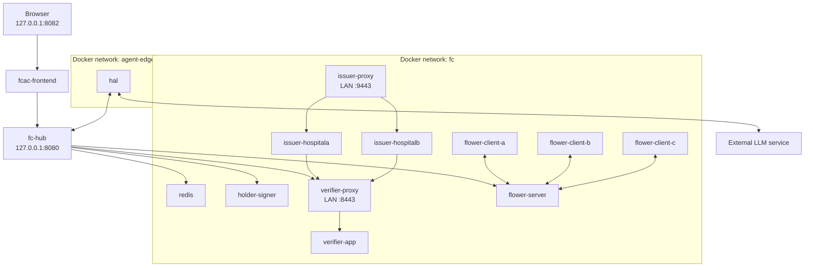

# OpenHealth-CDI Local Deployment and Operation
## 1. Purpose of this document
This document describes how to deploy and operate the OpenHealth-CDI research reference implementation in its current local Docker/OpenTofu form. It is written for an engineer who has not participated in the development of OpenHealth and should therefore be read together with [ARCHITECTURE.md](ARCHITECTURE.md), [GOVERNANCE.md](GOVERNANCE.md), [SCENARIOS.md](SCENARIOS.md), [MODE1B.md](MODE1B.md), and [TESTING.md](TESTING.md).
The deployment is intended to reproduce the executable research environment used for the A+B baseline, Mode 1A sponsored contribution, and Mode 1B governed computational participation. It is not a production deployment template. In particular, several local mechanisms such as Docker bridge networks, loopback publication, host-mounted cryptographic material, and local filesystem model storage are implementation choices used to realise architectural constraints in the reference environment.
The AWS migration of those constraints is documented separately in [AWS-PORTING.md](AWS-PORTING.md).
## 2. Deployment model
The current implementation is provisioned with OpenTofu using the Docker provider. OpenTofu builds the local application images, creates the required Docker networks and volumes, and starts the complete service set.
The deployment contains two Docker networks. `fc` is the federation-internal network used by the Hub, Gatekeeper, issuers, holder-signer, Redis, Flower runtime, frontend, and organisational Flower clients. `agent-edge` is the separate execution domain used by Hal. The Hub joins both networks and is the intended application aperture between Hal and federation-internal services.
The principal topology is:



The diagram describes the local implementation. Its architectural meaning is explained in [ARCHITECTURE.md](ARCHITECTURE.md).
## 3. Host requirements
The local host must provide a Linux environment capable of running Docker and OpenTofu. The PathMNIST Flower clients use CUDA and therefore require an operational NVIDIA GPU stack for the reference training configuration.
The principal host tools used by deployment and testing are:
- Docker
- OpenTofu
- NVIDIA driver
- NVIDIA Container Toolkit
- Git
- `curl`
- `jq`
- Python 3
- OpenSSL
The conformance scripts may require additional standard Unix utilities such as `grep`, `awk`, and `sed`.
The host GPU can be verified before the complete application is deployed by running `src/tests/Test00_verifyDockerGPU.sh`. The same test should be run again after the Flower client image has been built so that the image-level CUDA/PyTorch configuration is also checked.
## 4. Repository checkout
The deployment described here corresponds to the `delivery` branch.
A new operator can obtain it with:
```bash
git clone https://github.com/onzelf/openhealth-cdi.git
cd openhealth-cdi
git checkout delivery
```
Before changing the deployment, confirm the current branch and working-tree state:
```bash
git status
git branch --show-current
```
The reference deployment should be reproduced from a known commit before local modifications are introduced.
## 5. Runtime material intentionally excluded from Git
The public repository does not contain all material required to start the running trust environment. `.gitignore` intentionally excludes local OpenTofu state, verifier certificates, mutable bind and envelope state, decision state, key state, the verifier vault, holder-key material, and local secrets.
A new clone must therefore be supplied with the required local runtime material before `tofu apply` can reproduce the complete environment.
The relevant excluded paths include:
```text
src/infra/tofu/terraform.tfstate*
src/vfp-governance/verifier/certs/
src/vfp-governance/verifier/state/binds/
src/vfp-governance/verifier/state/envelopes/
src/vfp-governance/verifier/state/events/
src/vfp-governance/verifier/state/keys/
src/vfp-governance/verifier/vault/
src/tools/holder_keys/
src/tests/holder_keys/
secrets/
```
The executable policy, constitution, MOU, source code, entitlement configuration, tests, and infrastructure definition remain version-controlled. Runtime secrets and mutable cryptographic state do not.
> ⚠️ **Deployment prerequisite**
> - A fresh Git clone is the source baseline, not a complete trust-state backup.
> - Provision the local trust material and secrets required by the deployment before running OpenTofu.
> - Do not manufacture replacement credentials merely to make a failing deployment start. The identities encoded in the certificates are part of the local trust model.
## 6. Required certificate material
The verifier and issuer nginx services terminate mTLS using certificate material mounted from:
`src/vfp-governance/verifier/certs/`
The verifier edge expects:
```text
ca.crt
verifier.crt
verifier.key
```
The Hub uses:
```text
hub.crt
hub.key
```
The organisation administrative paths use:
```text
HospitalA-admin.crt
HospitalA-admin.key
HospitalB-admin.crt
HospitalB-admin.key
```
The issuer proxy expects:
```text
issuer-proxy.crt
issuer-proxy.key
```
Additional evidence-signing and holder-related material used by the Gatekeeper and tests must also be present where referenced by the current implementation.
The verifier nginx edge authenticates protected routes by the verified client certificate identity. `/admission/check`, for example, accepts the Hub identity, while administrative routes require the appropriate Hospital A or Hospital B administrator identity. The certificate set must therefore preserve the expected identities and not merely contain syntactically valid certificates.
## 7. Hal reasoning-runtime secret
Hal can use an external OpenAI reasoning runtime in the Mode 1B contextual demonstration. The local OpenTofu configuration mounts:
```text
secrets/.env
```
into the Hal container as:
```text
/run/secrets/openai.env
```
The file must contain a valid:
```text
OPENAI_API_KEY=<key>
```
The directory and file are intentionally excluded from Git and must never be committed.
Hal can also read `OPENAI_API_KEY` directly from its process environment, but the delivered OpenTofu configuration uses the mounted file.
The external reasoning credential is not a federation credential. It authorises access to the reasoning provider and must not be confused with Hal's holder identity or federation ECT.
## 8. Hal holder identity
Hal's federation holder identity is separate from the external reasoning credential. OpenTofu creates the Docker volume:
```text
hal-identity
```
and mounts it inside Hal at:
```text
/var/lib/hal/identity
```
Hal creates or reloads its Ed25519 private holder key in that directory and derives its public JWK and JKT. The private holder key therefore persists across ordinary container recreation while the volume remains intact.
Destroying the `hal-identity` volume changes Hal's cryptographic holder identity. If that happens, any existing issuer registration for Hal can no longer be assumed to match the new JKT.
Do not remove the volume casually during troubleshooting.
## 9. Local deployment address
The OpenTofu variable `lan_ip` determines the host address on which the verifier and issuer mTLS edges are published. The default in `main.tf` is:
```text
192.168.1.25
```
That value is only a local default and must be replaced when the deployment host uses another address.
Set the actual host address before planning:
```bash
export HOST_IP=<host-ip>
```
The verifier mTLS edge is published on:
```text
https://<HOST_IP>:8443
```
The issuer mTLS proxy is published on:
```text
https://<HOST_IP>:9443
```
The dashboard and direct Hub debugging endpoint are deliberately bound only to host loopback.
## 10. Service names used by mTLS
The local trust model uses the logical service names:
```text
verifier.local
issuer-hospitala.local
issuer-hospitalb.local
```
The verifier certificate and test tooling are designed around these identities. Depending on the operation, tests either rely on local name resolution or use `curl --resolve` to bind the logical TLS name to the configured host IP.
The important property is that TLS identity validation continues to use the intended logical service identity. Replacing the name with an arbitrary IP address while disabling certificate validation is not an equivalent deployment.
## 11. Pre-deployment checks
Before running OpenTofu, confirm Docker:
```bash
docker info
```
Confirm OpenTofu:
```bash
tofu version
```
Confirm the NVIDIA host stack:
```bash
nvidia-smi
docker run --rm --gpus all ubuntu:22.04 nvidia-smi
```
Confirm that the local certificate and secret locations exist:
```bash
test -d src/vfp-governance/verifier/certs
test -d src/vfp-governance/verifier/state
test -d src/vfp-governance/verifier/vault
test -s secrets/.env
```
Confirm the principal certificate files:
```bash
for f in \
  ca.crt \
  verifier.crt \
  verifier.key \
  hub.crt \
  hub.key \
  HospitalA-admin.crt \
  HospitalA-admin.key \
  HospitalB-admin.crt \
  HospitalB-admin.key \
  issuer-proxy.crt \
  issuer-proxy.key
do
  test -s "src/vfp-governance/verifier/certs/$f" || echo "MISSING: $f"
done
```
Any missing trust material should be resolved before deployment rather than discovered through cascading container failures.
## 12. OpenTofu initialisation
The OpenTofu module is:
```text
src/infra/tofu/
```
Enter that directory:
```bash
cd src/infra/tofu
```
Initialise the Docker provider:
```bash
tofu init
```
Validate the configuration:
```bash
tofu validate
```
A clean validation should complete before applying the configuration.
## 13. Review the deployment plan
Create a plan using the actual host address:
```bash
tofu plan \
  -var="lan_ip=${HOST_IP}"
```
The principal default analytical parameters are:
```text
run_id                         = local-pathmnist-ab-001
flower_rounds                  = 10
local_epochs                   = 1
learning_rate                  = 0.001
batch_size                     = 32
train_fraction                 = 0.80
cancer_samples_per_ab_hospital= 100
pathmnist_partition_profile    = COMPLEMENTARY_ABC_V1
pathmnist_partition_seed       = 20260728
mtls_port                      = 8443
issuer_mtls_port               = 9443
bench                          = false
```
These are reference-workload values. Changing them may alter analytical results. Some are implementation choices, while others participate in the reproducible experimental setup.
## 14. Apply the local deployment
Apply the configuration:
```bash
tofu apply \
  -var="lan_ip=${HOST_IP}" \
  -auto-approve
```
OpenTofu builds the local application images and creates the networks, named volumes, and containers defined by the reference deployment.
The first build can take substantially longer than later container restarts because the Flower client image includes the PathMNIST/PyTorch runtime.
## 15. Expected containers
After a successful apply, inspect the running containers:
```bash
docker ps --format 'table {{.Names}}\t{{.Status}}\t{{.Networks}}'
```
The expected service set includes:
```text
redis
holder-signer
verifier-app
verifier-proxy
issuer-proxy
issuer-hospitala
issuer-hospitalb
fc-hub
fcac-frontend
flower-server
flower-client-a
flower-client-b
flower-client-c
hal
```
Container existence alone does not establish governance conformance. It establishes that the deployment inventory is running. The conformance suite checks the relationships among these services.
## 16. Expected network membership
Inspect the two Docker networks:
```bash
docker network inspect fc
docker network inspect agent-edge
```
Federation-internal services should use `fc`.
Hal should use `agent-edge`.
The Hub should be connected to both.
This topology makes the Hub the normal application aperture between Hal and federation-internal services.
> 🔑 **Takeaway**
> - The two Docker networks are implementation mechanisms.
> - The important invariant is that Hal does not acquire the ordinary privileged federation-internal path while the Hub remains the controlled application aperture.
## 17. Published local endpoints
The principal host-visible endpoints in the reference deployment are:

| Endpoint | Publication | Purpose |
| --- | --- | --- |
| Dashboard | `http://127.0.0.1:8082` | browser interface |
| Hub | `http://127.0.0.1:8080` | local debugging and test access |
| Verifier mTLS edge | `https://<HOST_IP>:8443` | protected governance edge |
| Issuer mTLS edge | `https://<HOST_IP>:9443` | protected organisation issuer edge |

The Flower backend is not published to the host in the delivered OpenTofu configuration. It is reached internally by the Hub and Flower clients.
The loopback publication of the Dashboard and Hub is a local deployment choice implementing restricted ingress. It is not an AWS design requirement.
## 18. Verify the dashboard
After deployment, open:
```text
http://127.0.0.1:8082
```
The header should report Hub connectivity when the frontend proxy can reach `fc-hub`.
The dashboard is an operational interface over the governed system. It is not the source of policy or authority.
A concise visual navigation guide is provided in [DASHBOARD.md](DASHBOARD.md).
## 19. Verify the GPU-enabled Flower clients
Return to the test directory:
```bash
cd ../../tests
```
Run:
```bash
./Test00_verifyDockerGPU.sh
```
After deployment the test should check both the host GPU stack and the built `openhealth/flower-client:local` image. The image is expected to see CUDA through PyTorch `2.2.0+cu121`.
Failure at this stage should be diagnosed as a GPU/container-runtime problem before debugging federation governance.
## 20. Establish a governance envelope
The collaboration must have an active governance envelope before envelope-bound capabilities and governed operations can be exercised.
The envelope can be established through either the dashboard KYO ceremony or the test script:
```bash
./Test1A_createEnvelope.sh
```
The A+B constitution requires Hospital A and Hospital B approval and a two-of-two quorum.
Record the resulting identifier:
```bash
export EID=<active-envelope-id>
```
The same valid envelope should normally be retained while executing a complete regression sequence.
Creating a new envelope is a governance action, not a generic reset operation.
## 21. Select the collaboration boundary
The Administration view of the dashboard displays valid active envelopes and allows the operator to select the collaboration boundary used by the application.
Selecting an envelope identifies the governance context for subsequent operations. It does not by itself mint participant credentials and does not imply that a model was trained under that envelope.
The administration boundary view also reports whether the selected envelope is bound, its expiry, whether a model is currently associated with the view, and the ECT state of visible holders.
See Pane 3 in [DASHBOARD.md](DASHBOARD.md).
## 22. Mint holder ECTs
The dashboard permits an administrator to mint or refresh an ECT for a holder when the issuer reports that holder as eligible.
The operation uses the organisation issuer path. The caller identifies the holder and selected envelope, while the organisation issuer determines the effective capability from its own entitlement configuration.
An expired ECT should therefore be refreshed through the issuer path rather than replaced by a caller-constructed credential.
The issuer boundary and caller-injection protections are tested in `Test2C_issuer_mint.sh`, `Test2D_issuer_owned_entitlements.sh`, and `Test2F_issuer_registration_boundary.sh`.
## 23. A+B baseline training
The A+B baseline uses Hospitals A and B as the two required Flower participants.
In Administration mode select the A+B scenario, establish or select the intended envelope, ensure the required holder state is ready where applicable, and open the **Training** tab.
The training pane reports the current run configuration and permits the administrator to set the number of federated rounds and local epochs before starting or retraining.
The reference defaults are 10 rounds and one local epoch.
The complete non-interactive lifecycle can also be exercised with:
```bash
./Test1B_postEnvelope.sh "$EID"
```
That test reinitialises the logical run, waits for the bound envelope, starts a new training lifecycle, waits for a new correlated Flower run, and verifies the envelope-associated run manifest.
## 24. Training artefacts
The Flower server stores model and analytical artefacts beneath the mounted verifier vault.
A completed run contains artefacts such as:
```text
model.pt
metrics.csv
participants.json
confusion_counts.csv
confusion_normalized.csv
class_metrics.csv
final_model_metadata.json
```
`Test1C_verifyABRounds.sh` verifies the expected run artefacts and the round-zero plus trained-round metric sequence.
The model artefact belongs to an analytical run. It must not be confused with the currently selected governance envelope.
## 25. Metrics and operational inspection
The Administration workspace contains:
```text
Training
Metrics
Clients
Events
Evidence
```
The **Metrics** pane visualises accuracy and loss over rounds and presents the exact round-level values in tabular form.
The **Clients** pane reports configured and registered organisational participants.
The **Events** pane exposes orchestration and runtime events.
The **Evidence** pane provides access to governance evidence surfaced through the application.
The visual guide illustrates the Training and Metrics panes because they contain the main interactive analytical workflow. Clients, Events, and Evidence are inspection views rather than independent deployment phases.
See Panes 4A and 4B in [DASHBOARD.md](DASHBOARD.md).
## 26. A+B governed model use
After a model is available and the required holder ECT is ready, switch the dashboard role to **User** and open **Model use**.
The user selects the holder and requested tissue and then runs governed inference.
The frontend uses the administrator-minted ECT for the selected boundary and obtains a fresh DPoP proof for the request before Gatekeeper admission.
An ALLOW permits the model operation to execute. A DENY must leave the protected inference operation unexecuted.
Pane 5 in [DASHBOARD.md](DASHBOARD.md) illustrates the ordinary A+B user flow.
## 27. Mode 1A deployment use
Mode 1A does not require a different infrastructure deployment. The same service topology is reused.
The scenario activates Hospital C's Flower client as the data source while Charlie participates through the sponsored guest-contributor governance relation.
Hospital C therefore becomes operationally relevant without becoming a third founding member of the A+B constitution.
The relevant conformance sequence is:
```bash
ISSUER_IP="$HOST_IP" ./Test3F_mode1a_guest_admission.sh "$EID"
./Test3G_mode1a_guest_contribution_admission.sh "$EID"
ISSUER_IP="$HOST_IP" ./Test4C_sponsorship_regression.sh "$EID"
```
The governance meaning of Mode 1A is documented in [SCENARIOS.md](SCENARIOS.md) and [GOVERNANCE.md](GOVERNANCE.md).
## 28. Mode 1B deployment use
Mode 1B also reuses the same overall deployment but activates Hal's separate execution domain and bounded-agent capability.
Hal must be able to reach the Hub through `agent-edge` and the configured external reasoning runtime when the contextual LLM-mediated use case is exercised. Hal must not acquire the ordinary federation-internal service path or privileged federation credentials.
The principal local validation sequence is:
```bash
LAN_IP="$HOST_IP" ./Test5A_agent_isolation.sh

ISSUER_IP="$HOST_IP" VERIFIER_IP="$HOST_IP" \
  ./Test5C_agent_credential_admission.sh "$EID"

ISSUER_IP="$HOST_IP" VERIFIER_IP="$HOST_IP" \
  ./Test5D_mode1b_table7_conformance.sh "$EID"

ISSUER_IP="$HOST_IP" VERIFIER_IP="$HOST_IP" \
  ./Test5E_mode1b_contextual_agent.sh "$EID"
```
Mode 1B semantics and its dedicated dashboard figure are documented in [MODE1B.md](MODE1B.md).
## 29. Model lifecycle and governance-envelope lifecycle
A selected governance envelope and a selected model run are independent state dimensions.
Training can produce a model under one historical run context. A later governance envelope can subsequently govern use of that already existing model.
The dashboard may therefore show a current envelope together with an older model-run identifier. That state is not inherently inconsistent.
It would be incorrect to infer that the current envelope trained the displayed model solely because the model is currently used under that envelope.
> ⚠️ **Interpretation constraint**
> - The envelope governs the **current operation**.
> - The run identifies the **analytical provenance of the model**.
> - Deployment and UI state must preserve both rather than fabricating a single lifecycle.
## 30. Rebuilding one component
OpenTofu can rebuild and recreate an individual component without replacing the complete deployment.
For example, after a frontend source change:
```bash
cd ../infra/tofu
tofu apply \
  -var="lan_ip=${HOST_IP}" \
  -replace=docker_image.frontend \
  -replace=docker_container.frontend_even \
  -auto-approve
```
The same approach can be used for another component when its source or configuration genuinely requires replacement.
Do not replace unrelated containers as a generic troubleshooting strategy. Recreating stateful components can invalidate useful runtime evidence or change persistent identities.
## 31. nginx upstream refresh after container recreation
The local nginx proxy containers resolve Docker upstream names when nginx starts. If an upstream container is replaced and receives a different Docker address, a long-lived proxy can retain stale upstream resolution.
The practical symptom is that the recreated service is healthy when addressed directly from the Docker network but requests through the existing nginx proxy fail.
After recreating an issuer container, recreate or restart `issuer-proxy`.
After recreating `verifier-app`, recreate or restart `verifier-proxy`.
After recreating the Hub, restart the frontend proxy if its upstream reference has become stale.
This is an implementation-specific service-discovery behaviour and not a federation-governance property. The AWS deployment must provide an equivalent reliable service-discovery mechanism rather than reproducing this weakness.
Detailed symptoms and recovery procedures belong in [TROUBLESHOOTING.md](TROUBLESHOOTING.md).
## 32. Inspecting container logs
For a service-specific failure, inspect the relevant container before replacing anything.
Examples:
```bash
docker logs --tail 200 fc-hub
docker logs --tail 200 verifier-app
docker logs --tail 200 verifier-proxy
docker logs --tail 200 issuer-hospitala
docker logs --tail 200 issuer-hospitalb
docker logs --tail 200 issuer-proxy
docker logs --tail 200 flower-server
docker logs --tail 200 flower-client-a
docker logs --tail 200 flower-client-b
docker logs --tail 200 flower-client-c
docker logs --tail 200 hal
docker logs --tail 200 fcac-frontend
```
The component reporting the error is not necessarily the component whose invariant failed. Use [TESTING.md](TESTING.md) to classify the failed layer before changing the deployment.
## 33. Inspecting current topology
Useful Docker inspection commands include:
```bash
docker inspect fc-hub
docker inspect hal
docker network inspect fc
docker network inspect agent-edge
docker volume inspect hal-identity
```
These are especially useful when verifying Mode 1B network membership and mount custody.
`Test5A_agent_isolation.sh` should remain the executable authority for the delivered Mode 1B local isolation claim rather than relying on manual inspection alone.
## 34. Restarting the deployment
Because containers are configured with `restart = "unless-stopped"`, ordinary Docker daemon restarts preserve the intended service restart policy.
To restart a specific service:
```bash
docker restart <container-name>
```
Use service-specific restart when the problem is known to be transient and no image or configuration change occurred.
When infrastructure configuration changed, use OpenTofu so that the running container remains consistent with `main.tf`.
## 35. Destroying the deployment
A complete local teardown can be performed from `src/infra/tofu` with:
```bash
tofu destroy \
  -var="lan_ip=${HOST_IP}" \
  -auto-approve
```
A full destroy is not an ordinary reset procedure. The deployment contains persistent issuer-registry and Hal-identity volumes as well as host-mounted governance state and model artefacts.
Before destroying or deleting volumes, determine which state must be retained for the research record.
Deleting state indiscriminately can remove the relationship between previously recorded evidence and the runtime state that produced it.
## 36. Local security boundaries
The local deployment combines several different control mechanisms.
Docker network membership limits ordinary service paths.
mTLS authenticates protected verifier and issuer edges.
Organisation issuers own capability assignment.
Holder keys establish DPoP possession.
The Gatekeeper evaluates the concrete operation.
The execution service runs only after the admitted path reaches it.
These mechanisms must not be collapsed into a single concept such as "network security" or "authentication".
A process that can reach a TCP port has not thereby acquired federation authority.
An authenticated service identity has not thereby acquired every participant capability.
An ECT has not thereby become a bearer credential.
These distinctions are architectural and must survive deployment changes.
## 37. Local deployment versus AWS deployment
The local environment uses Docker mechanisms because they make the architecture executable and inspectable on one machine.
AWS is expected to replace many of those mechanisms.
Docker bridge isolation can become VPC, subnet, task-ENI, and security-group rules.
Host loopback publication can become controlled private ingress.
Local model storage can become managed AWS storage.
Local Redis can become a managed service.
The current nginx trust edge may remain behind a TCP-passthrough load balancer or later be replaced by another mechanism that preserves equivalent client-identity semantics.
The AWS port must therefore preserve invariants rather than reproduce the local inventory mechanically.
See [AWS-PORTING.md](AWS-PORTING.md).
## 38. Post-deployment conformance
A deployment is not considered ready merely because all containers are running.
After a clean deployment, execute the validation sequence documented in [TESTING.md](TESTING.md).
At minimum, a delivery candidate should establish:
- valid A+B envelope creation
- a complete A+B training and model artefact path
- issuer-owned capability assignment
- holder-bound admission
- signed ALLOW and DENY evidence
- sponsorship semantics
- Mode 1A contribution-versus-consumption separation
- Mode 1B agent execution isolation
- Hal bounded capability
- Table 7 Mode 1B conformance
- contextual Mode 1B requester-resource behaviour
The exact commands and expected results are intentionally centralised in [TESTING.md](TESTING.md) so that this deployment document does not create a second test specification.
## 39. Dashboard guide
The visual dashboard walkthrough is maintained separately in [DASHBOARD.md](DASHBOARD.md).
That document explains the five principal interface panes using annotated screenshots:
- Pane 1 — dashboard entry and scenario selection
- Pane 2 — current governed state
- Pane 3 — collaboration boundary and ECT administration
- Pane 4A — training
- Pane 4B — metrics
- Pane 5 — A+B user-mode governed model use
Mode-specific Mode 1B interpretation remains in [MODE1B.md](MODE1B.md) rather than being duplicated into the generic dashboard guide.
## 40. Source map
The principal deployment sources are:

| Concern | Repository path |
| --- | --- |
| local infrastructure | `src/infra/tofu/main.tf` |
| Docker provider lock | `src/infra/tofu/.terraform.lock.hcl` |
| verifier mTLS configuration | `src/vfp-governance/verifier/nginx/nginx.conf` |
| issuer mTLS configuration | `src/vfp-core/issuers/nginx/nginx.conf` |
| Hub | `src/vfp-core/hub/hub.py` |
| frontend | `src/vfp-core/frontend/` |
| Hal | `src/vfp-core/agents/hal/hal.py` |
| Flower backend and clients | `src/vfp-core/backend/` |
| executable policy | `src/vfp-governance/verifier/state/policy.json` |
| local conformance tests | `src/tests/` |

## 41. Deployment summary
The current local deployment is a single-host research environment that makes the OpenHealth-CDI federation architecture executable. OpenTofu provisions the Docker topology, while local trust material establishes the identities required by the mTLS and holder-binding paths.
Hospitals A and B form the constitutive collaboration. Hospital C can contribute operationally through the Mode 1A sponsored relation. Hal operates in a separate execution domain in Mode 1B and reaches the federation through the Hub rather than receiving ordinary privileged federation connectivity.
The deployment is complete only when the runtime inventory and the authority-bearing relationships are both correct. Containers establish the former. The conformance tests establish the latter.
