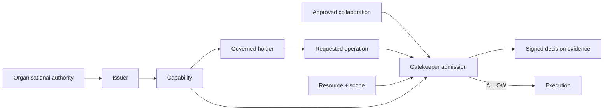
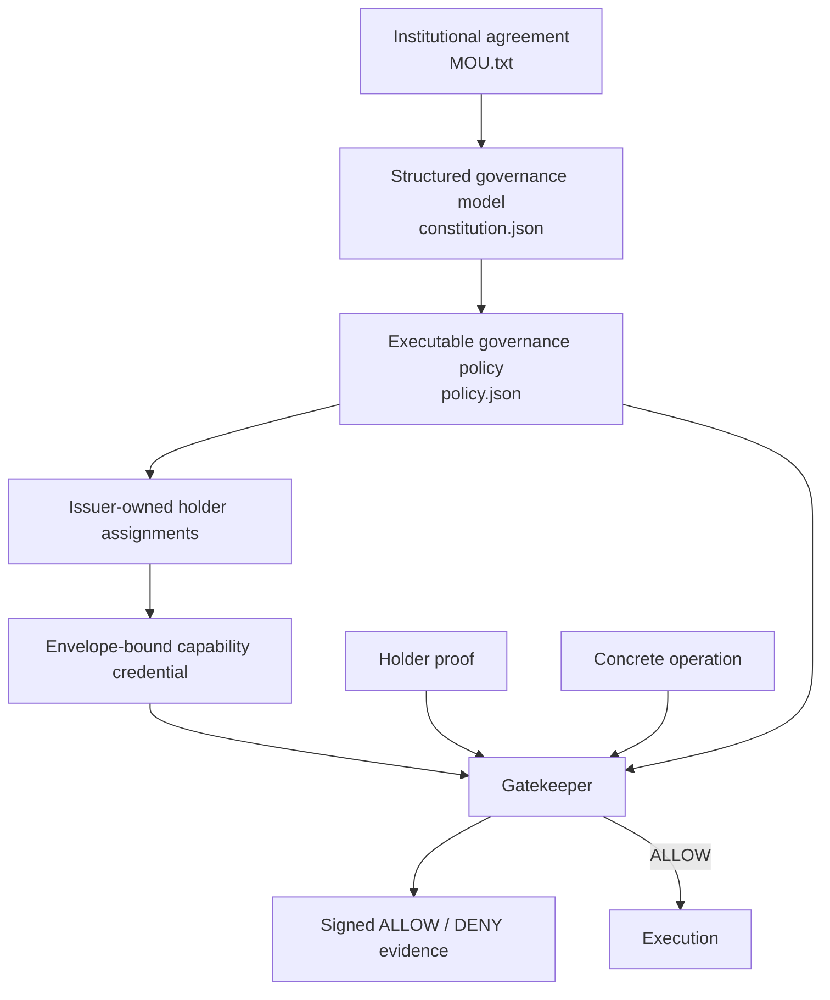
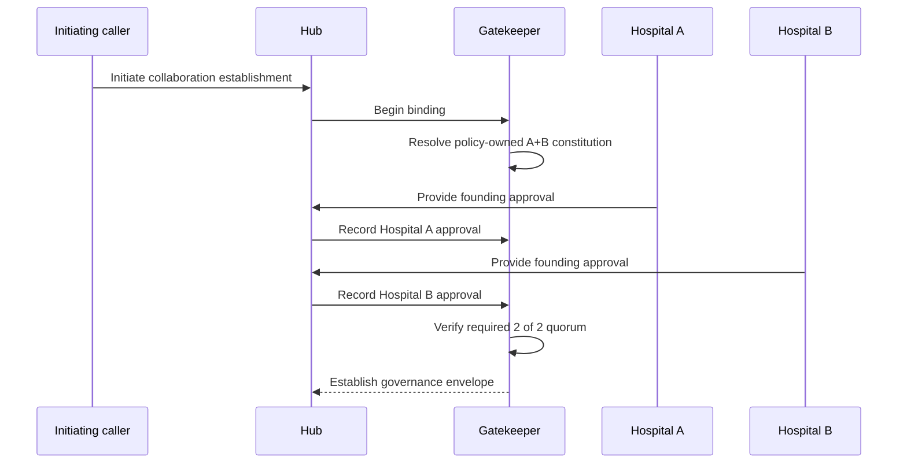
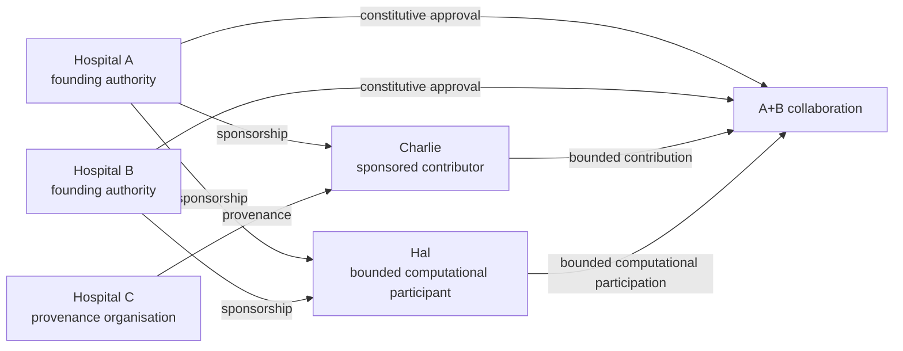
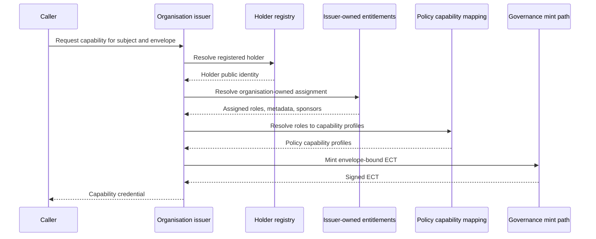
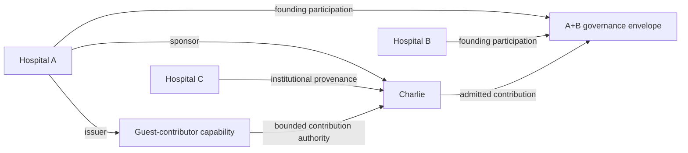
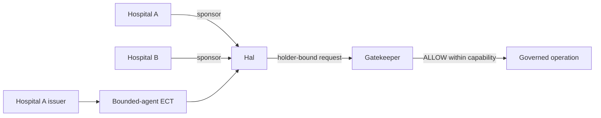
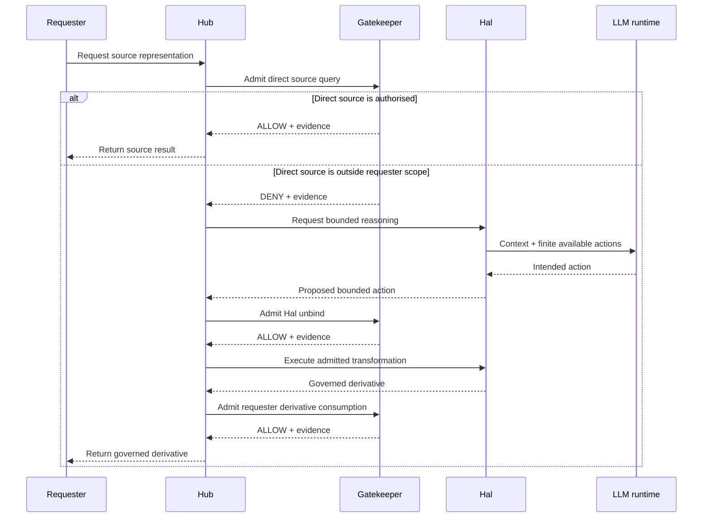

# OpenHealth-CDI Governance Model
## 1. Purpose of this document
OpenHealth-CDI is built around the proposition that collaboration across independently governed organisations cannot be described adequately by listing participants, services, credentials, or computational resources. A federation exists because particular relationships establish who may participate in a shared activity, which authority supports that participation, which operations are permitted, which resources those operations may address, and under which approved collaboration those permissions remain valid. This document describes how OpenHealth-CDI represents and enforces those relationships.
The governance model applies to all three executable modes. The A+B baseline establishes the founding collaboration between Hospitals A and B. Mode 1A introduces a sponsored contributor without converting that contributor's organisation into another founding member. Mode 1B introduces a computational participant without making either the agent's software implementation or its LLM reasoning runtime a source of federation authority. The objects involved become more diverse as the scenarios evolve, but the governance model remains the same.
A reader encountering OpenHealth-CDI for the first time should therefore understand governance as the authority structure surrounding an operation rather than as an access-control list attached to a collection of services. The principal question is always whether a particular participant may perform a particular operation over a particular resource, for a particular purpose, under a particular approved collaboration, with authority traceable to the organisations that govern that collaboration.
## 2. The governance relation
The fundamental governance relation in OpenHealth-CDI combines several dimensions that must remain distinguishable. A concrete operation has a participant or requester, an issuing authority, a capability, a holder identity, a resource, an action, a purpose, a scope, an approved collaboration, and sometimes a sponsorship relation. The Gatekeeper evaluates those dimensions together when deciding whether an operation is admitted.
No individual object is sufficient to establish authority. A registered user is not automatically authorised. A valid certificate is not automatically a capability. A capability is not automatically an ALLOW decision. An agent capable of executing a transformation is not automatically permitted to perform it. A derivative that has been produced is not automatically releasable to the requester.
This relation can be represented at a high level as follows.

The diagram deliberately places execution after admission. Computational ability does not create authority retroactively. The authority necessary for execution must already exist in the governed relation evaluated by the Gatekeeper.
## 3. Governance sources and their roles
The current implementation contains several governance artefacts that represent different stages between institutional agreement and executable admission. They are related, but they are not interchangeable.
`src/vfp-governance/verifier/state/MOU.txt` is the institutional source document for the research collaboration. It expresses the intended collaboration, participation conditions, data and model custody principles, research roles, sponsorship rules, holder assurance, evidence requirements, and other governance conditions in language suitable for an organisational agreement.
`src/vfp-governance/verifier/state/constitution.json` makes those concepts explicit in a structured form. It identifies the founding organisations, the default rule, research scope, participation grades, issuer authority, sponsorship, model custody, holder assurance, evidence requirements, and the distinction between constitutional and operational matters.
`src/vfp-governance/verifier/state/policy.json` is the executable policy representation. It defines the constitutive participant set and quorum, concrete governed operations, capability profiles, sponsorship rules, sponsorship authority, reserved scope, and the other constraints evaluated by the running system.
Organisation-specific issuer configuration assigns those policy-defined capability profiles to concrete registered holders. The issuer therefore connects the general policy to a particular participant without allowing the participant or application to choose its own effective authority.
The ECT represents the capability resulting from that issuer-controlled process and binds it to an approved collaboration and holder. DPoP establishes legitimate possession of the holder key for a concrete use of the capability. The Gatekeeper then evaluates the attempted operation and records signed ALLOW or DENY evidence.
The relationship among these layers is shown below.

The purpose of this sequence is to keep authority traceable. An operation should not become authorised because a convenient application component asserted that it ought to be authorised.
## 4. Constitutional governance and operational configuration
The constitution deliberately distinguishes governance conditions from operational implementation choices. This is necessary because many properties of a working distributed system are important for reliability or performance but have no constitutional meaning.
The governance layer includes the founding participants, participation grades, sponsorship requirements, research scope, reserved resources, model-custody conditions, research roles, issuer authority, holder assurance, delegation constraints, collaboration context, and evidence requirements. These properties determine who may participate and what participation means.
Operational configuration includes matters such as Docker deployment, service discovery, GPU selection, model architecture, optimizer choice, batch size, number of Flower rounds, and other runtime parameters. Those choices can affect whether the system works well, but changing them does not necessarily change the authority structure.
For example, moving from Docker to ECS should not require redefining Hospital A as a founding organisation. Changing the number of federated-learning rounds should not alter Charlie's sponsorship. Replacing the LLM used by Hal should not enlarge Hal's capability. Conversely, changing the founding organisations, creating a new participation grade, expanding the scope of a capability, or modifying who may sponsor a participant is a governance change even if no application code or container topology changes.
The distinction gives maintainers a practical test. If a proposed change alters who may perform which operation under whose authority, it belongs to the governance domain and requires corresponding governance review.
## 5. Default DENY
The constitutional default is DENY. An operation that is not explicitly authorised by the collaboration or by valid authority derived from it is refused.
This principle is stronger than maintaining a list of prohibited operations. The system does not assume that everything is allowed unless a specific prohibition can be found. Instead, the participant must establish a positive chain of authority for the attempted operation.
Default DENY is particularly important in an evolving federation. New actors, new services, and new computational capabilities can appear without automatically acquiring standing. Hospital C can exist and run code without becoming a founding member. Hal can execute software and call an LLM without acquiring general model access. A new API route can exist without becoming an authorised federation operation.
The practical consequence is that technical reachability, software capability, and absence of an explicit prohibition do not constitute authority.
## 6. Founding collaboration
The delivered collaboration is founded by `org://HospitalA` and `org://HospitalB`. The executable policy requires both founding participants and a quorum of two approvals out of two.
This participant set is policy-owned. A caller may initiate establishment of a governance envelope, but the caller does not determine which organisations constitute the collaboration or how many approvals are sufficient. Those conditions already belong to the federation policy.
This prevents a subtle but important failure mode. If a caller could create an envelope while supplying an arbitrary participant list and quorum, the application initiating the request would effectively possess constitutional authority. OpenHealth-CDI instead treats initiation and constitution as different acts.
The establishment sequence is therefore governed as follows.

The resulting envelope therefore represents an approved collaboration rather than a caller-defined session.
## 7. Constitutive participation and operational participation
OpenHealth-CDI distinguishes between organisations that constitute a collaboration and actors that are permitted to participate operationally within it. This distinction is necessary to support evolution without forcing every new actor into one homogeneous membership category.
Hospitals A and B are constitutive participants. Their relationship establishes the A+B collaboration and its governance context.
Charlie and Hospital C illustrate operational participation of a different kind. Charlie may contribute through a sponsored guest-contributor capability, while Hospital C remains the provenance organisation associated with that contributor. Neither Charlie nor Hospital C thereby gains the constitutional standing of Hospitals A and B.
Hal illustrates another operational relation. It can participate as a bounded computational participant under sponsorship and an explicit capability without becoming a founding organisation or receiving quorum rights.
The governance model can therefore add participants without rebuilding the constitutive federation each time.

The arrows carry different governance meanings. Treating every arrow simply as membership would destroy the distinctions the system is designed to demonstrate.
## 8. Governance envelope
A governance envelope identifies the approved collaboration context under which a capability may be exercised. The current policy requires capabilities to be bound to an `envelope_id`, and the Gatekeeper verifies that the envelope in the credential matches the envelope in the attempted operation.
This prevents a capability created for one approved collaboration from being reused silently under another. The envelope therefore participates directly in the authority relation rather than serving only as an application correlation identifier.
The governance envelope must not be confused with a training run or model artefact. A model may survive beyond the collaboration context under which it was originally trained. A later governance envelope may authorise a new operation over that existing model. In that situation the later envelope governs the current operation, but it does not rewrite the historical provenance of the model.
This separation is important because governance state answers whether an operation is currently authorised, while model provenance answers how and when the model artefact was produced.
## 9. Issuer authority
Hospitals A and B operate organisation-specific issuers. These issuers translate organisation-owned participant assignments into capabilities defined by the federation policy.
The caller does not choose its own effective authorisation profile. The issuer receives the subject and governance-envelope identifier, looks up the registered holder, resolves the organisation's entitlement assignment, maps the assigned profile names to policy capability profiles, attaches issuer-owned governance metadata, and requests creation of the signed ECT.
The request schema rejects extra fields. A caller cannot add a `profile` field to obtain a stronger profile and cannot add a `sponsors` field to choose its own sponsors. Actor metadata is also issuer-owned rather than caller-selected.
This keeps the authority chain explicit. The application may request issuance, but the issuer determines what can be issued.

The security significance is that a participant cannot convert an issuance API into self-authorisation by selecting the desired role in the request.
## 10. Holder registration
Each issuer maintains a registry of holders in its own namespace. A registry entry associates the issuer organisation, member identifier, subject, public key material, and JWK thumbprint.
Registration establishes which holder identity belongs to the subject for issuance purposes. It does not itself grant permission to perform an operation. A registered participant still requires an issuer-owned entitlement assignment, and the resulting capability remains subject to policy, holder proof, envelope binding, and admission.
This separation prevents registration from becoming equivalent to membership or authorisation. An unknown subject cannot obtain a capability, but a known subject does not receive arbitrary capability merely because a key has been registered.
## 11. Capability profiles
The executable policy defines capability profiles that collect the operations relevant to different forms of participation. These profiles are federation-policy objects. Organisation-specific issuer configuration determines which profiles a particular holder can receive.
The current principal profiles are shown below.

| Capability profile | Meaning in the current collaboration |
| --- | --- |
| `capset:pathmnist_hospital_a_participant` | Hospital A founding participation, training contribution, and evaluation |
| `capset:pathmnist_hospital_b_participant` | Hospital B founding participation, training contribution, and evaluation |
| `capset:pathmnist_guest_contributor` | sponsored federated-training contribution |
| `capset:pathmnist_bounded_agent` | bounded inference and policy-authorised unbind |
| `capset:pathmnist_derivative_reader` | consumption of approved derivative representations |
| `capset:pathmnist_other_tissue_reader` | model query over the authorised other-tissue scope |
| `capset:pathmnist_cancer_associated_reader` | model query over the authorised cancer-associated scope |

There is no default capability profile. A principal does not acquire general authority merely by being present in the participant catalogue or registered with an issuer.
## 12. Governed operations
Capability profiles resolve to concrete governed operations. An operation is defined by more than an action name. The executable policy associates the action with a resource, purpose, scope, and where appropriate additional flags or restrictions.
The principal operation classes in the current system are shown below.

| Operation | Resource | Purpose |
| --- | --- | --- |
| `join_envelope` | A+B collaboration resource | federated participation |
| `submit_update` | PathMNIST colon-pathology resource | federated training |
| `submit_evaluation` | PathMNIST colon-pathology resource | model evaluation |
| `query_model` | PathMNIST colon-pathology resource | approved model query |
| `bounded_inference` | PathMNIST colon-pathology resource | bounded model inference |
| `unbind` | PathMNIST colon-pathology resource | policy-authorised derivation |
| `consume_derivative` | PathMNIST derived representation | approved derivative consumption |

The distinction among these operations is critical. Permission to submit an update does not imply permission to query the resulting model. Permission to perform bounded inference does not imply permission to join the federation. Permission to transform a resource does not imply that a requester may consume the resulting derivative.
## 13. Scope and PathMNIST resource classes
The current research scenario uses PathMNIST tissue classes to make resource scope visible and testable. The collaboration distinguishes direct source-query authority for different holders rather than giving every requester general query access.
Audrey's other-tissue reader capability permits direct model queries for `mucus`, `normal_colon_mucosa`, and `lymphocytes`. Bob's cancer-associated reader capability permits direct model queries for `cancer_associated_stroma` and `colorectal_adenocarcinoma_epithelium`.
The `background` class is reserved. Its existence in the underlying dataset does not mean that it belongs to the authorised query scope. This provides a concrete example of the difference between resource existence and governed resource use.
The scope model also allows the system to demonstrate contextual behaviour in Mode 1B. The same tissue may be directly accessible to one requester and unavailable as a source to another requester while still being eligible for a governed derivative path.
## 14. ECT capability credential
The ECT is the signed credential representing authority derived through the issuer and federation policy. It carries the subject, issuing organisation, approved collaboration binding, capability profile or profiles, compiled capability, holder confirmation material, validity information, and where required sponsorship information.
The ECT should not be understood as a bearer token that automatically authorises whatever operation appears inside it. Its use remains conditioned by several independent checks. The ECT must belong to the correct approved collaboration, the current holder must prove possession of the corresponding key, the requested operation must lie within the issued action and scope, and all relevant policy conditions must remain satisfied.
The credential therefore represents one part of the governance relation rather than the final admission decision.
## 15. Holder binding and DPoP
OpenHealth-CDI requires proof that the party exercising an ECT controls the holder identity associated with that credential. DPoP provides this proof.
The DPoP proof is tied to properties of the concrete request, including the target, method, unique request identifier, freshness information, and governance-envelope context. The Gatekeeper checks holder correspondence, freshness, and replay conditions before treating the capability as legitimately exercised.
Human participants use the separate holder-signer component in the local reference implementation. The signer owns the signing timestamp rather than accepting a caller-selected `iat`, which prevents a caller from asking a custodial signer to legitimise an arbitrary proof time.
Hal maintains its own holder key inside its agent execution environment and produces its own DPoP proof. The difference in key custody reflects the difference between a human-holder simulation and a computational participant. The governance property is unchanged. In both cases bearer possession of the ECT is insufficient.
## 16. Authentication, holder proof, capability, and admission
Several control mechanisms participate in the same operation, but they answer different questions.
mTLS authenticates the identity that reaches a protected service edge. For example, the verifier nginx boundary establishes whether a request to `/admission/check` comes from the expected Hub certificate.
The ECT represents which capability an issuer granted to the governed subject under an approved collaboration.
DPoP establishes whether the current actor controls the holder key associated with that capability.
Admission determines whether the concrete attempted operation is permitted when all of those facts are considered together with resource, action, purpose, scope, sponsorship, validity, and governance context.
Conflating these mechanisms would weaken the model. A valid Hub certificate must not give Audrey or Bob arbitrary model access. Possession of Audrey's ECT must not be sufficient without Audrey's holder proof. Valid holder proof must not permit an operation outside the ECT scope. A technically executable operation must not bypass admission.
## 17. Sponsorship
Sponsorship is an explicit relation used for participation grades that are neither founding membership nor ordinary unsponsored user access. The federation policy defines which capability profiles require sponsorship, how many sponsors are required, and which organisations are eligible to sponsor.
The current sponsorship authority consists of Hospitals A and B, and sponsors must be active participants in the governing envelope. The guest-contributor profile requires one founding-member sponsor. The bounded-agent profile requires both founding organisations.
Sponsorship is profile-sensitive rather than a universal property attached to every participant. Audrey and Bob remain unsponsored holders. Charlie carries sponsorship because he participates through the guest-contributor grade. Hal carries sponsorship because it participates through the bounded-agent grade.
This distinction prevents sponsorship from spreading accidentally to unrelated capability profiles.
## 18. Sponsorship, issuer, provenance, and membership
Mode 1A is designed specifically to keep several relationships separate.
Charlie receives the guest-contributor capability from Hospital A's issuer. Hospital A is also Charlie's sponsor. Hospital C remains Charlie's institutional provenance. Hospital C is not Charlie's issuer and is not represented as the sponsor. Neither Charlie nor Hospital C becomes a founding member of the A+B collaboration.
The current relationship is shown below.

This separation has practical consequences. Hospital C provenance does not give Hospital C quorum rights. Hospital A sponsorship does not make Charlie equivalent to Hospital A. Contribution authority does not grant model-consumption rights. The signed decision evidence preserves the sponsor relationship rather than reconstructing it from unrelated metadata.
## 19. Sponsorship is not general delegation
Sponsorship and delegation are not synonyms in the current implementation.
Delegation would describe a relation in which one holder derives child authority from another holder under constraints such as subset authority, preserved collaboration context, bounded expiry, and prohibition of privilege amplification.
Sponsorship instead establishes that an eligible founding organisation supports a participant's admission under a predeclared participation grade. Charlie receives the guest-contributor capability defined by policy. He does not inherit Hospital A's complete authority and then exercise a subset selected at runtime. Hal similarly receives a bounded-agent capability rather than inheriting all authority possessed by Hospitals A and B.
The constitution contains explicit rules for delegation, including subset authority and prohibition of privilege amplification, but the current reference implementation records general delegation enforcement as outside its implemented scope. Documentation should therefore not present sponsorship as though OpenHealth-CDI already contained a generic delegation subsystem.
## 20. Participation grades
The constitution supports differentiated participation through participation grades. This allows the collaboration to evolve without making every new actor constitutionally equivalent to the founding organisations.
The guest-contributor grade describes a participant that may contribute to federated training under sponsorship while remaining outside the founding quorum and without acquiring implied model-query rights.
The bounded-agent grade describes a computational participant whose operations are explicitly limited and whose accountability remains connected to human or legal sponsors. It does not grant general source-consumption rights, general model-query authority, founding membership, or quorum rights.
A new actor can therefore enter through an already authorised participation grade without requiring the architecture to reinterpret its object type. A genuinely new participation grade would represent a governance change because it introduces a new kind of relationship that must be authorised by the collaboration.
## 21. Current holder assignments
The delivered issuer configuration gives the principal holders different roles that make the governance relations executable.

| Holder | Issuer | Current capability profiles | Additional relation |
| --- | --- | --- | --- |
| Audrey | Hospital A | other-tissue reader and derivative reader | none |
| Bob | Hospital B | cancer-associated reader and derivative reader | none |
| Charlie | Hospital A | guest contributor | Hospital A sponsor and Hospital C provenance |
| Hal | Hospital A | bounded agent | Hospitals A and B as sponsors |

Audrey and Bob are deliberately asymmetric. They have different direct source-query scopes but both possess derivative-consumption authority. This allows the same source class to produce different outcomes depending on which requester is interacting with it.
Charlie demonstrates contribution without membership equivalence.
Hal demonstrates computational participation without granting authority to the reasoning runtime.
## 22. Mode 1A governance
Mode 1A extends the A+B collaboration by allowing Charlie to contribute a Hospital C data partition through a sponsored guest-contributor relation. The underlying federated-learning process may see another Flower client, but governance does not interpret all Flower clients as equivalent participants.
Charlie has authority to contribute to federated training under the guest-contributor capability. He does not receive the founding `join_envelope` capability and does not acquire model-query rights from contribution alone.
Hospital C remains outside the founding quorum. Its data provenance can therefore participate operationally without changing which organisations constitute the collaboration.
Mode 1A demonstrates a general federation property. Operational participation can expand while constitutional authority remains stable.
## 23. Contribution and model custody
The constitution separates contribution rights from custody and consumption of the shared model. This prevents a contributor from acquiring broader authority merely because its data helped produce the model.
Hospitals or participants admitted for `submit_update` are authorised for that operation under the defined training scope. That does not imply that they may download model weights, assume custody of the shared model, or query every part of it.
Hospital C is the most visible example. Sponsored contribution permits participation in training, but it does not confer the model rights of the founding organisations or the specialised query capabilities assigned to Audrey and Bob.
This distinction remains valid even if the federated-learning framework or model-storage mechanism changes.
## 24. Mode 1B governance
Mode 1B introduces Hal through the `capset:pathmnist_bounded_agent` participation profile. Hal is represented as a computational holder with its own key material and requires sponsorship by both founding organisations.
The current bounded-agent capability permits `bounded_inference` and `unbind` over the policy-defined tissue scope. It does not permit `join_envelope`, general `query_model`, or privileged federation-governance operations.
Hal therefore participates as a bounded operational actor under the existing A+B collaboration. Its agent identity does not create a separate source of authority.
The relationship can be represented as follows.

The two sponsors establish the participation relation required by policy. They do not transfer their complete authority to Hal.
## 25. Hal and the reasoning runtime
Hal is the governed participant. The external LLM used by Hal is a reasoning runtime and has no federation standing of its own.
This distinction is essential because the reasoning runtime can influence execution without becoming part of the authority chain. The current Hal implementation supplies the runtime with a finite set of available actions and asks it to select an intended action for the supplied requester and resource context. The LLM may select `no_transform`, `blur_image`, `minimal_statistics`, or `refuse` when those actions are available.
The returned action is not an admission decision. It represents an execution proposal. A proposed transformation still requires the appropriate Hal capability and Gatekeeper ALLOW before execution becomes a governed operation.
Replacing the LLM with another model, another provider, or a deterministic planner would therefore not change the governance model provided that the replacement remains downstream of the same authority boundary.
## 26. Source access and contextual authority
The current Mode 1B scenario gives Audrey and Bob different direct source-query scopes. This allows the system to demonstrate that governance depends on the requester-resource relation rather than on the identity of Hal or the internal behaviour of the LLM.
Audrey can directly query selected other-tissue classes, including mucus. She cannot directly query colorectal adenocarcinoma epithelium under her source-reader capability.
Bob can directly query the cancer-associated scope, including colorectal adenocarcinoma epithelium. He cannot directly query mucus under his source-reader capability.
The same Hal process can therefore participate in all four contextual combinations without receiving different intrinsic authority. The relevant relation changes because the requester and resource change.
The current behaviour is:

| Requester | Resource class | Direct source result | Governed outcome |
| --- | --- | --- | --- |
| Audrey | mucus | ALLOW | source returned |
| Audrey | colorectal adenocarcinoma epithelium | DENY | governed derivative path |
| Bob | colorectal adenocarcinoma epithelium | ALLOW | source returned |
| Bob | mucus | DENY | governed derivative path |

This demonstrates that the system does not contain a rule such as "Hal blurs cancer" or "Hal returns mucus". The operation is selected in context and remains bounded by the governance relation.
## 27. Unbind and transformation
When direct source consumption is denied but the policy permits a derivative path, Hal may attempt the `unbind` operation. In the current implementation the approved derivative representation is `blurred_image_with_qualitative_accuracy`.
Unbind authorises the transformation relation. It does not authorise release to the requester.
This separation matters because otherwise the ability to transform a resource would implicitly enlarge the requester's authority. A participant denied the source could obtain it indirectly by instructing an agent to produce a new representation and treating the transformation itself as release permission.
OpenHealth-CDI prevents that collapse by keeping transformation and consumption as different governed operations.
## 28. Derivative consumption
The derivative is represented as a different governed resource, `pathmnist-derived-representation`. Requesters who possess the derivative-reader capability may attempt `consume_derivative` for the approved derivative representation and tissue scope.
Audrey and Bob both possess this derivative-consumption capability in the delivered configuration. This is why each can receive a governed derivative for a tissue class that lies outside their direct source-query scope after the required transformation path has been admitted.
The original source decision remains DENY. The final ALLOW concerns another resource and another operation.
The complete path is shown below.

This sequence separates requester source authority, Hal transformation authority, and requester derivative authority.
## 29. Admission
Admission is the point at which the Gatekeeper evaluates the concrete attempted operation. The Gatekeeper does not decide from the subject name or actor type alone. It evaluates the capability and request under the current governance context.
The relevant relation includes the subject, issuer, capability profile, concrete action, resource, purpose, requested tissue scope, approved collaboration, holder proof, sponsorship where required, validity conditions, and any operation-specific flags.
An ALLOW applies to that operation. It does not turn the participant into a generally trusted actor.
A DENY also applies to that operation. It does not necessarily exclude the participant from all other federation activity.
This operation-level granularity is what allows Hal to be permitted for bounded inference while being denied a privileged governance operation, or Audrey to be denied a cancer-source query while later being allowed to consume the authorised derivative.
## 30. Admission is not execution success
Governance and runtime outcome are intentionally independent.
An operation can be admitted and subsequently fail because a model service, Flower process, storage mechanism, or external LLM is unavailable. The ALLOW remains a statement that the operation was permitted under the governance relation. It is not a guarantee that execution will succeed.
The converse is equally important. If a process can technically execute an operation outside the admitted path, technical success does not make the operation governed.
This distinction is why the execution path and trust boundaries described in [ARCHITECTURE.md](ARCHITECTURE.md) matter. Admission must determine legitimate execution rather than merely observe it.
## 31. Decision evidence
The Gatekeeper produces signed evidence for admission outcomes. Decision evidence is part of the reference implementation rather than a convenience added for debugging.
The constitution requires evidence to preserve enough information to determine which authority and context supported the decision. Relevant fields include the participant, issuer, capability or participation profile, sponsorship where required, authorised scope, approved collaboration, requested action, declared purpose, requested tissue classes, decision outcome, decision reason, related model run when applicable, holder-binding result, and timestamp.
The test suite verifies these decision artefacts cryptographically. Mode 1A tests verify that Charlie's signed evidence preserves sponsorship as a distinct relation. Mode 1B tests verify evidence for source denial, bounded inference, unbind, derivative consumption, and prohibited agent operations.
The important principle is that the dashboard displaying ALLOW or DENY is not the authoritative evidence. The signed decision artefact is.
## 32. Negative decisions as evidence
A governance architecture cannot be demonstrated only by successful paths. Default DENY requires executable negative cases that show the limits of authority.
The current conformance suite tests failures such as unknown-subject issuance, caller-selected profile injection, caller-selected sponsorship, holder mismatch, DPoP replay, stale proof, scope violations, cross-context misuse, and privileged operations attempted by Hal.
These failures are not incidental error handling. They demonstrate the boundaries that give the successful operations their meaning.
For example, showing that Hal can perform `bounded_inference` proves little about bounded authority unless the same system also demonstrates that Hal cannot use its agent status to obtain privileged governance capability.
## 33. Mode 1B Table 7 conformance
`Test5D_mode1b_table7_conformance.sh` turns the five Mode 1B governance requirements from the accompanying study into executable cases. The expected sequence is `DENY / ALLOW / ALLOW / ALLOW / DENY`.
The first case denies unrestricted requester access to a cancer source outside the requester's direct capability. The second permits Hal's bounded inference. The third permits Hal's policy-authorised unbind. The fourth permits the requester to consume the governed derivative. The fifth denies a privileged governance operation attempted by Hal.
The significance of this sequence is that authority remains operation-specific. Hal's successful bounded operation does not enlarge its federation authority. The requester's derivative access does not retroactively grant source access. An agent that is useful within one admitted relation remains prohibited outside that relation.
## 34. Model lifecycle and governance lifecycle
The model lifecycle and governance-envelope lifecycle remain separate throughout the system.
A training run produces or updates a model artefact. That artefact can persist after the run completes. A governance envelope establishes the collaboration context under which current operations may be admitted. The selected envelope can therefore change without changing the historical origin of an existing model.
If an earlier A+B model is used under a newly established governance envelope, the correct interpretation is that the later operation is governed by the new envelope. It is not correct to state that the model was trained under that envelope.
This distinction protects provenance and prevents current governance state from rewriting historical analytical state.
## 35. Governance and federated learning
OpenHealth-CDI uses federated learning as a concrete distributed computation, but the governance model is not defined by federated learning.
Flower coordinates model training, local clients submit updates, and training data remain local to their participant environments. Those properties make the scenario meaningful, but governance concerns the authority under which participation and resource use occur.
The same governance architecture could be applied to another cross-organisational computation if the relevant participants, resources, operations, purposes, capabilities, and evidence were defined appropriately.
This is why `submit_update` is one governed operation rather than the definition of federation itself.
## 36. Governance and infrastructure controls
Infrastructure security and federation governance are complementary.
Network segmentation can prevent Hal from obtaining a normal internal path to Redis, the holder-signer, issuers, or Flower. mTLS can establish the identity reaching a protected federation edge. Key custody can constrain who can generate holder proofs. These controls help make governance load-bearing.
None of them individually decides the full federation relation. A security group cannot decide whether Audrey may consume cancer tissue. mTLS cannot decide whether Charlie is sponsored. A Docker network cannot determine whether Bob holds derivative-consumption authority.
Likewise, governance does not remove the need for infrastructure security. An architecture that records DENY decisions while exposing privileged execution paths around the Gatekeeper would make admission largely decorative.
The system therefore combines governance controls with trust-boundary controls while keeping their purposes distinct.
## 37. Governance and agent safety
Mode 1B governs what authority Hal may exercise in the federation. It does not claim to solve general-purpose AI-agent safety.
The system does not establish that the LLM will always reason correctly, that prompts cannot manipulate it, that arbitrary code is impossible, or that every internal agent action is safe. Those concerns belong to model behaviour, sandboxing, tool control, software containment, and related runtime disciplines.
The governance claim is narrower. Whatever reasoning mechanism Hal uses, the mechanism cannot legitimately enlarge the federation authority established through sponsorship, capability issuance, holder binding, and admission.
A perfectly sandboxed agent without federation authority would still require governance. A correctly governed participant can still require additional runtime safety controls. The two control domains should not be conflated.
## 38. Delegation boundary
The constitution describes delegation constraints, including the requirement that child authority remain a subset of parent authority, collaboration context be preserved, expiry not exceed the parent, privilege amplification be prohibited, and the sponsoring organisation remain accountable.
General delegation enforcement is not implemented as a complete feature in the delivered reference implementation.
This boundary should remain explicit because sponsorship is implemented and could otherwise be misread as proof that a generic delegation mechanism exists. The current executable claim concerns sponsorship, capability issuance, and bounded participation. It does not extend automatically to arbitrary delegation chains.
## 39. Governance ownership
Authority remains understandable because different governance facts have identifiable owners.

| Governance fact | Current authoritative source |
| --- | --- |
| founding organisations | constitution and executable policy |
| founding quorum | executable policy |
| governed operation definitions | executable policy |
| capability-profile definitions | executable policy |
| sponsorship requirements | constitution and executable policy |
| eligible sponsoring organisations | constitution and executable policy |
| holder entitlement assignment | organisation-specific issuer configuration |
| holder actor metadata | organisation-specific issuer configuration |
| holder sponsor assignment | organisation-specific issuer configuration |
| holder public identity | organisation issuer registry |
| capability minting | governance mint path |
| concrete operation admission | Gatekeeper |
| signed decision evidence | Gatekeeper evidence path |
| LLM intended-action selection | execution only, not governance authority |
| dashboard scenario selection | presentation and orchestration only |

This ownership model is intended to prevent convenient application state from becoming accidental authority.
## 40. Governance changes and operational changes
Maintainers should classify proposed changes before implementation.
A change to founding organisations, quorum, participation grades, sponsorship rules, resource scope, capability operations, issuer authority, reserved resources, holder-assurance requirements, derivative-consumption authority, or evidence requirements is a governance change because it alters the authority relation.
A change to service ports, Docker images, Flower rounds, optimizer, GPU type, model implementation, storage backend, frontend framework, or LLM provider may be operational if the same governance relations remain intact.
Operational changes can still introduce serious security failures. For example, moving mTLS termination can change the trusted origin of identity even if the change is presented as infrastructure work. The relevant question is therefore not the team or technology involved but whether the observable governance or trust-boundary invariant changes.
## 41. Portability
The AWS port must preserve governance semantics while replacing local implementation mechanisms.
Docker network separation may become ECS networking and security groups. Local volumes may become managed storage. Redis may become a managed service. The Hub may run behind a load balancer. None of these substitutions should change the founding collaboration, sponsorship semantics, issuer authority, holder binding, admission rules, or evidence requirements.
The cloud implementation must also preserve the distinction between infrastructure identity and federation authority. A load balancer or IAM policy may support the deployment, but it must not silently replace the application-level capability and admission model unless that change is explicitly designed and revalidated.
The detailed porting contract is described in [AWS-PORTING.md](AWS-PORTING.md).
## 42. Executable evidence
The repository provides executable tests for the major governance relations. The full test catalogue, prerequisites, commands, expected outputs, and evidence interpretation are provided in [TESTING.md](TESTING.md).
The principal governance tests include the following.

| Test | Governance property exercised |
| --- | --- |
| `Test2D_issuer_owned_entitlements.sh` | issuer-owned capability assignment and rejection of caller-selected authority |
| `Test2E_fcac_conformance.sh` | shared ECT and admission governance |
| `Test2F_issuer_registration_boundary.sh` | holder registration boundary |
| `Test3F_mode1a_guest_admission.sh` | sponsored guest admission |
| `Test3G_mode1a_guest_contribution_admission.sh` | contribution without implied consumption |
| `Test4A_dpop_replay_protection.sh` | holder-proof replay resistance |
| `Test4B_dpop_iat_freshness.sh` | holder-proof freshness |
| `Test4C_sponsorship_regression.sh` | separation of issuer, sponsorship, provenance, and membership |
| `Test5A_agent_isolation.sh` | agent execution boundary that makes admission load-bearing |
| `Test5C_agent_credential_admission.sh` | Hal holder-bound capability admission |
| `Test5D_mode1b_table7_conformance.sh` | bounded-agent governance requirements |
| `Test5E_mode1b_contextual_agent.sh` | contextual requester-resource governance |

The tests should be interpreted as evidence for the invariants they exercise rather than as generic certification of every future deployment.
## 43. Repository source map
The governance implementation can be traced to the following repository locations.

| Concern | Repository path |
| --- | --- |
| institutional collaboration terms | `src/vfp-governance/verifier/state/MOU.txt` |
| structured constitution | `src/vfp-governance/verifier/state/constitution.json` |
| executable governance policy | `src/vfp-governance/verifier/state/policy.json` |
| Gatekeeper and admission | `src/vfp-governance/gatekeeper/app.py` |
| verifier mTLS trust edge | `src/vfp-governance/verifier/nginx/nginx.conf` |
| issuer implementation | `src/vfp-core/issuers/issuer.py` |
| capability-profile mapping | `src/vfp-core/issuers/config/cap_profiles.json` |
| Hospital A assignments | `src/vfp-core/issuers/config/hospital_a_entitlements.json` |
| Hospital B assignments | `src/vfp-core/issuers/config/hospital_b_entitlements.json` |
| human holder signer | `src/vfp-governance/signer/signer.py` |
| Hal holder and execution implementation | `src/vfp-core/agents/hal/hal.py` |
| application orchestration | `src/vfp-core/hub/hub.py` |
| governance conformance tests | `src/tests/` |

Some repository identifiers retain historical names such as `fcac` and `vfp`. Those identifiers describe implementation history and should not be used to infer the conceptual scope of the delivered OpenHealth-CDI architecture.
## 44. Governance summary
OpenHealth-CDI represents governance as a set of explicit authority-bearing relations rather than as properties inferred from system objects. Hospitals A and B constitute the collaboration through policy-owned conditions and a two-of-two founding quorum. Hospital C can participate through Charlie's sponsored contribution without becoming constitutionally equivalent to the founders. Audrey and Bob receive issuer-defined but different direct source rights while both can hold separately governed derivative-consumption authority. Hal participates as a holder-bound computational actor whose authority is restricted to the operations defined by its bounded-agent capability. The LLM used by Hal remains an execution mechanism and does not become a federation principal.
Capability assignment remains under issuer control. Capability exercise remains bound to the holder. Authentication remains distinct from capability. Admission remains distinct from execution. Sponsorship remains distinct from membership, provenance, and general delegation. Contribution remains distinct from model custody and consumption. Transformation remains distinct from derivative release. Current governance context remains distinct from model provenance. Signed evidence records both successful and rejected governance decisions.
These separations allow the collaboration to evolve without reconstructing its architecture for every new participant or computational mechanism. The governing principle is therefore not that particular objects have fixed meanings. Their meaning is determined by the relationships under which they participate.

## Governance composition

For the Category Theory foundation of Mode 1B governance composition, its executable realization, exact-W traceability, and the distinction between transformation and release authority, see [GOVERNANCE_COMPOSITION.md](GOVERNANCE_COMPOSITION.md).
