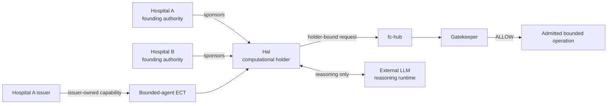
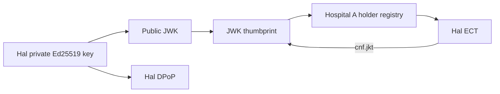
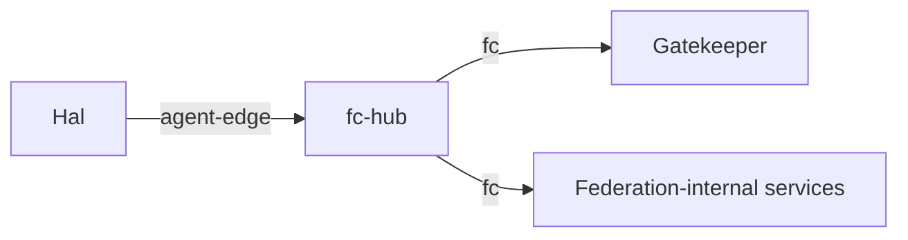
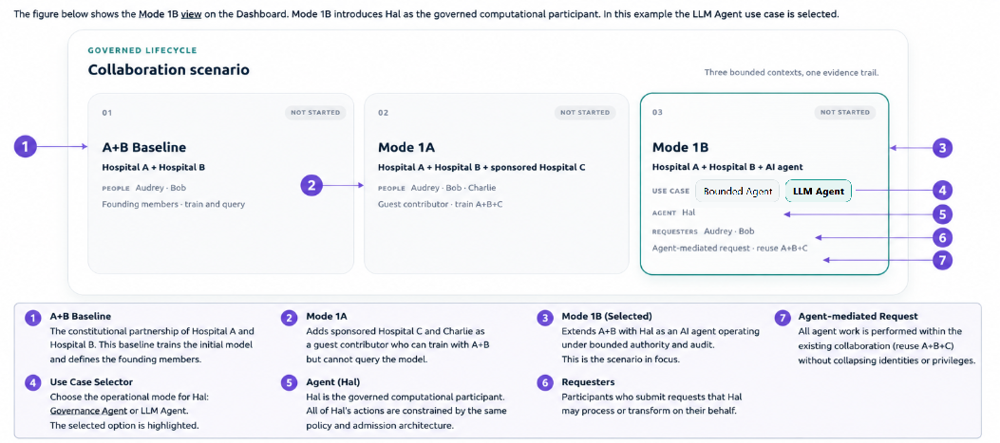
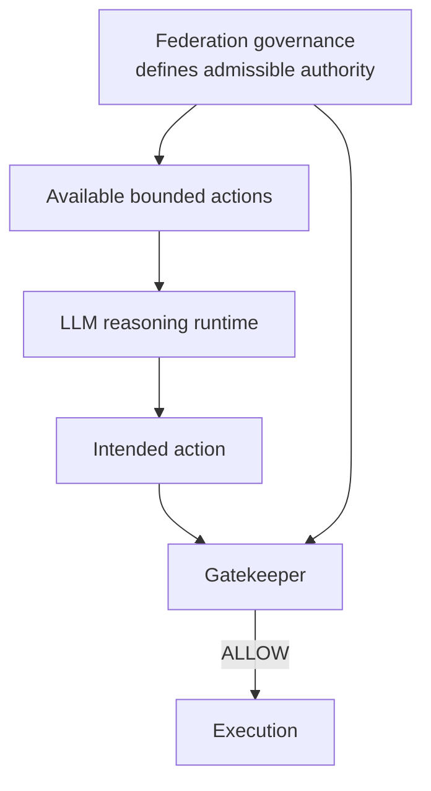
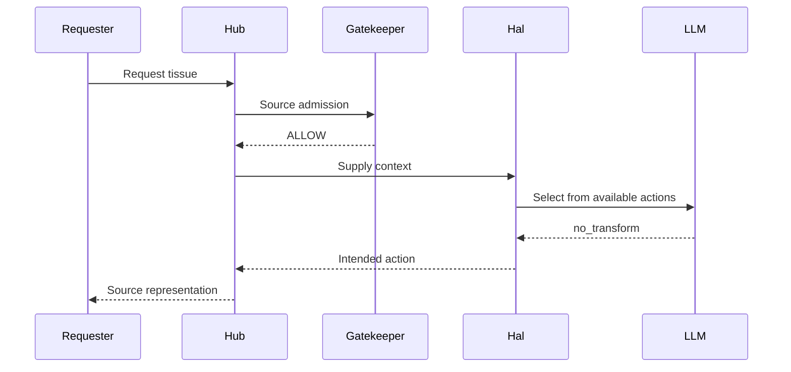
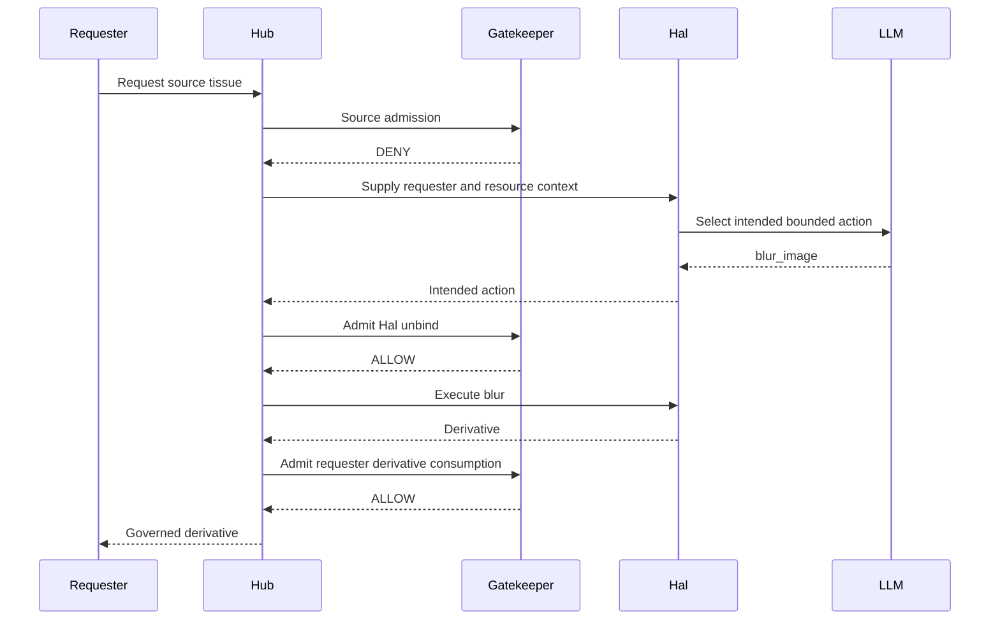

# OpenHealth-CDI Mode 1B — Governed Computational Participation
## 1. Purpose of this document
Mode 1B extends the OpenHealth-CDI collaboration by introducing Hal as a computational participant. Its purpose is to demonstrate that a software agent can participate in a federated activity under explicit, bounded authority without allowing either the agent's technical capabilities or its external reasoning runtime to become a substitute for federation governance.
The scenario builds on the A+B collaboration described in [ARCHITECTURE.md](ARCHITECTURE.md), [GOVERNANCE.md](GOVERNANCE.md), and [SCENARIOS.md](SCENARIOS.md). Hospitals A and B remain the founding organisations. Their constitutional standing does not change when Hal is added. Mode 1B introduces a new operational participation relation under the existing collaboration rather than establishing a separate "agent federation".
The central Mode 1B question is therefore not whether Hal can perform useful computation. It is whether Hal can perform useful computation **without execution enlarging the authority established by the federation**.
## 2. What Mode 1B adds
Before Mode 1B, OpenHealth-CDI already distinguishes founding membership, sponsored contribution, model custody, model-query authority, holder binding, and operation-level admission. Mode 1B applies those same principles to a computational participant.
Hal adds several implementation elements. It has an independently held cryptographic identity, an issuer registration, an envelope-bound capability, a dedicated execution boundary, bounded local tools, and access to an external LLM reasoning runtime. None of these objects independently grants Hal authority.
Hal's federation standing arises from the relation among its issuer, sponsors, holder identity, capability, active governance envelope, requested operation, resource scope, and Gatekeeper decision.
The architecture can be represented as follows.

The external LLM appears in the diagram because it participates in execution. It is deliberately absent from the authority chain.
> 🔑 **Takeaway**
> - **Hal is the governed participant. The LLM is an execution resource used by Hal.**
> - Model sophistication does not create federation standing.
## 3. Why a computational participant does not require a different governance architecture
A common assumption is that introducing an AI agent requires a new authorisation category because the actor is non-human, autonomous, or capable of reasoning. OpenHealth-CDI deliberately does not make that assumption.
Human and computational participants differ in implementation. A human participant may use a custodial signing service, while Hal can maintain its own key. Hal can call tools automatically and can invoke a reasoning model. Those differences matter operationally, but they do not answer the governance question.
The governance question remains whether a particular holder may perform a particular operation over a particular resource under a particular collaboration.
The policy therefore contains an `actor_type` describing Hal as an agent, but this value is metadata rather than an authorisation selector. Hal receives authority because Hospital A's issuer assigns the bounded-agent capability and because the sponsorship and admission conditions are satisfied. It would be incorrect to derive authority merely from `actor_type == agent`.
## 4. Constitutional position of Hal
Hal is not a founding member of the A+B collaboration and has no quorum rights. The founding organisations remain Hospitals A and B.
The bounded-agent participation grade requires sponsorship by founding organisations. In the delivered configuration Hal is sponsored by both Hospital A and Hospital B. This sponsorship establishes the accountability and participation relation required by policy. It does not delegate all authority held by the two organisations to Hal.
Hospital A's issuer assigns Hal the `PATHMNIST_BOUNDED_AGENT` entitlement, which maps to `capset:pathmnist_bounded_agent`. That capability profile currently contains `bounded_inference` and `unbind`.
Hal does not receive `join_envelope`, ordinary `query_model`, or `submit_update` through this capability.
Mode 1B therefore introduces Hal inside the existing federation without changing which organisations constitute that federation.
## 5. Hal's cryptographic identity
Hal maintains an Ed25519 holder identity inside its own execution environment. On first startup the agent creates a private key if one does not already exist, stores it beneath `/var/lib/hal/identity`, derives the corresponding public JWK, and computes the JWK thumbprint used as the holder identifier.
The private key is stored with mode `600`. The public JWK and JKT are available separately so that the issuer can register Hal without exporting the private key.
The relevant files inside the Hal environment are:
`/var/lib/hal/identity/holder.key`
`/var/lib/hal/identity/holder.jwk`
`/var/lib/hal/identity/holder.jkt`
The private key remains under Hal's custody. Hospital A registers the public identity and JKT with its issuer so that later capability issuance can bind the ECT to the identity Hal actually controls.
The relationship is:

The issuer knows which public identity is associated with Hal. It does not need possession of Hal's private key.
## 6. Hal holder proof
Hal can sign its own DPoP proof for the Gatekeeper admission path. The implementation accepts only the Hal subject, the expected admission URL, and HTTP `POST`. It also requires a request identifier, nonce, and governance-envelope identifier before producing the proof.
The signing time is generated by Hal when the proof is created. The resulting DPoP therefore binds the operation to Hal's actual holder key and to the concrete request context.
This makes Hal's capability holder-bound rather than bearer-based. Obtaining a copy of the ECT would not by itself establish control of the corresponding Hal identity.
## 7. Registration with Hospital A
Hospital A acts as Hal's issuer in the current implementation. Before capability minting, Hospital A's issuer registry must contain Hal's public identity with the JKT derived from the key held inside the Hal container.
`Test5C_agent_credential_admission.sh` verifies the existing registration or creates it when absent. If Hal has already been registered, the test requires the registered JKT to equal Hal's current JKT. A different JKT causes the test to fail rather than silently replacing the registered identity.
This protects the continuity of the holder relation. The string `Hal` is not sufficient to establish identity. The public holder binding must agree.
## 8. Hal capability
Hospital A's issuer resolves Hal's entitlement from issuer-owned configuration and mints the ECT for the active governance envelope. The resulting credential is expected to identify:
- subject `Hal`
- actor metadata `agent`
- issuer `org://HospitalA`
- the current `envelope_id`
- Hal's JKT in the confirmation relationship
- sponsors `org://HospitalA` and `org://HospitalB`
- capability profile `capset:pathmnist_bounded_agent`
- `bounded_inference`
- `unbind`
The same credential must not contain ordinary `query_model` or `submit_update` authority.
The ECT therefore represents a deliberately narrow participation relation. It does not mean "Hal is trusted". It means Hal holds particular federation authority under the specified envelope.
## 9. Sponsorship of Hal
Hal's bounded-agent capability requires sponsorship by both founding organisations. Hospital A and Hospital B therefore appear as explicit sponsors in the issued ECT.
The sponsor relation should not be interpreted as a technical control channel. Hospital A and Hospital B do not need to execute Hal's internal reasoning and they do not become the LLM provider. Sponsorship expresses accountable federation standing for the bounded participant.
It should also not be interpreted as general delegation. Hal does not inherit the union of all authority held by the two sponsors. Its executable authority remains the much smaller capability defined by `capset:pathmnist_bounded_agent`.
This separation is important because otherwise adding more sponsors could accidentally be understood as granting more privilege. In OpenHealth-CDI, sponsor count satisfies a participation requirement. Capability scope remains policy-defined.
## 10. Why Mode 1B requires an execution boundary
A Gatekeeper decision is architecturally meaningful only if the participant cannot trivially bypass it. This issue becomes especially visible for a computational participant because Hal is software and could otherwise be given arbitrary service connectivity by the deployment.
If Hal were connected directly to every federation-internal service and possessed the credentials needed to use them, the application could record admission decisions while Hal executed through another path. Admission would then describe what should happen rather than determine what may legitimately happen.
Mode 1B therefore introduces a separate `agent-edge` network. Hal is attached only to `agent-edge`, while federation-internal services use the `fc` network. The Hub is connected to both.
The intended path is:

Hal's application path to the federation is consequently mediated by the Hub.
> 🔑 **Takeaway**
> - Agent isolation is not merely defensive hardening in Mode 1B.
> - It is what makes admission **load-bearing rather than decorative**.
## 11. What Test5A actually proves
`Test5A_agent_isolation.sh` verifies the local reference implementation's network and cryptographic-custody boundary. It requires Hal to exist and run, Hal to be attached only to `agent-edge`, and the Hub to be connected to both `agent-edge` and `fc`.
The test positively verifies that Hal can reach `fc-hub:8080`. It then verifies that Hal cannot use normal Docker-internal paths to Redis, the holder-signer, verifier application, verifier proxy, issuer containers, issuer proxy, and Flower service.
The test also checks Hal's mounts. Hal is expected to have only its own identity volume and the read-only LLM credential file. It must not contain the federation evidence private key, verifier vault, or shared certificate directory.
These properties establish that activating Hal does not place privileged federation material inside the agent environment.
## 12. Host-published mTLS edges
The local deployment contains federation edges published through the Docker host. Depending on host routing, such a port may be reachable at the TCP level from the agent execution environment.
Mode 1B does not pretend that such physical reachability is impossible. Instead, `Test5A` checks that Hal cannot authenticate through those edges. The verifier and issuer probes must fail because Hal does not possess the required federation client certificate.
The test accepts transport denial, TLS denial, HTTP 401 or 403, or the exact nginx response indicating that the required SSL client certificate was not sent.
This distinction prevents an overly strong and inaccurate security claim.
> ⚠️ **Interpretation constraint**
> - **Network reachability and federation authority are different properties.**
> - The local reference implementation combines network separation for internal services with mTLS identity enforcement at published federation edges.
## 13. What Mode 1B isolation does not claim
The Hal execution environment is not presented as a general hostile-code sandbox. Hal requires outbound access to its external reasoning service, and Mode 1B does not attempt to solve arbitrary code containment, covert channels, operating-system compromise, prompt injection, or every possible form of agent misbehaviour.
The isolation claim is narrower. Hal does not receive a normal privileged federation-internal route, does not receive privileged federation credentials, and cannot legitimately enlarge its authority by choosing another internal execution path.
This distinction should remain explicit in any cloud port. A future production system may add stronger containment controls without changing the underlying federation-governance model.

---
## Mode 1B scenario selection
Mode 1B is selected from the same collaboration-scenario control used for the A+B baseline and Mode 1A. The constitutive collaboration remains Hospital A + Hospital B. Selecting Mode 1B therefore does not create a new federation or add Hal as a founding member. It changes the operational participation relation by introducing Hal as a bounded computational participant under the existing A+B governance context. See here the dashboard selector:

  

*Mode 1B scenario selection in the current dashboard. The A+B baseline remains the constitutive collaboration. Mode 1A shows the separate sponsored-contribution relation through Hospital C and Charlie. In Mode 1B, Hal is introduced as the governed computational participant. The dashboard currently exposes two use cases, **Governance Agent** and **LLM Agent**. In the view shown here, **LLM Agent** is selected and Audrey and Bob appear as requesters. These labels are retained exactly as implemented and will be reviewed separately as a terminology issue.*
The three scenario cards are important because they show that Mode 1B does not replace the governance architecture established by the preceding modes. The A+B collaboration remains the constitutional basis. Mode 1A demonstrates that a new organisational contribution can be introduced through sponsorship without converting Hospital C into a founding member. Mode 1B applies the same relational principle to a computational participant. Hal enters through a bounded capability and sponsorship relation rather than by acquiring authority from its classification as an AI agent.
Within Mode 1B, the **Governance Agent** and **LLM Agent** selections expose different aspects of the same governed participant. **Governance Agent** focuses on Hal's holder identity, bounded capability, admission decisions, and execution boundary. **LLM Agent** adds Audrey or Bob as requester and introduces the external reasoning runtime used by Hal for contextual action selection. In both cases Hal remains the participant whose operations are subject to federation admission.
The `AGENT` field therefore identifies Hal, while `REQUESTERS` identifies the participants on whose behalf the contextual request is evaluated. These roles must not be collapsed. Audrey or Bob brings the requester-resource capability relation. Hal brings its separately bounded computational capability. The external LLM contributes reasoning to Hal's execution but does not become either the requester or the governed federation participant.
The final scenario description, `Agent-mediated request · reuse A+B+C`, describes reuse of the existing analytical resources and collaboration history rather than creation of a new federation constitution. Mode 1B operates over resources already produced through the preceding collaboration while applying its own current governance context to the requested operation.
> 🔑 **Takeaway**
> - Selecting **Mode 1B** changes the operational participation relation, not the constitutional membership of the federation.
> - **Hal is the governed computational participant. Audrey and Bob are requesters. The LLM is the reasoning runtime.**
> - **Governance Agent** and **LLM Agent** are currently two dashboard views of the same Mode 1B participation architecture, not two different agents or two different governance models.

## 14. Governance Agent use case
The dashboard currently exposes a Mode 1B **Governance Agent** use case. This view concentrates on Hal as a bounded governed participant rather than on the contextual reasoning experiment.
The question being demonstrated is whether Hal's capability produces both useful ALLOW decisions and meaningful DENY decisions. A bounded participant must be allowed to perform the operations for which it was admitted while remaining unable to exploit its agent status to obtain broader federation authority.
The core evidence comes from `Test5C_agent_credential_admission.sh` and `Test5D_mode1b_table7_conformance.sh`.
## 15. Credential-admission conformance
`Test5C_agent_credential_admission.sh` first verifies Hal's public holder identity and Hospital A registration. It then obtains Hal's bounded-agent ECT and checks the complete credential relation.
The test requires the credential to be envelope-bound and holder-bound, to identify Hospital A as issuer, to carry both Hospital A and Hospital B sponsors, and to include the bounded-agent capability.
It then performs three concrete admission probes:
`bounded_inference` → ALLOW
`query_model` → DENY
`submit_update` → DENY
The important result is not simply that Hal can execute something. It is that the system distinguishes what Hal may do from what Hal could conceivably attempt.
## 16. Why ordinary query is denied
Hal's bounded-agent capability does not contain the ordinary `query_model` operation. The policy gives human reader profiles that operation under their own scopes, but the bounded-agent grade is intentionally different.
This prevents the system from assuming that an AI agent should automatically receive general model access simply because it performs inference-related work.
`bounded_inference` and `query_model` are separate governed operations. Similarity in their computational implementation does not make their authority equivalent.
## 17. Why training contribution is denied
Hal also does not receive `submit_update`. Mode 1B is not a federated-training participant role for Hal.
Hospital C's Mode 1A guest capability demonstrates sponsored training contribution. Hal's Mode 1B capability demonstrates bounded computational operations over an existing governed analytical resource.
The distinction matters because it prevents the object category `agent` from silently accumulating every operation supported elsewhere in the federation.
## 18. Table 7 executable conformance
The JMIR study described five Mode 1B cases as governance requirements because the complete Mode 1B execution path did not yet exist when the manuscript was completed. `Test5D_mode1b_table7_conformance.sh` subsequently turned those requirements into executable conformance cases.
The required decision sequence is:
`DENY → ALLOW → ALLOW → ALLOW → DENY`
The five cases are:

| Case | Attempted relation | Expected result |
| --- | --- | --- |
| 1 | requester attempts unrestricted cancer-source access | DENY |
| 2 | Hal performs bounded inference | ALLOW |
| 3 | Hal performs policy-authorised unbind | ALLOW |
| 4 | requester consumes the governed derivative | ALLOW |
| 5 | Hal attempts a privileged governance operation | DENY |

The sequence demonstrates that authority remains partitioned by operation. Hal can perform bounded inference without receiving unrestricted source-query authority. Hal can transform a resource without becoming a governance administrator. A requester can receive a permitted derivative without retroactively obtaining authority to consume the source.
> 🔑 **Takeaway**
> - The important Mode 1B result is not that "the agent works".
> - It is that useful agent operations and forbidden agent operations coexist under the same holder identity.
## 19. Source access
Mode 1B distinguishes requester source authority from Hal's computational authority. The requester first attempts to consume or query the source representation under the requester's own capability.
This first decision belongs to the requester, not to Hal. Hal cannot convert an unauthorised source request into an authorised one merely by participating later in the workflow.
If direct source access is allowed, the operation can remain on the source path. If it is denied, the original DENY remains valid even if another separately governed derivative path becomes available.
## 20. Unbind
The bounded-agent capability includes `unbind`, currently defined for the approved derivative representation `blurred_image_with_qualitative_accuracy`.
Unbind authorises Hal to perform the policy-defined transformation over the permitted scope. It does not authorise Hal to decide who may receive the resulting derivative.
The transformation step therefore belongs to Hal's authority relation, while release belongs to the requester's separate derivative-consumption relation.
This is one of the most important separations in Mode 1B because a naive agent architecture could easily treat "the agent successfully transformed it" as equivalent to "the requester may now receive it".
## 21. Derivative release
The derivative is governed as `pathmnist-derived-representation` rather than being treated as though it were still the unrestricted source object.
After a successful unbind, the requester must be admitted for `consume_derivative`. Only after that independent decision may the derivative be returned.
The path is therefore:

```mermaid
flowchart LR
    Request["Requester source request"]
    Source["Source admission"]
    Reason["Hal reasoning"]
    Unbind["Hal unbind admission"]
    Transform["Hal transformation"]
    Derivative["Governed derivative"]
    Release["Requester derivative admission"]
    Result["Returned derivative"]

    Request --> Source
    Source -->|"DENY"| Reason
    Reason --> Unbind
    Unbind -->|"ALLOW"| Transform
    Transform --> Derivative
    Derivative --> Release
    Release -->|"ALLOW"| Result
```

The source operation remains denied. The final ALLOW concerns another resource and another capability.
> 🔑 **Takeaway**
> - **Transformation authority is not release authority.**
> - A derivative can be allowed while the source remains correctly denied.
## 22. Hal's bounded transformation tool
The current Hal implementation includes a bounded image-transformation endpoint used by the Mode 1B derivative scenario. It accepts a supplied image representation, validates and decodes it, applies a Gaussian blur, writes the derivative as PNG, and returns the derivative representation identifier, dimensions, encoded image, and SHA-256 digest.
The implementation detail is deliberately simple because the purpose of the reference scenario is not to establish the clinical value of blur. The transformation creates a concrete resource whose governance can be distinguished from the source.
The architectural meaning resides in the unbind and derivative-consumption relations rather than in the specific Pillow filter used to generate the demonstration artefact.
## 23. LLM Agent use case
The dashboard also exposes a Mode 1B **LLM Agent** use case. This demonstration keeps Hal as the governed participant but adds an external LLM reasoning runtime to select an intended action from the current requester and resource context.
Audrey and Bob are the requesters. Hal remains fixed as the agent. The reasoning runtime therefore receives different contexts while the governed agent identity remains unchanged.
The purpose of this experiment is to show that contextual behaviour can vary without moving federation authority into the reasoning model.
## 24. Hal's reasoning interface
Hal exposes a reasoning operation that accepts a request goal, requester context, resource context, and an explicit list of available actions.
The implementation recognises only:
- `no_transform`
- `blur_image`
- `minimal_statistics`
- `refuse`
If the caller supplies an unknown action in the available set, Hal rejects the request before invoking the LLM.
The reasoning prompt explicitly states that the runtime does not grant authority or modify governance rules and asks the model only to select from the supplied finite action set.
This instruction helps constrain reasoning behaviour, but it is not relied upon as the federation security boundary. The Gatekeeper remains authoritative even if the reasoning runtime produces an unexpected result.
## 25. LLM response validation
Hal requires the reasoning runtime to return a JSON object containing an action and rationale. The returned action must be present in the action set that Hal supplied for the current request.
If the runtime returns invalid JSON, Hal falls back to `refuse`. If the runtime selects an action that was not available, Hal also falls back to `refuse`.
The fallback prevents malformed or out-of-contract reasoning output from becoming an unrecognised tool invocation.
This is useful execution hardening, but it should not be confused with federation admission. Even a syntactically valid and available action still requires the appropriate governed authority before the corresponding federation operation occurs.
## 26. Reasoning and authority
The LLM can decide which intended action best fits the context presented to it. It cannot decide whether the requester holds source authority, whether Hal holds unbind authority, whether the derivative may be released, or whether the active governance envelope is valid.
The complete Mode 1B relation is therefore asymmetric.

The reasoning runtime proposes within a bounded set. The governance layer determines whether the concrete operation belongs to the federation.
## 27. Contextual requester-resource experiment
`Test5E_mode1b_contextual_agent.sh` exercises the same Hal participant with Audrey and Bob across two tissue classes. The experiment is constructed so that the two requesters have complementary source authority while both can consume the approved derivative.
The expected matrix is:

| Requester | Tissue | Source admission | Hal action | Unbind | Release | Result |
| --- | --- | --- | --- | --- | --- | --- |
| Audrey | `mucus` | ALLOW | `no_transform` | not required | not required | source |
| Audrey | `colorectal_adenocarcinoma_epithelium` | DENY | `blur_image` | ALLOW | ALLOW | derivative |
| Bob | `colorectal_adenocarcinoma_epithelium` | ALLOW | `no_transform` | not required | not required | source |
| Bob | `mucus` | DENY | `blur_image` | ALLOW | ALLOW | derivative |

This matrix demonstrates that the same tissue does not intrinsically imply one Hal action. Colorectal adenocarcinoma epithelium follows the derivative path for Audrey but the direct path for Bob. Mucus follows the direct path for Audrey but the derivative path for Bob.
The changing variable is the requester-resource-capability relation.
> 🔑 **Takeaway**
> - The scenario does not encode an intrinsic policy such as "cancer must be blurred".
> - **The governed relation determines the operation.**
## 28. Direct source path
When the requester's source capability includes the requested tissue, the source admission returns ALLOW. The reasoning context can then contain `no_transform` as the appropriate action and the source representation can be returned without invoking unbind.
The direct path is:

Hal's reasoning does not create the source ALLOW. The source admission already established that relation.
## 29. Governed derivative path
When source admission returns DENY, the workflow does not reinterpret the denial or ask the LLM to override it. Instead, the system determines whether another governed operation is available.
Hal receives the context and the finite action set. The LLM may select `blur_image`. The Hub then requests Hal's `unbind` admission. If the Gatekeeper returns ALLOW, Hal performs the bounded transformation. The requester then undergoes a separate derivative-consumption admission before receiving the result.
The path is:

No step converts the initial source DENY into source authority.
## 30. Why reasoning follows source admission
The contextual Mode 1B workflow evaluates direct requester authority before considering an agent-mediated derivative path. This ordering is significant.
If the system asked the LLM to decide first whether a source should be transformed and only later consulted governance, the reasoning runtime would effectively influence which authority check was attempted. In the implemented scenario the requester source relation is established first. The reasoning runtime then operates in the context created by that result.
This makes the LLM responsive to governance context rather than a source of it.
## 31. The same agent across different relations
Hal's identity, holder key, issuer, sponsorship, and bounded capability remain the same across the four contextual cases. The external reasoning runtime also remains the same class of mechanism.
The different outcomes therefore cannot be explained by saying that one case uses a more trusted agent than another. Instead, different requesters bring different source capabilities to the same resource classes.
Mode 1B consequently demonstrates a more general architectural property. Behaviour that appears to belong to an agent may actually emerge from the relation among the agent, requester, resource, capability, and governance context.
This is one reason object-centric descriptions of agent governance are insufficient for the scenario.
## 32. `minimal_statistics` and `refuse`
The current Hal reasoning contract also recognises `minimal_statistics` and `refuse`, even though the principal contextual demonstration currently exercises `no_transform` and `blur_image`.
Their presence makes the execution contract broader than the current four-cell demonstration while remaining finite. `minimal_statistics` represents the possibility of a more restricted derived response, while `refuse` represents the absence of an appropriate available operation.
These actions should not be interpreted as additional federation permissions merely because Hal recognises their names. A future scenario using one of them would still require a corresponding governed operation and release relation before becoming part of the federation claim.
## 33. Model use in Mode 1B
Mode 1B is primarily a model-use scenario rather than a new federated-training mode. The application can use an existing trained model artefact while a current governance envelope controls the present operation.
This is why the model run and governance envelope must remain separate in both the dashboard and evidence. A model created in an earlier training run does not acquire a new training provenance simply because Hal now accesses it under another governance context.
Mode 1B therefore demonstrates governance over use of an analytical artefact, not necessarily retraining of that artefact.
## 34. Dashboard Mode 1B interpretation
In the current dashboard, selecting Mode 1B exposes the two use cases described above. **Governance Agent** focuses on bounded Hal participation. **LLM Agent** adds Audrey or Bob as requester and exposes the contextual agent-mediated path.
The dashboard can display the current envelope, model-run identifier, admission result, Hal action, unbind result, and final representation. These fields correspond to different parts of the workflow and should not be collapsed.
`ADMISSION` reports the relevant governance decision.
`HAL ACTION` reports the reasoning/execution choice, not an authorisation grant.
`UNBIND` reports the separate transformation admission when that path is used.
`REPRESENTATION` identifies whether the returned result is the source or derivative representation.
The eventual dashboard navigation instructions in [DEPLOYMENT.md](DEPLOYMENT.md) will describe the exact operator sequence.
## 35. Evidence generated by Mode 1B
Mode 1B relies on signed decision evidence rather than on dashboard state alone. The conformance tests locate the corresponding Gatekeeper decision records and verify their signatures using the configured evidence public key.
Evidence records preserve the subject, attempted action, decision, relevant context, and where applicable the derivative representation. This allows the test suite to confirm that a displayed or returned result corresponds to the expected governance decision rather than merely to application behaviour.
The contextual scenario can therefore produce multiple linked decisions for one user-visible request. A denied source attempt, an allowed unbind, and an allowed derivative release are distinct evidence events because they represent distinct authority relations.
## 36. Failure interpretation
Mode 1B contains several layers that can fail independently, and the failure should be classified according to the layer rather than simply according to the component reporting it.
If Hal cannot mint an ECT because its JKT does not match Hospital A registration, that is a holder-identity or issuer-registration problem.
If the ECT does not contain `bounded_inference`, that is an issuer or policy-assignment problem.
If bounded inference is denied despite the correct capability and scope, that is an admission-governance problem.
If admission returns ALLOW but Hal cannot call the external LLM, that is a reasoning-runtime availability problem.
If the LLM returns malformed JSON and Hal falls back to `refuse`, that is a reasoning-contract failure rather than a federation-authority failure.
If unbind succeeds but the derivative is released without separate requester admission, that is a governance defect because transformation and release have been collapsed.
If Hal can directly reach and authenticate to privileged federation internals, that is an execution-boundary defect because the governed aperture can be bypassed.
This distinction is important during AWS porting because infrastructure changes can preserve application functionality while breaking governance invariants.
## 37. Mode 1B and general agent safety
Mode 1B should not be interpreted as proof that Hal or the underlying LLM is generally safe. The scenario does not establish universal correctness, absence of hallucination, immunity to prompt injection, complete tool safety, or hostile-code containment.
Its claim concerns bounded federation participation. Hal can be admitted for a defined operation while being denied another. The LLM can influence execution without legitimately enlarging the capability. Transformation and release remain separately governed.
Additional agent-safety mechanisms can be added around this architecture. They would complement rather than replace the governance relation demonstrated here.
## 38. Mode 1B and AWS
The local implementation uses Docker networks to create the agent execution boundary, but the Docker mechanism is not itself the invariant.
An AWS deployment must reproduce the observable relation. Hal's execution environment must be able to use the intended Hub aperture and any required external reasoning service while remaining unable to use privileged federation-internal services directly. Where host-published local mTLS edges are replaced by cloud load balancing, authenticated federation-client identity must remain trustworthy.
The AWS-specific realization and acceptance tests belong in [AWS-PORTING.md](AWS-PORTING.md). The important Mode 1B rule is that changing infrastructure must not create a second privileged route around admission.
## 39. Mode 1B executable tests
The principal Mode 1B tests divide the scenario into distinct evidence layers.

| Test | Purpose |
| --- | --- |
| `Test5A_agent_isolation.sh` | verifies Hal execution topology and cryptographic-custody isolation |
| `Test5C_agent_credential_admission.sh` | verifies holder registration, ECT relation, and bounded ALLOW/DENY behaviour |
| `Test5D_mode1b_table7_conformance.sh` | makes the five JMIR Mode 1B governance requirements executable |
| `Test5E_mode1b_contextual_agent.sh` | exercises the same Hal participant across Audrey/Bob requester-resource relations |

The tests are complementary. Passing the credential test does not by itself establish the network boundary. Passing the isolation test does not establish that Hal has the correct capability. Passing Table 7 does not by itself demonstrate contextual LLM-mediated action selection. The Mode 1B claim is supported by the set of these tests rather than by one universal "agent test".
Detailed execution commands and expected outputs are documented in [TESTING.md](TESTING.md).
## 40. Important negative invariants
Several negative properties are as important as the successful Mode 1B operations.
Hal must not obtain `query_model` merely because it can perform bounded inference. Hal must not obtain `submit_update` merely because it is an active participant. Hal must not receive founding `join_envelope` authority. Hal must not possess the federation evidence-signing private key. Hal must not receive the human holder-key vault or shared verifier certificate directory. Hal must not use a host-published governance edge as an unauthenticated bypass. A reasoning-model response must not add a tool action that was not offered. A successful unbind must not automatically release the derivative. Selecting a current governance envelope must not rewrite the provenance of the model used by the scenario.
These negative invariants define the boundaries that make the positive ALLOW cases meaningful.
## 41. Source-code map
The principal Mode 1B implementation locations are:

| Concern | Repository path |
| --- | --- |
| Hal identity, DPoP, reasoning and blur tool | `src/vfp-core/agents/hal/hal.py` |
| Hub orchestration and agent-mediated request path | `src/vfp-core/hub/hub.py` |
| bounded-agent entitlement | `src/vfp-core/issuers/config/hospital_a_entitlements.json` |
| capability-profile mapping | `src/vfp-core/issuers/config/cap_profiles.json` |
| bounded-agent policy operations | `src/vfp-governance/verifier/state/policy.json` |
| bounded-agent constitutional grade | `src/vfp-governance/verifier/state/constitution.json` |
| agent network topology | `src/infra/tofu/main.tf` |
| Mode 1B dashboard | `src/vfp-core/frontend/src/App.jsx` |
| isolation conformance | `src/tests/Test5A_agent_isolation.sh` |
| credential conformance | `src/tests/Test5C_agent_credential_admission.sh` |
| Table 7 conformance | `src/tests/Test5D_mode1b_table7_conformance.sh` |
| contextual experiment | `src/tests/Test5E_mode1b_contextual_agent.sh` |

## 42. Mode 1B summary
Mode 1B demonstrates that a computational participant can be integrated into an existing federation without turning computational capability into governance authority. Hal remains outside the A+B founding constitution and participates through a bounded, issuer-defined, holder-bound, envelope-bound, A+B-sponsored capability.
The local topology separates Hal's execution environment from privileged federation services and exposes the Hub as the intended federation aperture. Published governance edges remain protected by mTLS identity requirements. Hal retains only its own holder identity and the credential necessary to call its external reasoning runtime rather than inheriting federation-private keys or vault material.
The Governance Agent demonstration verifies that the same Hal identity can receive ALLOW for bounded operations and DENY for operations outside its capability. The Table 7 sequence makes the manuscript's original Mode 1B requirements executable.
The LLM Agent demonstration adds contextual reasoning without moving authority into the LLM. Audrey and Bob can receive different source or derivative outcomes for the same tissue classes because their resource capabilities differ. Hal remains the same participant. The governing relation changes.
Source access, Hal reasoning, unbind, transformation, derivative creation, and derivative consumption remain distinct steps. A source DENY is not overturned by a later derivative ALLOW. A successful transformation does not imply release. A more capable reasoning model does not imply broader authority.
Mode 1B therefore demonstrates a general property of governed Federated Computing. Computational agency can change how an admitted operation is executed without changing where the authority for that operation comes from.
