# OpenHealth-CDI Executable Scenarios
## 1. Purpose of this document
OpenHealth-CDI contains three executable scenarios that demonstrate how one federation architecture can accommodate different forms of participation without redefining the collaboration each time a new actor or computational mechanism appears. The scenarios are not three independent applications and they are not three alternative governance models. They share the same constitutional collaboration, capability architecture, holder-binding model, admission path, evidence model, and separation between authority and execution.
The scenarios are intentionally cumulative. The A+B baseline establishes the founding collaboration and the ordinary governed training and model-use paths. Mode 1A introduces a contributor associated with a third organisation through sponsorship rather than through equivalent founding membership. Mode 1B introduces a computational participant whose reasoning and transformation capabilities remain bounded by the same governance architecture. Each scenario changes selected relationships while preserving the architectural invariants described in [ARCHITECTURE.md](ARCHITECTURE.md) and the governance semantics described in [GOVERNANCE.md](GOVERNANCE.md).
This document explains what each scenario is intended to demonstrate, which actors and resources participate, which relations change, which relations remain unchanged, and how the scenario should be interpreted when observed through the dashboard or test suite.
## 2. How to read the scenarios
The scenarios should be read as controlled changes to a common federation rather than as progressively larger inventories of components. Moving from A+B to Mode 1A does not simply mean that a third hospital object has been added. The important change is that a new contribution relation has been introduced without changing the constitutive standing of the founding organisations. Moving from Mode 1A to Mode 1B does not simply mean that an AI object has been added. The important change is that a computational participant can perform bounded operations without acquiring authority from its software type or reasoning capability.
The following diagram shows the progression.

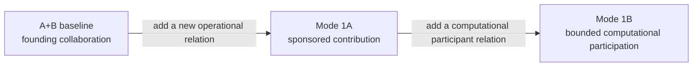

What grows across the three scenarios is the set of permitted relations. The underlying governance model remains stable.
> 🔑 **Takeaway**
> - The scenarios do not demonstrate three categories of federation.
> - They demonstrate that the same federation can evolve by adding new relations without treating every new object as a new constitutional class.
## 3. Common collaboration substrate
All three scenarios operate within the OpenHealth PathMNIST collaboration. Hospitals A and B are the founding organisations. The executable policy derives the constitutive participant set and requires a two-of-two approval quorum for establishment of the governance envelope. A selected active envelope provides the approved collaboration context under which capabilities are issued and operations are admitted.
The scenarios use the PathMNIST colon-pathology resource as a concrete analytical workload. Federated training is implemented with Flower, while governed model-use operations are mediated by the Hub and Gatekeeper. The dataset, Flower runtime, and model make the governance relations observable, but none of them defines the federation by itself.
The common governance path includes issuer-owned capability assignment, envelope-bound ECTs, holder proof through DPoP, Gatekeeper admission, and signed decision evidence. These mechanisms remain present when the participant population changes.
The shared substrate can therefore be represented as follows.

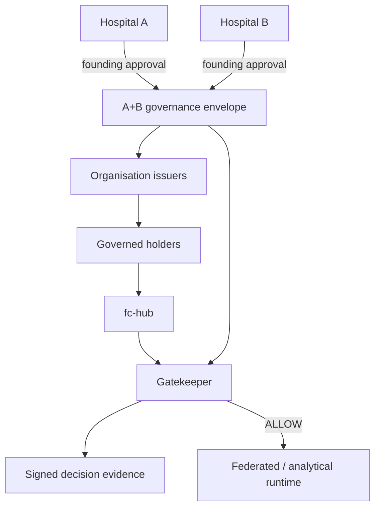

Each scenario changes the holders and operations that can legitimately enter this path. It does not bypass the path.
## 4. Scenario selection is not governance
The dashboard presents three scenario cards named `A+B Baseline`, `Mode 1A`, and `Mode 1B`. Selecting one of these cards changes the operational narrative, expected participants, available user interactions, and in the training scenarios the execution profile used by the application.
The scenario selector is not itself an authorisation mechanism. Selecting Mode 1A does not make Charlie authorised. Selecting Mode 1B does not grant Hal an ECT. Selecting A+B does not establish a governance envelope. The dashboard reflects and orchestrates the scenario, while capability issuance and Gatekeeper admission remain authoritative.
This distinction matters because the interface deliberately makes complex governance state easier to operate. Convenience in the presentation layer must not be mistaken for authority.
## 5. Scenario 1 — A+B baseline
The A+B baseline establishes the simplest executable form of the collaboration. Hospitals A and B are independently governed founding organisations that jointly approve the collaboration and then participate in federated computation under that approved context.
The purpose of the baseline is not merely to show that two Flower clients can train a model. That would be an ordinary federated-learning demonstration. The OpenHealth-CDI baseline additionally establishes that participation, model use, and evidence are governed through explicit federation relations.
The principal human actors represented in the dashboard are Audrey and Bob. Audrey is associated with Hospital A and Bob with Hospital B. Their later source-query capabilities are intentionally different, but that difference does not alter the constitutive standing of their organisations.
The baseline establishes the reference relationship shown below.

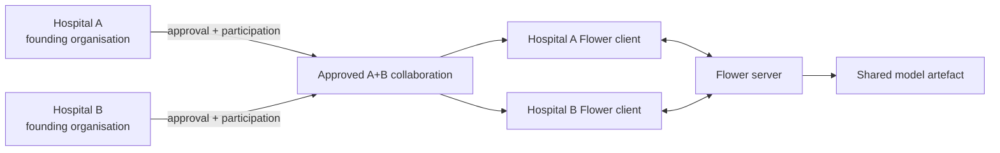

The existence of two Flower clients is therefore an execution fact. Their founding-organisational authority comes from the governance relation that precedes execution.
## 6. A+B envelope establishment
Before governed operations can be associated with the collaboration, an active governance envelope is established through the founding approval process. The application may initiate the process, but the set of founding organisations and required quorum come from policy.
The sequence is:

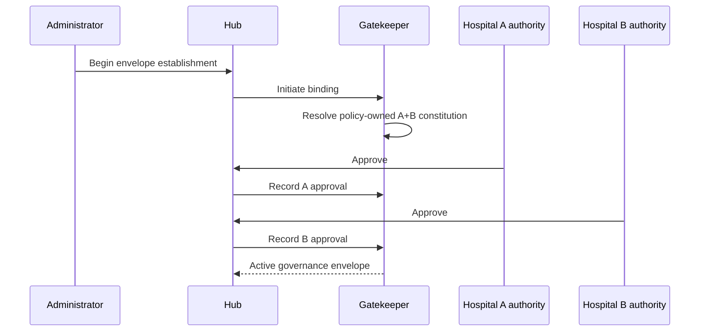

The active envelope becomes the current collaboration context for later issuance and admission. It should not be interpreted as a model identifier or as proof that every currently selected model was trained under that envelope.
## 7. A+B federated training
When A+B training is executed, the Flower server coordinates the Hospital A and Hospital B clients. Each client works from its local PathMNIST partition and contributes model updates rather than transferring the raw training dataset to the other hospital.
The governance significance lies in the admitted participation relation rather than in the aggregation algorithm. Hospitals A and B can submit their authorised updates because their founding-participant capability includes the relevant training operation. The Flower server performs the computation after the application has established the governed context in which that participation occurs.
The baseline therefore separates two statements that could otherwise be confused. The first is that Hospitals A and B technically participate in federated training. The second is that they are authorised participants in the collaboration under which that training occurs. OpenHealth-CDI is concerned with making the second statement explicit and testable.
## 8. A+B model use
The model-use scenario demonstrates that model custody and model-query authority are distinct from training participation. A model produced by the collaboration is treated as a protected shared research artefact rather than as an automatically distributable result.
Audrey and Bob receive issuer-owned model-query capabilities with different tissue scopes. Audrey's direct source-query scope contains selected other-tissue classes. Bob's direct source-query scope contains the cancer-associated classes. The difference becomes especially important in Mode 1B, but it originates in the ordinary A+B governance model rather than being invented specifically for the agent scenario.
A model request therefore follows a governed path.

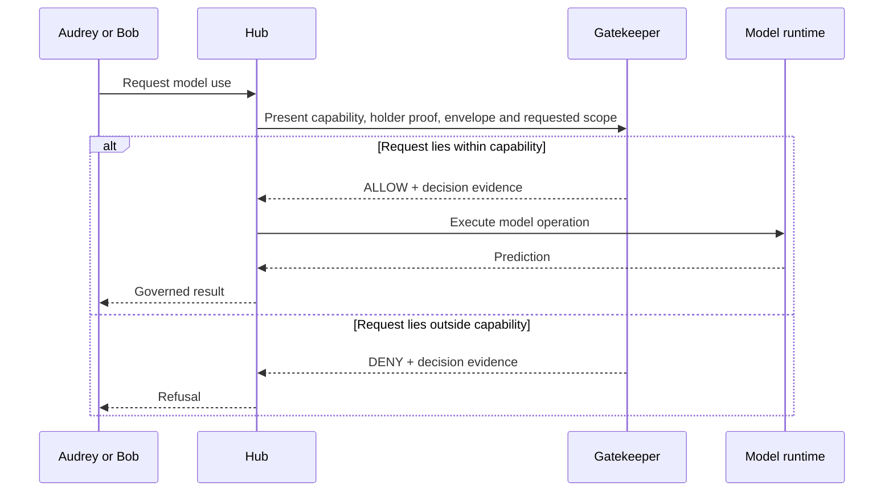

The same model can therefore be available through different relations to different requesters.
## 9. What the A+B baseline establishes
The baseline creates the reference against which the later scenarios are interpreted. It establishes that the federation constitution is policy-owned, that the founding organisations remain independently governed, that capability issuance belongs to organisation-specific issuers, that capability exercise is holder-bound, that model use is subject to admission, and that decision evidence is produced for the governed path.
Mode 1A and Mode 1B should therefore not be read as replacing this baseline. They extend the set of operational relations that can coexist with it.
## 10. Scenario 2 — Mode 1A sponsored contribution
Mode 1A introduces a participant associated with Hospital C while preserving the A+B founding collaboration. The purpose of the scenario is to demonstrate that a federation can accept a new operational contributor without promoting every contributing organisation to equivalent constitutional membership.
Charlie is the concrete participant used for this scenario. Hospital A's issuer assigns Charlie the guest-contributor capability. Hospital A sponsors Charlie. Hospital C remains Charlie's institutional provenance.
Those three facts are intentionally different. Hospital A is the issuing and sponsoring authority. Hospital C identifies the external organisational provenance. Charlie is the holder that exercises the guest-contributor capability.
The relationship is:

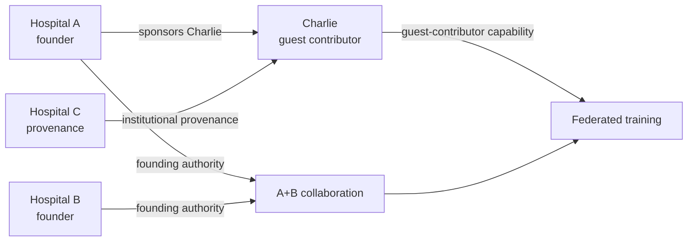

Hospital C can therefore affect the shared computation without acquiring the governance standing of Hospitals A and B.
> 🔑 **Takeaway**
> - Hospital C's data contribution does not make Hospital C a founding member.
> - Hospital A sponsorship does not erase Hospital C provenance.
> - Charlie's right to contribute does not imply a right to consume the model.
## 11. Mode 1A participant activation
Before Charlie can use the guest-contributor capability, his holder identity must be associated with Hospital A's issuer and the issuer must be able to mint the envelope-bound capability assigned to him.
The Mode 1A admission test verifies that Charlie is represented as an active guest contributor associated with Hospital C, that Hospital A owns the guest-contributor entitlement, that Charlie has a holder identity enrolled with the Hospital A issuer, and that the Hub can obtain the corresponding ECT through the real issuer path.
The resulting capability is deliberately narrow. It grants `submit_update` for the `federated_training` purpose under the guest-contributor profile. It does not grant general model-query authority.
The activation sequence can be represented as:

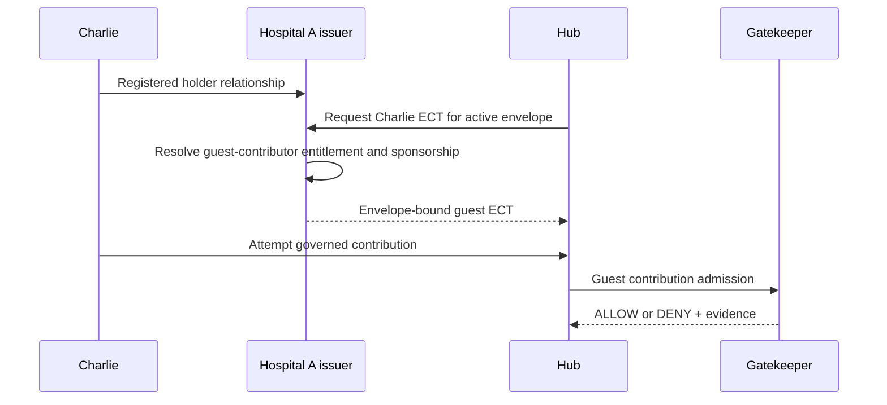

The guest role therefore comes from issuer and policy state rather than from the fact that the application currently displays Mode 1A.
## 12. Mode 1A contribution aperture
The guest contribution path is distinct from the ordinary model-query path. The current conformance test explicitly exercises the guest contribution aperture without immediately executing Flower, which allows governance admission to be tested independently from mutation of the trained model artefact.
A valid request over the allowed non-reserved training scope receives an ALLOW for `submit_update` with purpose `federated_training`. The signed evidence identifies the guest-contributor capability and does not attribute unrelated reader profiles to Charlie.
The same capability is denied if it attempts to contribute the reserved `background` tissue class. This demonstrates that a valid participant and valid capability do not erase resource scope.
The test also verifies that Charlie cannot use the same ECT to query the trained model. Contribution and model consumption therefore remain independent operations under separate authority.
## 13. Mode 1A federated execution
When the Mode 1A training scenario is executed, the federated runtime contains three participating organisational sites. Hospitals A and B continue as the founding participants, while the Hospital C contribution enters through Charlie's sponsored guest relation.
At the Flower level this may appear simply as an A+B+C training run with three clients. At the governance level the three participants are not equivalent. A and B have founding standing. C contributes through the guest path. That difference must survive even though Flower itself does not need to know the constitutional distinction in order to aggregate updates.
This is an important example of the separation between computational topology and governance topology.

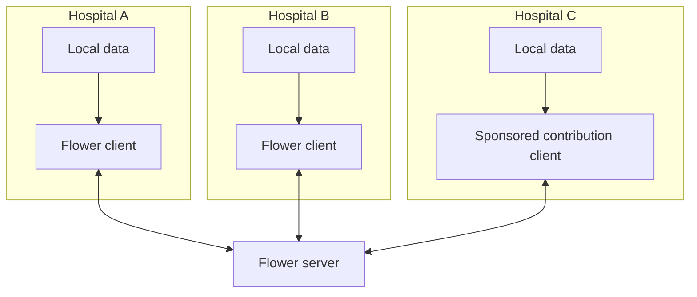

The runtime sees three contributing clients. The federation sees two founding organisations and one sponsored contribution relation.
## 14. Mode 1A does not redefine the federation
The addition of Hospital C does not alter the founding A+B quorum. Hospital C does not obtain the `join_envelope` relationship merely because its data participates in training, and Charlie does not acquire query authority merely because his contribution affects the model.
This is the architectural purpose of Mode 1A. A collaboration can evolve operationally without reconstructing its constitutional membership for each new activity.
## 15. Scenario 3 — Mode 1B computational participation
Mode 1B introduces Hal as a governed computational participant. The scenario is designed to determine whether a non-human process can participate under bounded federation authority without allowing either its computational capabilities or its LLM reasoning runtime to become an alternative source of governance.
Hal maintains its own holder identity and receives an envelope-bound bounded-agent capability. The current policy permits bounded inference and policy-authorised rebind over a limited PathMNIST scope. Hal does not receive founding membership, general model-query authority, or privileged governance operations.
Mode 1B therefore does not create an "AI exception" to the existing governance system. It applies the same principle already used elsewhere. A participant may attempt only the operations represented by its admitted relation.
## 16. Two Mode 1B demonstrations
The dashboard exposes two Mode 1B use cases named **Governance Agent** and **LLM Agent**. These are not two different agents and they are not two different governance architectures. Both use Hal as the governed computational participant.
The Governance Agent use case isolates the governance question. It demonstrates that Hal has a real holder identity, receives a bounded capability, can perform permitted operations, cannot perform privileged operations, and is separated from direct privileged federation paths.
The LLM Agent use case adds contextual reasoning. Audrey or Bob becomes the requester, Hal remains the governed agent, and an external LLM reasoning runtime helps choose an intended bounded action according to the requester-resource context. Governance still determines whether that action may be executed and whether the resulting representation may be released.
The relationship between the two use cases is:

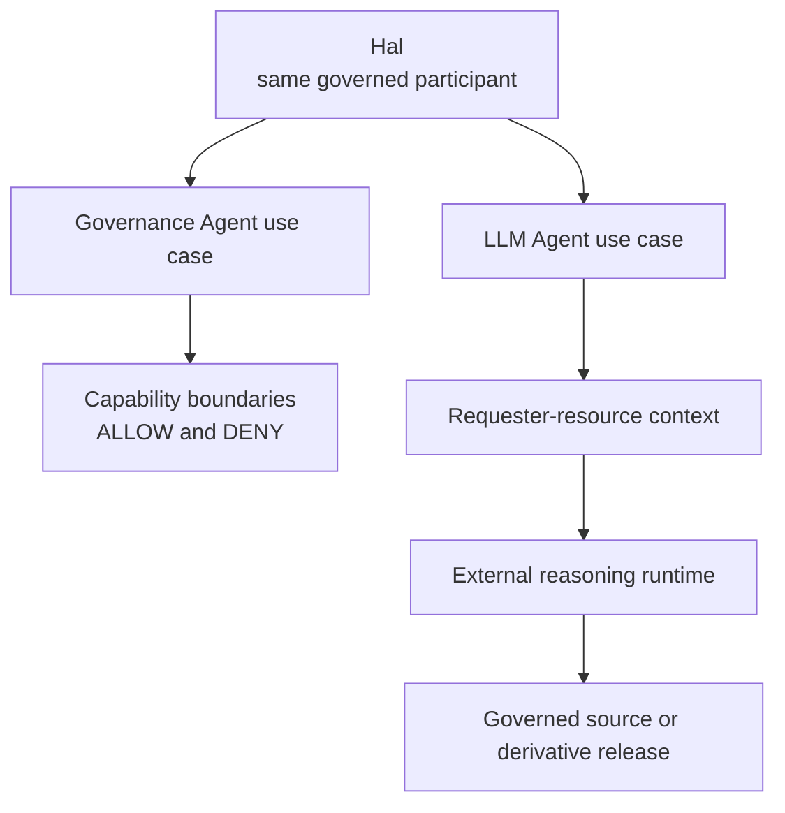

The second demonstration adds reasoning and contextual resource handling. It does not replace the governance demonstrated by the first.
> 🔑 **Takeaway**
> - **Hal is the governed agent. The LLM is not.**
> - The Governance Agent and LLM Agent views exercise different aspects of the same Hal participation relation.
## 17. Mode 1B Governance Agent use case
The Governance Agent use case corresponds most directly to the bounded-agent conformance requirements. It asks whether Hal can exercise permitted authority while remaining unable to enlarge that authority through execution.
The current conformance sequence contains five governance cases. An unrestricted requester source operation is denied. Hal's bounded inference is allowed. Hal's policy-authorised rebind is allowed. Consumption of the resulting governed derivative by the authorised requester is allowed. A privileged governance operation attempted by Hal is denied.
The expected decision sequence is therefore:
`DENY → ALLOW → ALLOW → ALLOW → DENY`
This sequence is intentionally mixed. A demonstration in which every Hal operation returned ALLOW would not show bounded authority. A demonstration in which Hal was globally blocked would not show useful governed computational participation.
The scenario instead demonstrates that Hal can be useful inside an admitted scope while remaining unprivileged outside it.
## 18. Mode 1B execution boundary
Mode 1B also requires the agent's normal execution path to make admission meaningful. In the local deployment Hal resides on `agent-edge`, while privileged federation services reside on `fc`. The Hub connects the two domains and acts as the intended application aperture.
This separation prevents the ordinary Hal execution path from simply ignoring the Gatekeeper and invoking internal federation services directly.
The reference implementation combines this network separation with authenticated mTLS edges. A host-published service may be physically reachable depending on local routing, but Hal does not thereby possess an accepted privileged federation client identity.
The scenario therefore tests a narrower and more useful property than generic agent containment. It establishes that the governed path is load-bearing for federation authority.
## 19. Mode 1B bounded inference
`bounded_inference` is one of Hal's policy-defined operations. The capability applies only to the scope declared by the bounded-agent profile and does not turn Hal into a general model reader.
The operation demonstrates that computational participation can be useful without being unrestricted. Hal can act on the model within the explicitly authorised relation while remaining unable to infer new authority from its ability to call tools or reason about the task.
The distinction between technical capability and federation capability is especially visible here. Hal's Python process may contain code capable of several actions, but only an admitted operation belongs to the governed federation path.
## 20. Mode 1B rebind
`rebind` permits Hal to produce a policy-authorised derivative representation for the defined tissue scope. The current implementation uses a blurred image representation with qualitative accuracy as the concrete derivative.
The operation exists because a requester denied the original source may still be allowed to receive a governed representation derived from that source. Rebind authorises Hal's transformation. It does not authorise release of the derivative to the requester.
This distinction creates a separate authority boundary between production and consumption.
## 21. Mode 1B derivative consumption
After an admitted rebind produces a derivative, the requester must separately exercise `consume_derivative`. Audrey and Bob both receive derivative-reader authority in the delivered configuration.
The final release therefore results from the requester's derivative-consumption relation rather than from Hal's transformation authority. Hal cannot make the derivative releasable merely by producing it.
The complete relationship is:

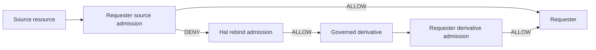

The first DENY remains true even when the later derivative ALLOW succeeds.
## 22. Mode 1B LLM Agent use case
The LLM Agent use case adds a reasoning runtime to the bounded-agent path. The requester is Audrey or Bob, Hal remains the agent, and Hal invokes the external LLM with the current requester context, resource context, and a finite set of available actions.
The LLM selects an intended action. It does not decide federation authority. If source access is already permitted, the appropriate result can be `no_transform`. If direct source access is denied but an approved derivative path is available, the reasoning runtime can select `blur_image`. The Hub and Gatekeeper still perform the required governance steps before the operation and release occur.
The flow is:

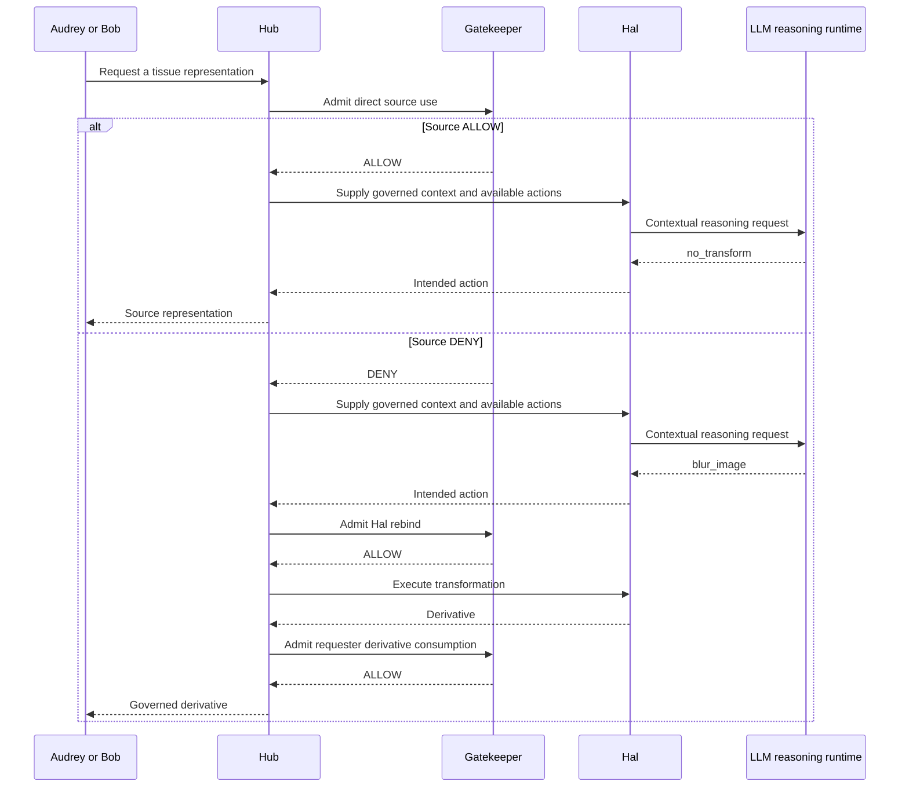

The LLM operates inside a set of possibilities already bounded by the application and remains downstream of governance admission.
## 23. The contextual requester-resource matrix
The contextual scenario intentionally uses the same Hal instance with two requesters and two resource classes. The purpose is to show that the operation cannot be predicted from the agent identity alone.
Audrey can directly consume `mucus` under her source-query capability. She cannot directly consume `colorectal_adenocarcinoma_epithelium`. Bob has the complementary relationship for these two examples.
The resulting matrix is:

| Requester | Requested tissue | Direct source admission | Hal action | Rebind | Derivative release | Presented representation |
| --- | --- | --- | --- | --- | --- | --- |
| Audrey | `mucus` | ALLOW | `no_transform` | not required | not required | source |
| Audrey | `colorectal_adenocarcinoma_epithelium` | DENY | `blur_image` | ALLOW | ALLOW | derivative |
| Bob | `colorectal_adenocarcinoma_epithelium` | ALLOW | `no_transform` | not required | not required | source |
| Bob | `mucus` | DENY | `blur_image` | ALLOW | ALLOW | derivative |

Hal does not change identity between rows. The LLM does not acquire different federation privileges between rows. What changes is the requester-resource-capability relation.
This is why statements such as "the agent blurs cancer images" would describe the scenario incorrectly. Audrey's cancer request follows the derivative path, while Bob's cancer request does not. The same tissue can therefore result in different operations for different requesters.
> 🔑 **Takeaway**
> - Agent behaviour in this scenario is **relational and contextual**, not an intrinsic property attached to Hal.
> - The requester-resource relation changes while the agent remains the same.
## 24. Direct source path
When the requester's source capability already covers the requested resource, the Gatekeeper admits the source operation. The reasoning runtime can select `no_transform`, and no rebind or derivative-consumption step is needed.
This path is important because Mode 1B is not designed to force every request through a transformation. The transformation exists only where the governed relation requires a different representation.
The direct path can therefore be expressed as:
`requester → source admission ALLOW → no_transform → source`
## 25. Governed derivative path
When the direct source request lies outside the requester's capability, the Gatekeeper returns DENY for that source operation. The denial becomes part of the evidence trail and remains the correct result for the original request.
The system can then consider a different governed path. Hal's reasoning runtime may select an approved transformation. Hal must be admitted for `rebind`. If rebind succeeds, the derivative is produced. The requester must then be independently admitted for `consume_derivative`.
The path is therefore:
`requester → source DENY → Hal reasoning → rebind ALLOW → derivative produced → requester derivative ALLOW → derivative released`
The final result does not override the earlier DENY because the final operation concerns a different governed resource.
## 26. What the LLM contributes
The LLM contributes contextual action selection. It receives structured information about the request goal, requester context, resource context, and the finite set of actions Hal makes available. It returns an intended action and rationale.
The LLM does not determine the requester capability, issue an ECT, establish sponsorship, create the governance envelope, modify the policy, decide the Gatekeeper result, or grant derivative-consumption authority.
Its role is therefore significant computationally but subordinate architecturally. It provides reasoning inside a governance envelope that it does not control.
## 27. What Mode 1B does not claim
Mode 1B is not a general agent-safety benchmark. It does not demonstrate that an LLM cannot hallucinate, that prompts cannot influence a model incorrectly, that all tool use is safe, or that arbitrary malicious code is contained.
It demonstrates a narrower property. A computational participant can operate through an explicitly bounded federation relation, and execution is prevented from legitimately enlarging the authority established by admission.
Runtime safety mechanisms such as sandboxing, tool restrictions, model-behaviour controls, and network egress policies can complement this architecture. They solve a different problem.
## 28. Model artefacts across scenarios
The dashboard and application may reuse an existing trained model artefact when switching to Mode 1B. The scenario must not be interpreted as saying that the currently selected governance envelope trained that model merely because the envelope now governs its use.
A training run establishes model provenance. A governance envelope establishes the authority context for the current operation. An existing model can therefore be used under a later envelope without rewriting the history of the model.
This becomes especially important when moving between A+B, Mode 1A, and Mode 1B during demonstrations. The active scenario and active envelope describe the current governed operation. They do not automatically describe the historical training lineage of whichever model artefact is selected.
> ⚠️ **Interpretation constraint**
> - `current envelope` means **current governance context**.
> - `model run` means **analytical provenance**.
> - They may be related for a particular operation, but they are not the same lifecycle.
## 29. Cross-scenario comparison
The three scenarios can now be compared by the relationship they introduce rather than by the number of components they contain.

| Property | A+B | Mode 1A | Mode 1B |
| --- | --- | --- | --- |
| founding organisations | A + B | A + B | A + B |
| founding quorum | 2 of 2 | 2 of 2 | 2 of 2 |
| additional operational participant | none | Charlie / Hospital C provenance | Hal |
| participation mechanism | founding capability | sponsorship + guest contribution | sponsorship + bounded-agent capability |
| contribution authority | A + B | A + B + sponsored C contribution | not the defining Mode 1B operation |
| model query | governed human requester | still separate from C contribution | contextual requester path |
| transformation | not required by baseline scenario | not required by Mode 1A | policy-authorised Hal rebind |
| derivative consumption | available by capability where applicable | separate from contribution | explicitly exercised |
| LLM involved | no | no | optional reasoning runtime |
| LLM federation authority | none | none | none |
| constitutive architecture replaced | no | no | no |

The invariant is more important than the added object. Each scenario increases operational expressiveness while the A+B constitutional foundation remains recognisable.
## 30. Scenario evidence
The scenarios are not defined only by dashboard presentation. Each is connected to executable evidence.
The A+B test families establish the federation envelope, capability issuance, governed inference, holder binding, and associated evidence. Mode 1A adds tests that verify Charlie's guest participation grade, Hospital A issuer relationship, Hospital C provenance, bounded contribution authority, reserved-resource denial, absence of model-query authority, and preservation of sponsorship in signed evidence.
Mode 1B adds agent-isolation, Hal credential admission, bounded-operation conformance, and the contextual Audrey/Bob requester-resource experiment.
The principal scenario-specific tests are:

| Scenario | Principal tests | What they establish |
| --- | --- | --- |
| A+B | Test1*, Test2*, Test3E | founding governance, issuer-owned capability, model-use admission |
| Mode 1A | `Test3F_mode1a_guest_admission.sh` | Charlie's guest holder and contribution-only ECT |
| Mode 1A | `Test3G_mode1a_guest_contribution_admission.sh` | contribution ALLOW, reserved-scope DENY, no query authority |
| Mode 1A | `Test4C_sponsorship_regression.sh` | sponsor, issuer, provenance, and membership remain distinct |
| Mode 1B | `Test5A_agent_isolation.sh` | governed agent execution boundary |
| Mode 1B | `Test5C_agent_credential_admission.sh` | Hal holder-bound admitted capability |
| Mode 1B | `Test5D_mode1b_table7_conformance.sh` | bounded-agent governance sequence |
| Mode 1B | `Test5E_mode1b_contextual_agent.sh` | requester-resource contextual execution |

The complete execution procedure and interpretation of every test belongs in [TESTING.md](TESTING.md).
## 31. Dashboard interpretation
The dashboard presents the three scenarios as a governed lifecycle. A+B expects the two founding organisational clients. Mode 1A expects the third sponsored contribution site. Mode 1B returns to the A+B organisational collaboration while adding Hal as the computational participant rather than presenting Hal as another hospital.
Within Mode 1B, the **Governance Agent** view focuses on Hal's bounded participation, while the **LLM Agent** view exposes requester selection and the contextual agent-mediated path. Audrey and Bob appear as requesters in the latter view, while Hal remains fixed as the agent.
The dashboard also displays the selected governance envelope, model run, current admission result, and where applicable the Hal action, rebind result, and returned representation. These fields intentionally expose the distinction among governance context, analytical state, reasoning result, and final resource representation.
The dashboard is therefore an operational view over the architecture rather than the source of scenario semantics.
## 32. Reproducing the conceptual progression
A reader reproducing the scenarios should understand the progression before executing individual commands.
First, establish an active A+B governance envelope and verify the founding governance path. Then ensure the ordinary A+B holder and model-use paths are operational. Mode 1A can then activate Charlie's sponsored guest relation and exercise contribution without granting model-query authority. Mode 1B can subsequently activate Hal's bounded capability and test the governance-agent conformance cases. The contextual LLM-mediated experiment can then exercise Audrey and Bob through the same Hal participant.
This sequence reflects conceptual dependency rather than a requirement that every demonstration must retrain every model from zero. Model artefacts can persist independently from governance-envelope lifecycles.
Exact deployment and execution commands are intentionally deferred to [DEPLOYMENT.md](DEPLOYMENT.md) and [TESTING.md](TESTING.md), where prerequisites and expected results can be specified without mixing operational instructions into the scenario semantics.
## 33. Scenario failure interpretations
A failure should be interpreted according to the relation being exercised rather than merely according to the component that emitted the error.
If Charlie cannot mint an ECT, the relevant questions concern holder registration, issuer-owned entitlement, sponsorship, and envelope validity. If Charlie can contribute but can also query the model, Mode 1A has failed because contribution authority has leaked into consumption authority.
If Hal can perform bounded inference but can directly invoke privileged federation services through an unintended path, Mode 1B has failed because admission is no longer load-bearing. If Hal performs an allowed rebind but the derivative is released without separate requester admission, transformation authority has leaked into release authority.
If the LLM proposes the wrong contextual action but the governance boundary still prevents an unauthorised operation, that is a reasoning-runtime failure rather than an authority failure. If an unauthorised operation is actually executed because the LLM proposed it, the federation boundary has failed.
This classification helps distinguish governance defects, infrastructure defects, runtime defects, and model-behaviour defects.
## 34. Relationship to the JMIR study
The accompanying JMIR manuscript introduced the progression from the A+B collaboration to differentiated organisational and computational participation. At manuscript completion, Mode 1B was represented through requirements rather than through the completed executable path now contained in the repository.
The current scenarios should therefore be read as the implementation continuation of that study. A+B and Mode 1A provide the organisational foundation. Mode 1B makes the previously stated bounded-agent requirements executable and extends the experiment with the contextual Audrey/Bob requester-resource matrix.
The implementation does not require the historical paper architecture to be rewritten. It provides concrete execution and evidence for the relations that the study proposed.
## 35. Source-code map
The principal repository locations associated with the scenarios are:

| Concern | Repository path |
| --- | --- |
| scenario dashboard | `src/vfp-core/frontend/src/App.jsx` |
| Hub orchestration | `src/vfp-core/hub/hub.py` |
| A+B and Mode 1A Flower runtime | `src/vfp-core/backend/` and infrastructure definitions |
| actor scenario metadata | `src/vfp-core/issuers/config/actors.json` |
| issuer-owned assignments | `src/vfp-core/issuers/config/hospital_a_entitlements.json` and `hospital_b_entitlements.json` |
| capability mapping | `src/vfp-core/issuers/config/cap_profiles.json` |
| executable governance policy | `src/vfp-governance/verifier/state/policy.json` |
| Hal runtime | `src/vfp-core/agents/hal/hal.py` |
| executable scenario evidence | `src/tests/` |

The actor metadata assists scenario presentation. It is not the authoritative source of authorisation. Effective capability continues to come from issuer-owned assignments and the executable governance policy.
## 36. Scenario summary
The A+B baseline demonstrates a governed collaboration between two independently authoritative founding organisations. Its significance lies not merely in distributed training but in the explicit constitution, capability, holder, admission, and evidence relations surrounding that training and subsequent model use.
Mode 1A demonstrates that operational participation can expand without changing the constitutive collaboration. Charlie can contribute under Hospital A sponsorship while retaining Hospital C provenance, and that contribution does not grant model-consumption rights.
Mode 1B demonstrates that the same architecture can govern a computational participant. Hal receives bounded authority and remains subject to admission. Its external LLM reasoning runtime can influence intended execution without becoming a federation principal. Source consumption, agent transformation, and derivative release remain separately governed. The same Hal instance produces different operational paths for Audrey and Bob because authority follows the requester-resource relation rather than the identity of the agent.
Taken together, the scenarios demonstrate federation evolution through changing relations rather than through an ever-growing undifferentiated inventory of participants.
