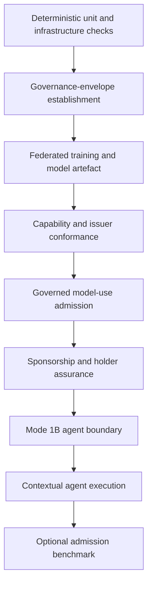

# OpenHealth-CDI Testing and Executable Conformance
## 1. Purpose of this document
OpenHealth-CDI uses executable tests for two related purposes. Some tests verify that the implementation functions correctly as a distributed PathMNIST application. Others verify architectural and governance invariants that cannot be established merely by observing that the application runs. This document explains both categories, their dependencies, the order in which they should be executed, the state they may create, the expected results, and the meaning of a successful or failed test.
The tests are part of the research reference implementation. They make architectural statements executable. A successful test does not simply indicate that an endpoint returned HTTP 200. Depending on the test, it can establish that authority came from the correct issuer, that a capability was bound to the correct holder and governance envelope, that a denied operation did not execute, that sponsorship did not become membership, that a computational agent remained outside privileged federation paths, or that source and derivative consumption remained separately governed.
The principal test directory is:
`src/tests/`
The repository also contains an admission microbenchmark under:
`src/tests/microbench/`
The numbering reflects the sequence in which major implementation gates were established. The sequence is not continuous because not every historical development gate remains as a separate delivered test. The absence of names such as `Test3B`, `Test3C`, `Test3D`, or `Test5B` should therefore not be interpreted as a missing release artefact.
## 2. Testing philosophy
A distributed application can appear operational while violating the federation architecture. A Flower client can connect when it should not have federation authority. An issuer can return a syntactically valid token while allowing the caller to select its own privilege. An agent can obtain an ALLOW decision while retaining another direct path to the protected service. A derivative can be produced correctly while being released to a requester who was never admitted to consume it.
OpenHealth-CDI therefore tests relationships and negative boundaries as well as successful execution. ALLOW and DENY are both expected results depending on the attempted relation.
The tests can be understood as layers.



Later tests generally depend on state established by earlier layers. They should not be treated as isolated unit tests unless their description explicitly says that they are independent.
## 3. What a GREEN test means
A GREEN result means that the invariant exercised by that test was observed under the current local deployment and test preconditions. It does not mean that every architectural invariant has been established by that single test.
For example, `Test5C_agent_credential_admission.sh` demonstrates that Hal has the expected holder-bound capability and receives the expected ALLOW and DENY decisions. It does not by itself prove that Hal lacks a bypass route to privileged federation services. That property belongs to `Test5A_agent_isolation.sh`.
Similarly, `Test5A_agent_isolation.sh` can establish the execution boundary without proving that the issuer assigned Hal the correct capability. The Mode 1B claim depends on the combination of these tests.
> 🔑 **Takeaway**
> - No single "end-to-end success" replaces the conformance suite.
> - The architecture is supported by multiple independent invariants that must remain simultaneously true.
## 4. Test working directory
The canonical working directory for the shell tests is:
```bash
cd src/tests
```
This is important because several tests use paths such as `../vfp-governance/...` and `../tools/...`. Running them from another directory can therefore produce a file-not-found failure that does not indicate an architectural defect.
Commands in this document assume that the operator is already in `src/tests`.
## 5. Common host variables
Several tests need to reach the host-published issuer or verifier mTLS edges. The local reference deployment commonly uses the same host address for those published services.
Before running the full suite, define the deployment host address:
```bash
export HOST_IP=<host-ip>
export ISSUER_IP="$HOST_IP"
export VERIFIER_IP="$HOST_IP"
export ISSUER_PROXY_IP="$HOST_IP"
export LAN_IP="$HOST_IP"
```
For example, a local laboratory deployment might use:
```bash
export HOST_IP=192.168.1.25
```
The actual value is deployment-specific and must not be copied blindly.
`verifier.local`, `issuer-hospitala.local`, and `issuer-hospitalb.local` are TLS service names used by the local reference implementation. The deployment must provide the corresponding local name-resolution arrangement where a test does not use `curl --resolve`.
## 6. Active governance envelope
Most governance and application tests require an active governance envelope. This document refers to its identifier through:
```bash
export EID=<active-envelope-id>
```
The envelope can be created through `Test1A_createEnvelope.sh` or through the dashboard's KYO workflow. Once a valid envelope has been established, the same `EID` should normally be retained through a complete regression run.
Creating unnecessary envelopes during debugging makes model provenance, selected-envelope state, and decision evidence harder to interpret. A new envelope should therefore be created when the test purpose requires a new collaboration context, not simply as a generic recovery action.
## 7. Statefulness of the test suite
The suite is intentionally not completely stateless. Some tests inspect existing state, some create runtime credentials or evidence, and some perform an entire model-training lifecycle.
The most important side effects are:
- `Test1A_createEnvelope.sh` creates a new governance envelope.
- `Test1B_postEnvelope.sh` starts a new A+B training lifecycle and produces a new model run associated with the selected envelope.
- admission tests create signed decision evidence.
- `Test3E_dashboard_policy_scope.sh` selects the requested envelope and may mint an Audrey ECT.
- `Test3F_mode1a_guest_admission.sh` can generate Charlie's holder key if absent, register the holder if necessary, and mint Charlie's ECT.
- `Test5C_agent_credential_admission.sh` can register Hal if absent and mints Hal's bounded-agent ECT.
- `Test5D_mode1b_table7_conformance.sh` and `Test5E_mode1b_contextual_agent.sh` create admission evidence while exercising their cases.
A test failure should therefore be interpreted with knowledge of the state already created during the run.
## 8. Evidence versus execution
Several tests deliberately separate admission from execution. This is not incomplete testing.
For example, the Mode 1A guest-contribution test can request admission for Charlie's contribution while explicitly verifying that Flower execution did not occur and that the trained model artefact remained unchanged. That isolates the governance question from the computational side effect.
Other tests deliberately execute the model after admission to establish that the admitted path is operational.
The suite therefore distinguishes:
`admission conformance`
from:
`execution conformance`
and from:
`model-quality measurement`.
These categories should not be collapsed when interpreting results.
## 9. Fast deterministic checks
Two Python tests verify PathMNIST story assumptions without running the distributed stack.
`test_pathmnist_partition.py` verifies the frozen A/B/C partition rules using a deterministic synthetic dataset. It checks that partitions are disjoint, ignored classes are absent, the A and B cancer-class caps are respected, C receives the remaining cancer-heavy contribution, and non-cancer data remain with A and B.
From `src/tests`, run:
```bash
PYTHONPATH=.. python3 test_pathmnist_partition.py
```
Expected result:
```text
PASS: frozen PathMNIST A/B partition invariants
```
`test_pathmnist_metrics.py` verifies the story-level grouping used for non-cancer and cancer metrics and confirms that the reserved label is excluded from the grouped metrics.
Run:
```bash
PYTHONPATH=.. python3 test_pathmnist_metrics.py
```
Expected result:
```text
PASS: story metric groups exclude label 1
```
These tests establish deterministic analytical assumptions. They do not exercise federation governance.
## 10. Test00 — host and Docker GPU preflight
`Test00_verifyDockerGPU.sh` checks whether the local machine can run the GPU-enabled PathMNIST workload used by the reference implementation.
It verifies the host NVIDIA driver through `nvidia-smi`, verifies Docker availability, runs `nvidia-smi` inside a GPU-enabled container, and, when the local Flower client image already exists, verifies that the image sees CUDA through PyTorch `2.2.0+cu121`.
Run:
```bash
./Test00_verifyDockerGPU.sh
```
A successful run reports that the host driver and Docker GPU exposure are operational. If the Flower client image has not yet been built, the image-specific check is skipped and the script asks the operator to run the test again after deployment.
This is an infrastructure test rather than a governance test.
## 11. Test1A — create an A+B governance envelope
`Test1A_createEnvelope.sh` exercises the complete interactive A+B envelope-establishment ceremony. It starts a binding operation, asks the operator for the six-digit verification codes displayed for Hospital A and Hospital B, claims the corresponding sessions, submits both approvals, and reaches the policy-required two-of-two quorum.
Run:
```bash
./Test1A_createEnvelope.sh
```
The test is interactive. The operator must obtain the Hospital A and Hospital B verification codes through the configured `/verify-start` process and enter them when prompted.
The successful output ends by reporting the created envelope:
```text
✓ Envelope created: <envelope-id>
```
Record it immediately:
```bash
export EID=<envelope-id>
```
The script also identifies `Test1B_postEnvelope.sh` as the next lifecycle test.
The significance of Test1A is not merely that a UUID is produced. It demonstrates that the current envelope is created from the A+B approval process rather than from an arbitrary caller-defined participant set.
## 12. Test1B — bind, START, train, and evidence the envelope
`Test1B_postEnvelope.sh` exercises the operational lifecycle after envelope establishment. It requires the Hub, Flower server, and A/B clients to be running.
Usage:
```bash
./Test1B_postEnvelope.sh "$EID"
```
Optional arguments are:
```text
./Test1B_postEnvelope.sh <envelope_id> [run_id] [timeout_seconds]
```
The defaults are:
`run_id = local-pathmnist-ab-001`
`timeout_seconds = 1800`
The test reinitialises the logical run while preserving the selected envelope, waits for the Flower backend to be registered and bound, verifies that the experiment becomes START-ready, simulates the dashboard START operation, waits for a new correlated Flower training run to complete, and verifies the resulting `/vault/<envelope-id>/run.json` manifest.
The success condition is not satisfied by a stale `done` state from an older model. The test records the previous model-run identifier before START and requires a new completed model run whose manifest identifies the current envelope.
Expected final meaning:
```text
Envelope <EID> was bound, explicitly started, trained, and evidenced.
```
The resulting run artefacts are checked separately by Test1C.
## 13. Test1C — verify the completed A+B model run
`Test1C_verifyABRounds.sh` verifies the analytical artefacts produced by the A+B baseline run.
Run with defaults:
```bash
./Test1C_verifyABRounds.sh
```
or explicitly:
```bash
./Test1C_verifyABRounds.sh local-pathmnist-ab-001 10
```
The test verifies that the Hospital A and Hospital B clients reported the expected CUDA/PyTorch environment, that the central run artefacts exist, and that metrics contain the round-zero baseline plus the expected trained rounds.
The checked run artefacts include the model, metrics, participant evidence, confusion matrices, class metrics, and final model metadata.
This test establishes that the distributed analytical run completed and produced the expected evidence package. It does not by itself establish the authority under which later model-use requests are made.
## 14. Test1D — direct non-governed model validation
`Test1D_validate_non_governed.sh` loads the protected A+B model directly and evaluates selected PathMNIST labels as an ordinary model.
Run:
```bash
./Test1D_validate_non_governed.sh
```
An alternative run identifier can be supplied:
```bash
./Test1D_validate_non_governed.sh <run-id>
```
The script explicitly describes itself as a **non-governed** query test. It is a functional model smoke test and reports per-label behaviour without imposing model-quality acceptance thresholds.
> ⚠️ **Interpretation constraint**
> - A successful `Test1D` proves that the model artefact can perform inference.
> - It does **not** prove that a requester is authorised to perform that inference through the federation.
The direct model path exists so that analytical correctness can be distinguished from governance correctness.
## 15. Test1E — direct backend image-prediction smoke test
`Test1E_predict_image.sh` exercises the Flower backend's `/predict_image` functionality using a deterministic PathMNIST test image. The script sends the image with the active envelope identifier and checks the response structure, model dimensions, prediction label, tissue name, and top-k result.
Run:
```bash
./Test1E_predict_image.sh "$EID"
```
A successful run ends with:
```text
✓ /predict_image direct inference test passed
```
Like Test1D, this is primarily a backend functional check. The governed end-user inference path is exercised later through the Hub and Gatekeeper.
## 16. Test2A — direct Gatekeeper and EdDSA admission probe
`Test2A_run_probe_eddsa_nginx.sh` isolates the governance-side path from policy capability to minted ECT, EdDSA DPoP, and `/admission/check`.
Run:
```bash
./Test2A_run_probe_eddsa_nginx.sh "$EID"
```
For additional ECT inspection:
```bash
INSPECT_MINTED_ECT=true ./Test2A_run_probe_eddsa_nginx.sh "$EID"
```
This test deliberately bypasses the organisation issuer implementation. It uses the governance mint path directly so that capability compilation, holder binding, DPoP, nginx mTLS routing, and Gatekeeper decisions can be examined without conflating an issuer defect with a Gatekeeper defect.
This makes Test2A useful for fault isolation. Passing it does not establish that `issuer.py` correctly owns participant entitlement assignment.
## 17. Test2B — ECT mint-contract test
`Test2B_mint_ect.sh` tests the ECT mint contract directly against the governance mint path and inspects the returned credential.
Run:
```bash
./Test2B_mint_ect.sh "$EID"
```
The test verifies that the minted credential is bound to the expected envelope and that its resource, operation, purpose, and tissue scope correspond to the selected capability profile.
It does not invoke `/admission/check` and does not exercise organisation-specific issuer resolution. It therefore answers a narrower question than Test2A or Test2C.
## 18. Test2C — organisation issuer mint path
`Test2C_issuer_mint.sh` verifies the Hospital A issuer path from member registration and issuer-owned entitlement assignment to the ECT returned by the issuer.
Run:
```bash
ISSUER_IP="$HOST_IP" ./Test2C_issuer_mint.sh "$EID"
```
The default subject is Audrey. The test verifies that Hospital A's local entitlement configuration assigns Audrey the expected reader role, that the role maps to the expected capability profile, and that Audrey already has an issuer registry entry.
It then requests an ECT without sending an authorisation profile. The issuer must resolve the profile itself and return the expected capability.
Finally, the test attempts to inject a different `profile` field into the mint request. The issuer must reject the request with HTTP 422.
The successful result establishes that the caller requests issuance but does not select its own privilege.
> 🔑 **Takeaway**
> - The issuer is not a token-signing convenience endpoint.
> - It is an authority boundary because the **issuer**, not the requester or Hub, determines the effective capability assignment.
## 19. Test2D — issuer-owned entitlement conformance
`Test2D_issuer_owned_entitlements.sh` checks the broader separation between actor metadata and authorisation.
Run:
```bash
ISSUER_IP="$HOST_IP" ./Test2D_issuer_owned_entitlements.sh "$EID"
```
The script is read-only with respect to repository files, OpenTofu configuration, and member registration. It inspects current configuration and performs live minting and governed inference probes.
It verifies that the Hub does not send an authorisation profile to the issuer, that the issuer rejects profile injection, that Audrey and Bob receive the different capabilities assigned by their respective organisational issuers, that unknown principals cannot mint, and that `actors.json` has no authorisation path into the issuer or Gatekeeper.
The test also invokes `Test3E_dashboard_policy_scope.sh` to confirm that policy compilation and the governed application path remain consistent with those issuer assignments.
The phrase "read-only" in this test should therefore be understood as **no repository or registration mutation**, not as "no runtime requests or decision evidence".
## 20. Test2E — canonical envelope and signed-evidence conformance
`Test2E_fcac_conformance.sh` validates two related governance properties. First, it verifies canonical binding between the active envelope and the executable policy. Second, it verifies independently inspectable signatures on the envelope and on Gatekeeper ALLOW/DENY decision records.
Run:
```bash
ISSUER_IP="$HOST_IP" ./Test2E_fcac_conformance.sh "$EID"
```
The test uses the active envelope artefact, current policy, evidence public key, issuer path, holder key, and DPoP generation tools. It exercises both an allowed and a denied request and verifies the corresponding signed evidence rather than trusting the HTTP response alone.
This test is one of the principal conformance checks for the shared admission substrate used by Modes A+B, 1A, and 1B.
## 21. Test2F — issuer registration boundary
`Test2F_issuer_registration_boundary.sh` verifies that the holder registry itself is protected as an authority boundary.
Unlike most tests in this family, it does not require an envelope identifier.
Run:
```bash
ISSUER_IP="$HOST_IP" ./Test2F_issuer_registration_boundary.sh
```
The test verifies that Hospital A registration is restricted to the Hospital A administrative mTLS identity, that another organisation's administrative certificate cannot register a Hospital A member, that an existing subject cannot be silently overwritten with different key material, and that failed attempts leave the original enrolled identity unchanged.
This protects the premise on which holder-bound issuance depends. If a caller could silently replace Audrey's or Hal's registered public key, later DPoP verification could be cryptographically correct while referring to the wrong holder.
## 22. Test3A — governed PathMNIST end-to-end execution
`Test3A_run_pathmnist_e2e.sh` links governance to visible model execution.
Run:
```bash
ISSUER_PROXY_IP="$HOST_IP" ./Test3A_run_pathmnist_e2e.sh "$EID"
```
The test resolves the model run associated with the envelope unless `ARTIFACT_RUN_ID` is supplied explicitly. It requires the Hub, Flower server, and both organisation issuers to be running and requires a model artefact associated with the selected envelope.
Its purpose is to make the chain from policy to ECT, Gatekeeper decision, and model execution visible in one test while retaining the individual evidence produced at each layer.
This is an end-to-end application test, but it does not replace the narrower issuer, DPoP, sponsorship, or isolation tests.
## 23. Test3E — dashboard and Hub policy-scope conformance
`Test3E_dashboard_policy_scope.sh` verifies that the frontend and Hub do not duplicate policy-owned tissue authorisation and that the user-facing path reflects Gatekeeper decisions.
Run:
```bash
./Test3E_dashboard_policy_scope.sh "$EID"
```
The default frontend API is:
`http://127.0.0.1:8082/api`
The test first performs a static check for duplicated `allowed_tissues` or historical profile hints in the Hub and frontend. It then queries the administration boundary through the frontend proxy and verifies that the API does not publish a second authorisation table.
The script selects the exact supplied envelope, verifies that it is bound, ensures Audrey has a current ECT, and performs four governed inference cases:
`mucus` → ALLOW and execute
`debris` → DENY with `capability_scope_exceeded`
`cancer_associated_stroma` → DENY with `capability_scope_exceeded`
`background` → DENY with `reserved_tissue`
For every DENY the test requires `executed == false`.
The final success marker is:
```text
✓ Dashboard policy-scope test passed
```
This test is important because a visually correct dashboard could otherwise hide a second, duplicated authorisation model in application code.
## 24. Test3F — Mode 1A guest activation
`Test3F_mode1a_guest_admission.sh` activates and verifies Charlie's Mode 1A guest-participation relation.
Run:
```bash
ISSUER_IP="$HOST_IP" ./Test3F_mode1a_guest_admission.sh "$EID"
```
The test verifies that Charlie is represented as an active guest contributor associated with Hospital C, that Hospital A owns the guest-contributor entitlement, and that the capability maps to the expected bounded `submit_update / federated_training` operation.
If Charlie's canonical holder key is absent, the test can generate it. It verifies or establishes Charlie's Hospital A issuer registration and then uses the real Hub administration path to mint Charlie's ECT.
The resulting ECT must contain the guest-contributor capability and must not grant model-query authority.
The test therefore establishes the credential relation required before the guest contribution aperture can be tested.
## 25. Test3G — Mode 1A guest contribution aperture
`Test3G_mode1a_guest_contribution_admission.sh` assumes the Mode 1A credential path established by Test3F and tests what Charlie can actually do with that capability.
Run:
```bash
./Test3G_mode1a_guest_contribution_admission.sh "$EID"
```
The test verifies that Charlie's ECT is ready, records the hash of the existing trained model, and requests guest contribution admission for the complete non-reserved tissue set.
The expected result is ALLOW for `submit_update / federated_training` with `executed == false`. The signed evidence must identify the narrow guest-contributor capability and must not attribute reader capabilities to Charlie.
The same ECT is then used to attempt contribution of `background`. That request must return DENY with `reserved_tissue`.
The test subsequently attempts model queries across the non-reserved PathMNIST classes. They must all be denied with `capability_violation`.
Finally, the model hash must remain unchanged, demonstrating that the test exercised the contribution admission aperture without silently retraining or modifying the model.
> 🔑 **Takeaway**
> - **Contribution authority does not imply model-consumption authority.**
> - The same credential that legitimately admits Charlie's contribution is expected to fail when used as a model-query credential.
## 26. Test4A — DPoP replay protection
`Test4A_dpop_replay_protection.sh` verifies that a holder proof is bound to a single use rather than being reusable as an authentication artefact.
Run:
```bash
./Test4A_dpop_replay_protection.sh "$EID"
```
The test performs three steps. A fresh Audrey DPoP proof is admitted. The exact same proof is replayed and must be denied with `dpop_replay`. A new proof is then created using the same ECT and must remain admissible.
The result demonstrates that replay invalidates the proof, not the underlying capability credential.
## 27. Test4B — DPoP `iat` freshness
`Test4B_dpop_iat_freshness.sh` verifies temporal validity of the holder proof.
Run:
```bash
./Test4B_dpop_iat_freshness.sh "$EID"
```
The default stale and future offsets are 120 seconds, deliberately outside the Gatekeeper's configured freshness and clock-skew tolerances.
The test requires:
an old signed proof → DENY with `dpop_iat_stale`
a future-dated signed proof → DENY with `dpop_iat_future`
a current signed proof → ALLOW
The capability therefore remains usable while a temporally invalid proof is rejected.
## 28. Test4C — sponsorship regression
`Test4C_sponsorship_regression.sh` verifies that adding explicit sponsorship did not collapse previously distinct governance relations.
Run:
```bash
ISSUER_IP="$HOST_IP" ./Test4C_sponsorship_regression.sh "$EID"
```
The test verifies the compiled sponsorship rules for the guest-contributor and bounded-agent capability profiles, including the required number and type of sponsors. It verifies that Hospitals A and B are the eligible founding sponsors.
For Charlie it checks that Hospital A is the sponsor while Hospital C remains provenance. It explicitly attempts caller injection of a sponsor set and requires the issuer to reject the field.
It mints ordinary Audrey and Bob credentials and verifies that they remain unsponsored. It mints Charlie's credential and verifies that the explicit Hospital A sponsorship is present without overloading the issuing-organisation field.
The test then runs `Test3E_dashboard_policy_scope.sh`, `Test3F_mode1a_guest_admission.sh`, and `Test3G_mode1a_guest_contribution_admission.sh` as regression dependencies.
Finally, it verifies signed Charlie contribution evidence and confirms that the evidence preserves issuer and sponsor as distinct relations.
> 🔑 **Takeaway**
> - Sponsorship is not inferred from provenance and does not spread to unrelated holders.
> - Adding sponsorship must not transform every participant into a sponsored participant or every external organisation into a federation member.
## 29. Test5A — Mode 1B agent isolation
`Test5A_agent_isolation.sh` verifies the local execution and cryptographic-custody boundary around Hal.
It does not take an envelope identifier. It requires the deployment host address through `LAN_IP`.
Run:
```bash
LAN_IP="$HOST_IP" ./Test5A_agent_isolation.sh
```
The test verifies that Hal and the Hub are running, that Hal is attached only to `agent-edge`, and that the Hub is attached to both `agent-edge` and `fc`.
It positively verifies that Hal can reach the Hub. It then verifies that federation-internal Docker services are not reachable through the normal internal network path, including Redis, holder-signer, verifier application, verifier proxy, issuer services, issuer proxy, and Flower internal services.
For host-published verifier and issuer mTLS edges, the test deliberately uses a different criterion. Those edges may be routable depending on host networking, so the test requires Hal to be rejected because it cannot present the required federation client certificate.
The script also checks Hal's cryptographic custody. Hal must own its Ed25519 holder key with mode `600`, and its mounts must be limited to its identity and read-only LLM credential. Hal must not contain the federation evidence-signing private key, verifier vault, or shared federation certificate material.
> ⚠️ **Interpretation constraint**
> - Test5A does not claim that no packet can physically reach every published federation address.
> - It proves that the normal agent execution path is separated from federation internals and that host-published governed edges remain unusable without accepted federation identity.
This distinction must be preserved when translating the test to AWS.
## 30. Test5C — Hal credential and capability admission
`Test5C_agent_credential_admission.sh` verifies the Mode 1B identity and capability relation.
Run:
```bash
ISSUER_IP="$HOST_IP" VERIFIER_IP="$HOST_IP" \
  ./Test5C_agent_credential_admission.sh "$EID"
```
The test reads Hal's public JWK and JKT from the running container, verifies or establishes Hospital A registration, and requires the registered JKT to match the identity actually held by Hal.
It mints Hal's ECT through Hospital A and requires the credential to contain:
subject `Hal`
actor metadata `agent`
issuer `org://HospitalA`
the current envelope identifier
Hal's own JKT
Hospital A and Hospital B sponsors
`capset:pathmnist_bounded_agent`
`bounded_inference`
`unbind`
The credential must not contain `query_model` or `submit_update`.
The test then performs three admission probes:
`bounded_inference` → ALLOW
ordinary `query_model` → DENY
training `submit_update` → DENY
The test succeeds only if the same Hal identity is useful within its capability and restricted outside it.
## 31. Test5D — Mode 1B Table 7 conformance
`Test5D_mode1b_table7_conformance.sh` is the executable reproduction of the five Mode 1B conformance cases stated in the accompanying study.
Run:
```bash
ISSUER_IP="$HOST_IP" VERIFIER_IP="$HOST_IP" \
  ./Test5D_mode1b_table7_conformance.sh "$EID"
```
The expected decision sequence is:
```text
DENY / ALLOW / ALLOW / ALLOW / DENY
```
The five cases are:
1. requester attempts unrestricted cancer-source access → DENY
2. Hal bounded inference → ALLOW
3. Hal policy-authorised unbind → ALLOW
4. requester consumes the governed derivative → ALLOW
5. Hal attempts a privileged governance operation → DENY
The test verifies signed decision evidence for the cases rather than relying only on the admission response. It also verifies Hal and Audrey holder identities and the expected envelope-bound capability relations.
The success of cases 2 and 3 does not invalidate cases 1 and 5. The mixed result is the intended evidence of bounded authority.
## 32. Test5E — contextual Mode 1B LLM-mediated execution
`Test5E_mode1b_contextual_agent.sh` exercises the same Hal participant across different requester-resource relations.
Run:
```bash
ISSUER_IP="$HOST_IP" VERIFIER_IP="$HOST_IP" \
  ./Test5E_mode1b_contextual_agent.sh "$EID"
```
This test requires the external reasoning runtime configured for the running Hal service to be operational. In the delivered local configuration that means the OpenAI credential mounted for Hal must be valid and outbound access to the configured Responses API must succeed.
The expected contextual matrix is:

| Requester | Tissue | Source | Hal action | Unbind | Release | Result |
| --- | --- | --- | --- | --- | --- | --- |
| Audrey | `mucus` | ALLOW | `no_transform` | not required | not required | source |
| Audrey | `colorectal_adenocarcinoma_epithelium` | DENY | `blur_image` | ALLOW | ALLOW | derivative |
| Bob | `colorectal_adenocarcinoma_epithelium` | ALLOW | `no_transform` | not required | not required | source |
| Bob | `mucus` | DENY | `blur_image` | ALLOW | ALLOW | derivative |

The test verifies the requester and Hal credential state, performs the governed source request, invokes the Hal reasoning path, verifies unbind and derivative-consumption admission when required, and checks the corresponding signed evidence.
A reasoning-runtime outage should therefore be classified separately from a Gatekeeper conformance failure.
> 🔑 **Takeaway**
> - The four cases do not test four different agents.
> - They test **one Hal identity under four different requester-resource relations**.
## 33. Why Test5D and Test5E are separate
Test5D and Test5E answer different questions.
Test5D asks whether the Mode 1B governance requirements are enforced. It is primarily a conformance experiment over explicit capabilities and admission decisions.
Test5E asks whether a stochastic external reasoning runtime can participate inside that bounded structure while the resulting operation continues to depend on requester and resource context.
A failure of Test5E's reasoning runtime does not automatically invalidate Test5D. Conversely, a successful LLM-generated action in Test5E cannot compensate for a failed capability or admission invariant in Test5D.
The distinction prevents model behaviour from being confused with federation governance.
## 34. Full local release-validation sequence
After a clean deployment, the following sequence provides a comprehensive local validation. It deliberately starts with the analytical prerequisites and then progresses through the governance and Mode 1B layers.
Start from:
```bash
cd src/tests

export HOST_IP=<host-ip>
export ISSUER_IP="$HOST_IP"
export VERIFIER_IP="$HOST_IP"
export ISSUER_PROXY_IP="$HOST_IP"
export LAN_IP="$HOST_IP"
```
Run deterministic and infrastructure checks:
```bash
PYTHONPATH=.. python3 test_pathmnist_partition.py
PYTHONPATH=.. python3 test_pathmnist_metrics.py
./Test00_verifyDockerGPU.sh
```
Create the governance envelope:
```bash
./Test1A_createEnvelope.sh
```
After the script reports the envelope identifier:
```bash
export EID=<created-envelope-id>
```
Run the baseline lifecycle:
```bash
./Test1B_postEnvelope.sh "$EID"
./Test1C_verifyABRounds.sh
./Test1D_validate_non_governed.sh
./Test1E_predict_image.sh "$EID"
```
Run the capability and issuer tests:
```bash
./Test2A_run_probe_eddsa_nginx.sh "$EID"
./Test2B_mint_ect.sh "$EID"
ISSUER_IP="$HOST_IP" ./Test2C_issuer_mint.sh "$EID"
ISSUER_IP="$HOST_IP" ./Test2D_issuer_owned_entitlements.sh "$EID"
ISSUER_IP="$HOST_IP" ./Test2E_fcac_conformance.sh "$EID"
ISSUER_IP="$HOST_IP" ./Test2F_issuer_registration_boundary.sh
```
Run the governed end-to-end path and Mode 1A tests:
```bash
ISSUER_PROXY_IP="$HOST_IP" ./Test3A_run_pathmnist_e2e.sh "$EID"
./Test3E_dashboard_policy_scope.sh "$EID"
ISSUER_IP="$HOST_IP" ./Test3F_mode1a_guest_admission.sh "$EID"
./Test3G_mode1a_guest_contribution_admission.sh "$EID"
```
Run holder-assurance and sponsorship regression:
```bash
./Test4A_dpop_replay_protection.sh "$EID"
./Test4B_dpop_iat_freshness.sh "$EID"
ISSUER_IP="$HOST_IP" ./Test4C_sponsorship_regression.sh "$EID"
```
Run Mode 1B:
```bash
LAN_IP="$HOST_IP" ./Test5A_agent_isolation.sh

ISSUER_IP="$HOST_IP" VERIFIER_IP="$HOST_IP" \
  ./Test5C_agent_credential_admission.sh "$EID"

ISSUER_IP="$HOST_IP" VERIFIER_IP="$HOST_IP" \
  ./Test5D_mode1b_table7_conformance.sh "$EID"

ISSUER_IP="$HOST_IP" VERIFIER_IP="$HOST_IP" \
  ./Test5E_mode1b_contextual_agent.sh "$EID"
```
`Test4C` internally reruns the principal Mode 1A governed paths. Running Test3E, Test3F, and Test3G separately beforehand is nevertheless useful for release validation because it localises a failure before the composite sponsorship regression is executed.
## 35. Targeted final regression
A full training lifecycle is not necessary after every documentation or non-executable change. When executable changes have already been tested during development, a targeted regression can establish the high-value governance boundaries without retraining an unchanged model.
For the delivered reference implementation, the high-value targeted set is:
```bash
ISSUER_IP="$HOST_IP" ./Test2E_fcac_conformance.sh "$EID"
ISSUER_IP="$HOST_IP" ./Test4C_sponsorship_regression.sh "$EID"
LAN_IP="$HOST_IP" ./Test5A_agent_isolation.sh
ISSUER_IP="$HOST_IP" VERIFIER_IP="$HOST_IP" \
  ./Test5C_agent_credential_admission.sh "$EID"
ISSUER_IP="$HOST_IP" VERIFIER_IP="$HOST_IP" \
  ./Test5D_mode1b_table7_conformance.sh "$EID"
ISSUER_IP="$HOST_IP" VERIFIER_IP="$HOST_IP" \
  ./Test5E_mode1b_contextual_agent.sh "$EID"
```
This is a regression strategy, not a substitute for the full clean-deployment validation required before a new release.
## 36. What to rerun after changing governance policy
A change to `policy.json`, `constitution.json`, capability profiles, issuer entitlements, sponsorship rules, or Gatekeeper admission logic should be treated as a governance-sensitive modification.
At minimum, rerun:
```bash
ISSUER_IP="$HOST_IP" ./Test2D_issuer_owned_entitlements.sh "$EID"
ISSUER_IP="$HOST_IP" ./Test2E_fcac_conformance.sh "$EID"
ISSUER_IP="$HOST_IP" ./Test4C_sponsorship_regression.sh "$EID"
ISSUER_IP="$HOST_IP" VERIFIER_IP="$HOST_IP" \
  ./Test5C_agent_credential_admission.sh "$EID"
ISSUER_IP="$HOST_IP" VERIFIER_IP="$HOST_IP" \
  ./Test5D_mode1b_table7_conformance.sh "$EID"
ISSUER_IP="$HOST_IP" VERIFIER_IP="$HOST_IP" \
  ./Test5E_mode1b_contextual_agent.sh "$EID"
```
If the change affects constitutive participants or quorum, create a fresh envelope under the new policy rather than reusing an envelope established under different constitutional conditions.
## 37. What to rerun after changing the Hub or frontend
Changes to Hub orchestration or frontend behaviour can accidentally introduce duplicated policy logic or alter the sequence between admission and execution.
At minimum, rerun:
```bash
./Test3E_dashboard_policy_scope.sh "$EID"
ISSUER_IP="$HOST_IP" ./Test4C_sponsorship_regression.sh "$EID"
ISSUER_IP="$HOST_IP" VERIFIER_IP="$HOST_IP" \
  ./Test5E_mode1b_contextual_agent.sh "$EID"
```
If execution lifecycle code changed, also rerun:
```bash
./Test1B_postEnvelope.sh "$EID"
./Test1C_verifyABRounds.sh
ISSUER_PROXY_IP="$HOST_IP" ./Test3A_run_pathmnist_e2e.sh "$EID"
```
## 38. What to rerun after changing issuer or holder handling
Changes to issuer TLS, member registry, entitlement resolution, capability minting, holder key handling, DPoP, or signing logic require the issuer and holder-assurance tests.
Run:
```bash
ISSUER_IP="$HOST_IP" ./Test2C_issuer_mint.sh "$EID"
ISSUER_IP="$HOST_IP" ./Test2D_issuer_owned_entitlements.sh "$EID"
ISSUER_IP="$HOST_IP" ./Test2F_issuer_registration_boundary.sh
./Test4A_dpop_replay_protection.sh "$EID"
./Test4B_dpop_iat_freshness.sh "$EID"
ISSUER_IP="$HOST_IP" VERIFIER_IP="$HOST_IP" \
  ./Test5C_agent_credential_admission.sh "$EID"
```
Mode 1B tests should also be rerun if the common holder-binding path changed.
## 39. What to rerun after changing infrastructure or network boundaries
A change to Docker networking, nginx, certificate mounts, proxy publication, Hal networking, Hub networking, or service exposure requires trust-boundary regression.
Run:
```bash
LAN_IP="$HOST_IP" ./Test5A_agent_isolation.sh
ISSUER_IP="$HOST_IP" ./Test2F_issuer_registration_boundary.sh
ISSUER_IP="$HOST_IP" ./Test2E_fcac_conformance.sh "$EID"
ISSUER_IP="$HOST_IP" VERIFIER_IP="$HOST_IP" \
  ./Test5C_agent_credential_admission.sh "$EID"
ISSUER_IP="$HOST_IP" VERIFIER_IP="$HOST_IP" \
  ./Test5D_mode1b_table7_conformance.sh "$EID"
```
When Docker mechanisms are replaced by AWS infrastructure, the local Docker test itself is no longer sufficient. The corresponding invariant must be re-expressed and tested against the AWS topology as described in [AWS-PORTING.md](AWS-PORTING.md).
## 40. Test failure classification
A failed test should first be classified by the layer it exercises.
A missing container, unresolved service name, missing certificate, or unreachable proxy is normally a deployment or infrastructure failure.
An unexpected ECT capability, caller-selected profile, wrong issuer, or wrong sponsorship set is an issuance or governance-configuration failure.
A valid capability combined with `dpop_binding_mismatch`, unexpected replay acceptance, or bad freshness behaviour is a holder-assurance failure.
An unexpected ALLOW or DENY for the correct capability and request is a Gatekeeper or policy-conformance failure.
An ALLOW followed by failed model execution is an execution failure rather than evidence that admission itself was wrong.
A successful operation after a Gatekeeper DENY is a severe architecture failure because admission is no longer load-bearing.
A Test5E failure caused by unavailable external LLM service is a reasoning-runtime dependency failure unless the governance path itself behaved incorrectly.
This classification should precede any attempt to regenerate envelopes or broadly rebuild the deployment.
## 41. Decision evidence inspection
Admission tests create decision records beneath:
`src/vfp-governance/verifier/state/events/decisions/`
The Mode 1A and Mode 1B tests verify these records automatically where their claims depend on signed evidence.
A decision record should be interpreted as evidence of the concrete attempted relation. Multiple decision records may therefore belong to one user-visible workflow. In the Mode 1B derivative path, for example, the source DENY, Hal unbind ALLOW, and requester derivative-consumption ALLOW are separate governance facts.
Their coexistence is intentional.
## 42. Why DENY tests must execute
A DENY test is not an expected "error" that can be omitted to make a clean demonstration. Negative cases establish the boundary of the capability.
For example, Hal's bounded-inference ALLOW is meaningful because the same holder is denied ordinary query and training contribution. Charlie's contribution ALLOW is meaningful because the same guest credential cannot query the model. Audrey's mucus ALLOW is meaningful because out-of-scope and reserved tissues remain denied.
A release candidate in which only positive paths were tested would therefore provide weaker architectural evidence than the current suite.
## 43. Model-quality results are diagnostic unless explicitly stated otherwise
The PathMNIST model exists to exercise the governed collaboration with a real analytical workload. Some tests verify model artefacts, predictions, class metrics, or deterministic partition properties.
Unless a test explicitly defines a numerical threshold as an acceptance criterion, reported model accuracy or per-class recall should be treated as analytical evidence rather than as a governance pass/fail condition.
This distinction prevents variation in stochastic training from being misdiagnosed as a federation-governance failure.
## 44. Admission microbenchmark
The optional admission benchmark is:
`src/tests/microbench/Bench_admission_pathmnist.sh`
The benchmark measures the Gatekeeper `/admission/check` path. ECT minting and DPoP construction occur outside the measured server-side admission interval.
From `src/tests`, run for example:
```bash
cd microbench
BENCH_CASE=allow NITER=1000 \
  ./Bench_admission_pathmnist.sh "$EID"
```
Other supported cases include:
```bash
BENCH_CASE=deny_scope NITER=1000 \
  ./Bench_admission_pathmnist.sh "$EID"

BENCH_CASE=deny_pop NITER=1000 \
  ./Bench_admission_pathmnist.sh "$EID"

BENCH_CASE=deny_reserved NITER=1000 \
  ./Bench_admission_pathmnist.sh "$EID"
```
The cases measure:
`allow` — expected ALLOW
`deny_scope` — expected `capability_scope_exceeded`
`deny_pop` — expected holder-binding mismatch
`deny_reserved` — expected reserved-tissue denial
`compute_p50.sh` is provided as a helper for benchmark result processing.
> ⚠️ **Interpretation constraint**
> - The microbenchmark measures the **admission path**, not end-to-end user latency.
> - ECT issuance, DPoP construction, model inference, network traversal outside the measured path, LLM reasoning, and derivative transformation must not be attributed to the reported Gatekeeper interval.
## 45. Local tests and AWS acceptance
The local test suite establishes the observable invariants of the delivered Docker/OpenTofu reference implementation. Some tests can be reused directly after an AWS port. Others implement their assertion through a Docker-specific mechanism and therefore need an AWS equivalent.
`Test5A_agent_isolation.sh` is the clearest example. Locally it inspects Docker network membership and attempts container-to-container connectivity. In AWS, the equivalent invariant will be expressed through VPC routing, security groups, task ENIs, load-balancer placement, and mTLS edge behaviour.
An AWS deployment must therefore not be declared conformant merely because the unmodified Docker test suite once passed locally.
The rule is:
> **When an implementation mechanism changes, preserve the invariant and re-test the invariant against the new mechanism.**
The mapping from local tests to AWS acceptance tests is documented in [AWS-PORTING.md](AWS-PORTING.md).
## 46. Test catalogue
The delivered top-level test catalogue is:

| Test | Primary concern | Requires active envelope |
| --- | --- | --- |
| `Test00_verifyDockerGPU.sh` | host and Docker GPU stack | no |
| `Test1A_createEnvelope.sh` | A+B envelope ceremony | creates one |
| `Test1B_postEnvelope.sh` | binding, START, training, run evidence | yes |
| `Test1C_verifyABRounds.sh` | A+B analytical artefacts | no explicit EID |
| `Test1D_validate_non_governed.sh` | direct model smoke test | no |
| `Test1E_predict_image.sh` | backend image-prediction path | yes |
| `Test2A_run_probe_eddsa_nginx.sh` | direct governance mint + DPoP + admission | yes |
| `Test2B_mint_ect.sh` | ECT mint contract | yes |
| `Test2C_issuer_mint.sh` | issuer-owned minting | yes |
| `Test2D_issuer_owned_entitlements.sh` | issuer-authority separation | yes |
| `Test2E_fcac_conformance.sh` | envelope-policy and signed evidence | yes |
| `Test2F_issuer_registration_boundary.sh` | issuer registry authority | no |
| `Test3A_run_pathmnist_e2e.sh` | governed model execution | yes |
| `Test3E_dashboard_policy_scope.sh` | policy-owned frontend/Hub behaviour | yes |
| `Test3F_mode1a_guest_admission.sh` | Charlie guest credential | yes |
| `Test3G_mode1a_guest_contribution_admission.sh` | guest contribution boundary | yes |
| `Test4A_dpop_replay_protection.sh` | replay resistance | yes |
| `Test4B_dpop_iat_freshness.sh` | holder-proof freshness | yes |
| `Test4C_sponsorship_regression.sh` | sponsorship semantics and Mode 1A regression | yes |
| `Test5A_agent_isolation.sh` | Hal topology and cryptographic custody | no |
| `Test5C_agent_credential_admission.sh` | Hal holder and capability admission | yes |
| `Test5D_mode1b_table7_conformance.sh` | Mode 1B governance requirements | yes |
| `Test5E_mode1b_contextual_agent.sh` | contextual LLM-mediated Mode 1B | yes |
| `test_pathmnist_partition.py` | deterministic data partition invariants | no |
| `test_pathmnist_metrics.py` | deterministic metric grouping | no |

The optional microbenchmark is maintained separately because performance measurement is not part of functional conformance.
## 47. Legacy names in the test suite
Several test and evidence identifiers retain historical names such as `fcac`. These are repository identifiers and should not be interpreted as changing the scope of the current OpenHealth-CDI documentation.
Renaming executable tests solely for terminology consistency would reduce traceability to previously validated runs without changing their behaviour. The current documentation therefore uses the exact executable filenames while explaining them in the current architectural vocabulary.
## 48. Release acceptance
Before a release is tagged, the required level of testing depends on whether executable behaviour changed.
For a release containing executable changes, the complete relevant regression set must be rerun, including the trust-boundary tests affected by the change.
For a documentation-only change after an already verified executable baseline, rerunning the entire GPU training lifecycle is not inherently required. The release record should instead identify the executable commit or regression state on which the documentation is based.
No release should be declared conformant while a known architecture-relevant test is failing or has been replaced by a weaker assertion without documenting the changed invariant.
Release-specific checks are described in [RELEASE.md](RELEASE.md).
## 49. Testing summary
The OpenHealth-CDI test suite is structured to make the architecture inspectable through executable evidence. Early tests establish that the analytical workload and governance envelope exist. Capability and issuer tests establish where authority originates. DPoP tests establish legitimate holder exercise. Mode 1A tests demonstrate contribution without membership or consumption leakage. Mode 1B tests demonstrate a computational participant whose useful operations remain bounded by the same federation architecture.
The most important property of the suite is therefore not the number of GREEN lines it produces. It is that successful and unsuccessful operations together reproduce the intended relations among participant, issuer, sponsor, holder, capability, resource, governance context, execution path, and evidence.
A future implementation can replace many of the mechanisms used by these tests. It cannot claim architectural equivalence unless the corresponding observable invariants remain testable.
